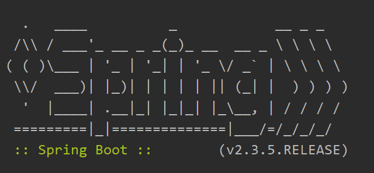
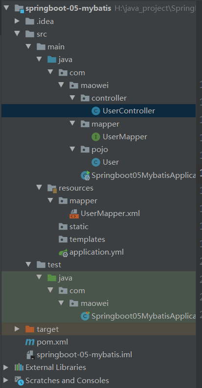

[toc]

# 1. SpringBoot简介

**回顾Spring：**

Spring是一个开源框架，2003 年兴起的一个轻量级的Java 开发框架，作者：Rod Johnson  。

**Spring是为了解决企业级应用开发的复杂性而创建的，简化开发。**


Spring是如何简化Java开发的：

为了降低Java开发的复杂性，Spring采用了以下4种关键策略：

1、基于POJO的轻量级和最小侵入性编程，所有东西都是bean；

2、通过IOC，依赖注入（DI）和面向接口实现松耦合；

3、基于切面（AOP）和惯例进行声明式编程；

4、通过切面和模版减少样式代码，RedisTemplate，xxxTemplate；


什么是SpringBoot：

SpringBoot是一个javaweb的开发框架，和SpringMVC类似，对比其他javaweb框架的好处，官方说是简化开发，**约定大于配置**，  you can "just run"，能迅速的开发web应用，几行代码开发一个http接口。


Spring Boot 基于 Spring 开发，**Spirng Boot 本身并不提供 Spring 框架的核心特性以及扩展功能**，只是用于快速、敏捷地开发新一代基于 Spring 框架的应用程序。也就是说，**它并不是用来替代 Spring 的解决方案，而是和 Spring 框架紧密结合用于提升 Spring 开发者体验的工具**。Spring Boot 以**约定大于配置的核心思想**，默认帮我们进行了很多设置，**多数 Spring Boot 应用只需要很少的 Spring 配置**。同时它集成了大量常用的第三方库配置（例如 Redis、MongoDB、Jpa、RabbitMQ、Quartz 等等），Spring Boot 应用中这些第三方库几乎可以零配置的开箱即用。


简单来说就是SpringBoot其实不是什么新的框架，它**默认配置了很多框架的使用方式**，就像maven整合了所有的jar包，spring boot整合了所有的框架 。


**Spring Boot的主要优点：**

- 为所有Spring开发者更快的入门
- **开箱即用**，提供各种默认配置来简化项目配置
- 内嵌式容器简化Web项目
- 没有冗余代码生成和XML配置的要求


# 2. 第一个SpringBoot程序

注意点：IDEA设置里File Encoding全部设置成UTF-8，否则很多配置会出错。


两种方法初始化项目：

首先确定项目环境（我自己的环境）：

* java version "1.8.0_251"
* Apache Maven 3.6.1
* SpringBoot 2.2.9（生成器中如果没有想要的SpringBoot版本可以直接在依赖中修改RELEASE）


**方法一：**使用spring.start.io网页创建项目

1. 打开spring.start.io
2. 填写项目信息，选择初始化组件（依赖）
3. 点击Generate Project生成项目，下载zip压缩包
4. 解压项目，使用IDEA导入该项目，一定要import（New -> Project From Existing Sources,然后选择maven项目）


**方法二：**直接在IDEA中创建SpringBoot项目

1. New -> New Project
2. Spring Initializer
3. 填写项目信息
4. 先择初始化组件，Spring Web
5. 填写项目路径


**项目结构分析：**

1. 一个主启动类，xxxxSpringBootApplication，xxx是工程名。主启动类是程序的入口
2. 一个application.properties配置文件
3. 一个测试类，xxxxSpringBootApplicationTests
4. 一个pom文件,以下是pom文件的结构

```xml
<?xml version="1.0" encoding="UTF-8"?>
<project xmlns="http://maven.apache.org/POM/4.0.0" xmlns:xsi="http://www.w3.org/2001/XMLSchema-instance"
	xsi:schemaLocation="http://maven.apache.org/POM/4.0.0 https://maven.apache.org/xsd/maven-4.0.0.xsd">
	<modelVersion>4.0.0</modelVersion>
	<!--父依赖-->
	<parent>
		<groupId>org.springframework.boot</groupId>
		<artifactId>spring-boot-starter-parent</artifactId>
		<version>2.2.9.RELEASE</version>
		<relativePath/> <!-- lookup parent from repository -->
	</parent>
	<groupId>com.maowei</groupId>
	<artifactId>HelloSpringBoot</artifactId>
	<version>0.0.1-SNAPSHOT</version>
	<name>HelloSpringBoot</name>
	<description>Demo project for Spring Boot</description>

	<properties>
		<java.version>1.8</java.version>
	</properties>

	<dependencies>
		<!--web场景启动器-->
		<!--web依赖：tomcat，DispatcherServlet，web.xml，SpringMVC.xml等等-->
		<dependency>
			<groupId>org.springframework.boot</groupId>
			<artifactId>spring-boot-starter-web</artifactId>
		</dependency>

		<!--spring-boot-starter，springboot所有依赖的名称都以这个开头-->
		<!--springboot单元测试-->
		<dependency>
			<groupId>org.springframework.boot</groupId>
			<artifactId>spring-boot-starter-test</artifactId>
			<scope>test</scope>
			<!--剔除依赖-->
			<exclusions>
				<exclusion>
					<groupId>org.junit.vintage</groupId>
					<artifactId>junit-vintage-engine</artifactId>
				</exclusion>
			</exclusions>
		</dependency>
	</dependencies>

	<build>
		<plugins>
			<!--打包插件-->
			<plugin>
				<groupId>org.springframework.boot</groupId>
				<artifactId>spring-boot-maven-plugin</artifactId>
			</plugin>
		</plugins>
	</build>

</project>

```


# 3. 原理初探

pom.xml

**开头有一个父依赖：**

父项目的主要作用是管理项目的资源过滤和插件。

```xml
parent>
    <groupId>org.springframework.boot</groupId>
    <artifactId>spring-boot-starter-parent</artifactId>
    <version>2.2.5.RELEASE</version>
    <relativePath/> <!-- lookup parent from repository -->
</parent>
```

点进去查看spring-boot-starter-parent,发现还有一个父依赖

```xml
<parent>
    <groupId>org.springframework.boot</groupId>
    <artifactId>spring-boot-dependencies</artifactId>
    <version>2.2.5.RELEASE</version>
    <relativePath>../../spring-boot-dependencies</relativePath>
</parent>
```

这里才是真正管理SpringBoot应用里面所有依赖版本的地方，SpringBoot的版本控制中心；

**以后我们导入依赖默认是不需要写版本；但是如果导入的包没有在依赖中管理着就需要手动配置版本了**


**启动器：**

```xml
<dependency>
    <groupId>org.springframework.boot</groupId>
    <artifactId>spring-boot-starter-web</artifactId>
</dependency>
```

**springboot-boot-starter-xxx**：就是spring-boot的场景启动器

**spring-boot-starter-web**：帮我们导入了web模块正常运行所依赖的组件；

SpringBoot将所有的功能场景都抽取出来，做成一个个的starter （启动器），只需要在项目中引入这些starter即可，所有相关的依赖都会导入进来 ， 我们要用什么功能就导入什么样的场景启动器即可 ；我们未来也可以自己自定义 starter；


**主启动类：**

默认的主启动类：

```java
//@SpringBootApplication 来标注一个主程序类
//说明这是一个Spring Boot应用
@SpringBootApplication
public class SpringbootApplication {

   public static void main(String[] args) {
     //以为是启动了一个方法，没想到启动了一个服务
      SpringApplication.run(SpringbootApplication.class, args);
   }

}
```

`@SpringBootApplication` 注解：

详细见：https://mp.weixin.qq.com/s/hzRwZvjYSX-dy-9Drz94aQ

**结论：**

1. SpringBoot在启动的时候从类路径下的META-INF/spring.factories中获取EnableAutoConfiguration指定的值
2. 将这些值作为自动配置类导入容器 ， 自动配置类就生效 ， 帮我们进行自动配置工作；
3. 整个J2EE的整体解决方案和自动配置都在springboot-autoconfigure的jar包中；
4. 它会给容器中导入非常多的自动配置类 （xxxAutoConfiguration）, 就是给容器中导入这个场景需要的所有组件 ， 并配置好这些组件 ；
5. 有了自动配置类 ， 免去了我们手动编写配置注入功能组件等的工作；


**SpringApplication:**

main方法实际上开启了一个进程（服务）：

```java
@SpringBootApplication
public class SpringbootApplication {
    public static void main(String[] args) {
        SpringApplication.run(SpringbootApplication.class, args);
    }
}
```

**SpringApplication.run分析**

分析该方法主要分两部分，一部分是SpringApplication的实例化，二是run方法的执行；


**SpringApplication类主要做了以下四件事情：**

1、推断应用的类型是普通的项目还是Web项目

2、查找并加载所有可用初始化器 ， 设置到initializers属性中

3、找出所有的应用程序监听器，设置到listeners属性中

4、推断并设置main方法的定义类，找到运行的主类

对应构造器的方法：

```java
public SpringApplication(ResourceLoader resourceLoader, Class... primarySources) {
    // ......
    this.webApplicationType = WebApplicationType.deduceFromClasspath();
    this.setInitializers(this.getSpringFactoriesInstances();
    this.setListeners(this.getSpringFactoriesInstances(ApplicationListener.class));
    this.mainApplicationClass = this.deduceMainApplicationClass();
}
```


**run方法流程分析：**


# 4. yaml配置注入

好玩的东西：

在resources目录下添加一个banner.txt文件，然后在banner生成网站上把想要生成的banner拷贝进去，springboot会自动替换成新的banner。

**也可以放一个空的banner.txt，这样的话可以消除控制台的banner**




## 4.1 SpringBoot配置文件：

SpringBoot使用一个全局配置文件，配置文件的名称是固定的

* application.properties

  语法：key=value

* application.yml

  语法：key: value （冒号后面有一个空格，yml对空格要求很严格）


配置文件的作用：

**修改SpringBoot自动配置的默认值**。新的工程中，SpringBoot配置文件什么都没有，因为SpringBoot采用的是底层的默认配置。

如：

在application.properties中改变端口号，默认的端口号是8080

`server.port=8081`

在application.yml中改变端口号

```yaml
server：
  prot: 8081
```


## 4.2 yaml概述：

YAML是 "YAML Ain't a Markup Language" （YAML不是一种标记语言）的递归缩写。在开发的这种语言时，YAML 的意思其实是："Yet Another Markup Language"（仍是一种标记语言）

这种语言以数据作为中心，而不是以标记语言为重点！


## 4.3 yamal基础语法

说明：语法要求严格！

1、空格不能省略

2、以缩进来控制层级关系，只要是左边对齐的一列数据都是同一个层级的。

3、属性和值的大小写都是十分敏感的


**字面量：普通的值  [ 数字，布尔值，字符串  ]**

字面量直接写在后面就可以 ， **字符串默认不用加上双引号或者单引号**

如：

```yaml
k: v
```

注意：

- “ ” 双引号，不会转义字符串里面的特殊字符 ， 特殊字符会作为本身想表示的意思；

  比如 ：name: "maowei \n xu"  输出 ：maowei 换行  xu

- ' ' 单引号，会转义特殊字符 ， 特殊字符最终会变成和普通字符一样输出

  比如 ：name: ‘kuang \n shen’  输出 ：kuang  \n  shen


**对象、Map：**

```yaml
Dog:
  name: xiaobai
  age: 3

map:
  key1: val1
  key2: val2
```

**行内写法：**

```yaml
Dog: {name: xiaobai,age: 3}
```


**数组、List、Set：**

用 - 表示组内的一个元素（ - 和元素之间需要一个空格）：

```yaml
list:
  - a
  - b
  - c
```

行内写法：

```yaml
pets: [do, cat, bird]
```


## 4.4 yaml向实体类注入匹配值

yaml注入配置文件：

1. 创建application.yml

2. 编写一个实体类

   ```java
   @Component
   //@ConfigurationProperties(prefix = "dog")
   public class Dog {
   
       private String name;
       private int age;
   }//省略了构造器，getter、setter方法
   ```

3. 原来给Bean注入值的方式

   ```java
   @Component
   //@ConfigurationProperties(prefix = "dog")
   public class Dog {
   	
       @Value("xiaobai")
       private String name;
       @Value("3")
       private int age;
   }//省略了构造器，getter、setter方法
   ```

4. 使用yaml配置注入

   **yml配置文件**：

   ```yaml
   dog:
     name: Alice
     age: 3
   ```

   **在实体类上添加**`@ConfigurationProperties`**注解：**

   prefix参数对应yaml文件中的名字

   ```java
   @Component
   @ConfigurationProperties(prefix = "dog")
   public class Dog {
   
       private String name;
       private int age;
   }//省略了构造器，getter、setter方法
   ```

   5.SpringBoot测试类

   ```java
   @SpringBootTest
   class Springboot02ApplicationTests {
   
       @Autowired
       private Dog dog;
   
       @Test
       public void pojoTest() {
           System.out.println(dog);
       }
   }
   // 测试结果：Dog{name='Alice', age=3}，注入成功
   ```


实体类中会报一个警告，springboot配置注解处理器没有找到


官方文档中建议加上配置文件处理器依赖：

```xml
<dependency>
    <groupId>org.springframework.boot</groupId>
    <artifactId>spring-boot-configuration-processor</artifactId>
    <optional>true</optional>
</dependency>
```


## 4.5 使用properties注入值

**@PropertySource ：**加载指定的配置文件（加载properties配置文件）；

**@configurationProperties**：默认从全局配置文件中获取值；

1. 创建person.properties配置文件

   ```properties
   name=maowei
   ```

2. 在Person实体类中注入

   ```java
   @PropertySource(value = "classpath:person.properties") //指定properties文件的路径
   @Component //注册bean
   public class Person {
   
       @Value("${name}") // 占位符替换值
       private String name;
   
       ......  
   }
   ```


## 4.6 yaml配置文件占位符

```yaml
erson:
    name: maowei${random.uuid} # 随机uuid
    age: ${random.int}  # 随机int
    happy: false
    birth: 2000/01/01
    maps: {k1: v1,k2: v2}
    hello: hello
    lists:
      - code
      - girl
      - music
    dog:
      name: ${person.hello:other}_旺财 # 如果person有hello属性，使用hello属性替换；否则使用other替换进行拼接
      age: 1
```


**小结：**

`@ConfigurationProperties` 注解和 `@Value` 注解的区别


1、@ConfigurationProperties只需要写一次即可 ， @Value则需要每个字段都添加

2、松散绑定：这个什么意思呢? 比如我的yml中写的last-name，这个和lastName是一样的， - 后面跟着的字母默认是大写的。这就是松散绑定。可以测试一下

3、JSR303数据校验 ， 这个就是我们可以在字段增加一层过滤器验证 ， 可以保证数据的合法性

4、复杂类型封装，yml中可以封装对象 ， 使用value就不支持


# 5. JSR303校验

SpringBoot中可以使用 `@Validated` 注解来校验数据，如果数据不符合要求，会统一抛出异常，方便异常中心统一处理。

**注意：**使用JSR303校验，一定要在**类上**加上 `@Validated` 注解，否则即便加上了其他注解，校验也不会生效

如： `@Max` 限制数值最大值，`@Email` 限制字符格式为邮箱地址

```java
@Component
@ConfigurationProperties(prefix = "dog")
@Validated
public class Dog {

    @Email
    private String name;
    @Max(value = 2, message = "年龄不超过2岁")
    private int age;

    public Dog() {
    }

    public Dog(String name, int age) {
        this.name = name;
        this.age = age;
    }
```


**常用的注解：**

```java
@NotNull(message="名字不能为空")
private String userName;

@Max(value=120,message="年龄最大不能查过120")
private int age;

@Email(message="邮箱格式错误")
private String email;

空检查
@Null       验证对象是否为null
@NotNull    验证对象是否不为null, 无法查检长度为0的字符串
@NotBlank   检查约束字符串是不是Null还有被Trim的长度是否大于0,只对字符串,且会去掉前后空格.
@NotEmpty   检查约束元素是否为NULL或者是EMPTY.
    
Booelan检查
@AssertTrue     验证 Boolean 对象是否为 true  
@AssertFalse    验证 Boolean 对象是否为 false  
    
长度检查
@Size(min=, max=) 验证对象（Array,Collection,Map,String）长度是否在给定的范围之内  
@Length(min=, max=) string is between min and max included.

日期检查
@Past       验证 Date 和 Calendar 对象是否在当前时间之前  
@Future     验证 Date 和 Calendar 对象是否在当前时间之后  
@Pattern    验证 String 对象是否符合正则表达式的规则

.......等等
除此以外，我们还可以自定义一些数据校验规则
```

**下面是注解的包路径：**


# 6. 多环境切换及配置文件加载顺序

1. 可以使用多个.properties文件来实现多环境切换（原理：不同目录位置下的properties文件加载顺序不同，先加载的配置文件被后加载的配置文件覆盖）

2. 使用ymal文件，可以实现在一个配置文件中配置多个环境，并选择激活指定环境

## 6.1 ymal多文档块

使用 `---` 符号来分隔不同的环境（不可缺少）。

通过参数 `spring.profiles` 来指定环境名称；使用 `spring.profiles.active` 来激活指定环境

**profiles释义**：配置文件

```yaml
server:
  port: 8080

spring:
  profiles:
    active: dev

---
server:
  port: 8081

spring:
  profiles: dev

---
server:
  port: 8082
spring:
  profiles: test
```


## 6.2 多个properties配置文件

### 6.2.1 在resources目录下编写多个不同名称的properties文件

如：

application-dev.properties：开发调试下的环境

application-test.properties：测试下的环境

**SpringBoot默认加载 applicaion.properties配置文件**。

通过在application.properties主配置文件中，选择激活的环境。

```properties
# 激活开发环境
spring.profiles.active=dev
```


**如果application.yml与application.properties同时配置了环境，比如端口号，并且没有激活指定的环境，那么默认使用properties中配置的环境。**


### 6.2.2 在不同目录下编写多个application.properties

不同目录下的application.properties优先级不同。

优先级顺序，从高到低：

1. `file:./config/`                                         项目路径下的config文件夹中的配置文件

2. `file:./`                                                        项目路径下的配置文件
3. `classpath:./config/`                               **类路径下（resources文件夹下）**的config文件夹中的配置文件
4. `classpath:./`                                              **类路径下（resources文件夹下）**的配置文件

**3，4优先级中的类路径（java文件夹或resources文件夹下）实际上是指resources文件夹下，如果配置文件在类路径中，习惯上放在资源目录下。**


### 6.3 运维技巧

项目打包之后，使用命令行参数 `spring.config.location` ，外部指定新的配置文件。

这个时候，外部指定的配置文件的优先级最高

```
java -jar spring-boot-config.jar --spring.config.location=F:/application.properties
```


# 7. 自动配置原理

1. SpringBoot会自动加载大量的自动配置类（含有默认配置）

2. 由我们自己查看需要的功能有没有在SpringBoot写好的默认配置类中

3. 查看自动配置类中配置了哪些组件：只要我们需要的组件存在其中，就不需要再手动配置了

4. 给容器中自动配置添加组件的时候，会从**properties类**中获取某些属性。我们只需要在配置文件中指定这些属性即可。

5. 个人目前的理解：**自动配置类和properties类**本质上都是JavaConfig类（包含 `@Configuration` 注解）；

   properties类就是自动配置类中的组件，自动配置类通过 `@ConditionalOnxxx` 注解判断是否加载某些组件（xxxProperties类）。properties类通过与ymal配置文件绑定向properties类中注入属性；

   之前是，直接在xml配置中配置所有东西。**现在通过在yamal文件中配置JavaConfig**。

**注：**

* 自动配置类的名称是：xxxxxAutoConfiguration，功能是给容器中添加组件

  **自动配置类总结** ：**根据当前不同的条件判断，决定这个配置类是否生效！**

  - 一但这个配置类生效，这个配置类就会给容器中添加各种组件；
  - 这些组件的属性是从对应的properties类中获取的，这些类里面的每一个属性又是和配置文件绑定的（如果yml配置文件中没有显式地指定值，使用默认的属性）；
  - 所有在yamal配置文件中配置的属性都是在xxxxProperties类中封装着；
  - 配置文件能配置什么就可以参照某个功能对应的这个属性类

* properties类的名称是：xxxxxProperties，封装ymal配置中的属性（如果没有配置，使用默认值）


具体例子：**HttpEncodingAutoConfiguration类（Http编码自动配置）**

见：https://mp.weixin.qq.com/s/1z1fSZs0nA12HdpkLsxqtQ


了解：`@Conditional` 注解（xxxxAutoConfiguration，自动配置类中的条件）

自动配置类根据条件来选择加载哪些组件（`@Conditional` 注解生效的组件）。

| **@Conditional扩展注解**        | **作用（判断是否满足指定条件）**                 |
| ------------------------------- | ------------------------------------------------ |
|                                 |                                                  |
|                                 |                                                  |
| @ConditionalOnJava              | 系统的Java版本是否符合要求                       |
| @ConditionalOnBean              | 容器中存在指定Bean                               |
| @ConditionalOnMissingBean       | 容器中不存在指定Bean                             |
| @ConditionalOnExpression        | 满足SpEL表达式指定                               |
| @ConditionalOnClass             | 系统中有指定的类                                 |
| @ConditionalOnMissingClass      | 系统中(classpath里)没有指定的类                  |
| @ConditionalOnSingleCandidate   | 容器中只有一个指定的Bean，或者这个Bean是首选Bean |
| @ConditionalOnProperty          | 系统中指定的属性是否有指定的值                   |
| @ConditionalOnRsource           | 类路径下是否存在指定资源                         |
| @ConditionalOnWebApplication    | 当前是Web环境                                    |
| @ConditionalOnNotWebApplication | 当前不是Web环境                                  |
| @ConditionalOnJndi              | JNDI存在指定项                                   |


虽然有很多自动配置类，但是不是所有组件都加载到了容器中。

通过在ymal配置文件中配置debug=true属性，来让控制台打印自动配置报告，这样我们就可以很方便就能知道哪些自动配置类生效。

```yamal
# 开启SpringBoot调制类
debug=true
```


**Positive matches：**查看启用的自动配置类


**Negitive matches：**查看没有启用的自动配置类


# 8. SpringBoot Web开发

自动装配：

SpringBoot帮我们配置了什么？我们能不能进行修改？能修改哪些东西？能不能扩展？

* **xxxxAutoConfiguration：**根据条件（`@Conditional`注解），向容器中装配组件
* **xxxxProperties：**配置类（组件），可以向其中注入yaml文件中自定义的内容；由**xxxxAutoConfiguration装配到容器中。

**其中WebMVC配置全部在WebMvcAutoConfiguration中配置**。


## 8.1 静态资源处理

项目中的静态资源，如css，js等文件

**WebMvcAutoConfiguration**的源码分析见：https://mp.weixin.qq.com/s/vYbEYlveseIGWWL_eEM36w


以下四个存放静态资源的目录可以被识别：

classpath为工程目录，但习惯上静态资源目录全部存放在resources目录下

```java
"classpath:/META-INF/resources/"   // webjars包下的文件
"classpath:/resources/"            // resources目录下的名称为resources的文件夹（需要创建）
"classpath:/static/"               // resources目录下的名称为static的文件夹
"classpath:/public/"               // resources目录下的名称为public的文件夹（需要创建）
```


也可以在ymal配置文件中自定义静态文件的存放目录，此时，上面默认的静态文件存放目录全部失效：

```java
spring.resources.static-locations=classpath:/coding/,classpath:/maowei/
```

一般不会重新配置静态文件存放的目录


## 8.2 首页和图标定制

在static文件夹中新建index.html文件

此时，会自动映射到静态文件目录下的index.html文件

进入 localhost:8080/ 会自动显示index.html的内容


## 8.3 Thymeleaf

**模板引擎**：

springboot支持的前端页面是html，不是jsp页面。如果使用jsp，可以用jsp处理转发到前端的数据。

springboot推荐使用模板引擎Thymeleaf：

模板引擎的作用就是我们来写一个页面模板，比如有些值呢，是动态的，我们写一些表达式。而这些值，从哪来呢，就是我们在后台封装一些数据。然后把这个模板和这个数据交给我们模板引擎，模板引擎按照我们这个数据帮你把这表达式解析、填充到我们指定的位置，然后把这个数据最终生成一个我们想要的内容给我们写出去，这就是我们这个模板引擎，不管是jsp还是其他模板引擎，都是这个思想。

下图是Thymeleaf的示意图：


**引入Thymeleaf的几种方式：**

Thymeleaf 官网：https://www.thymeleaf.org/

Thymeleaf 在Github 的主页：https://github.com/thymeleaf/thymeleaf

Spring官方文档：找到我们对应的版本

https://docs.spring.io/spring-boot/docs/2.2.5.RELEASE/reference/htmlsingle/#using-boot-starter 

引入pom依赖：

```xml
<!--thymeleaf-->
<dependency>
    <groupId>org.springframework.boot</groupId>
    <artifactId>spring-boot-starter-thymeleaf</artifactId>
</dependency>
```

注意在maven仓库中找到的Spring Boot Starter Thymeleaf是2.X版本的。而SpringBoot父依赖中的Thymeleaf默认版本是3.X版本的，如果导入了2.X版本的Thymeleaf一定会出现问题。


根据Spring Boot自动配置的原理，查看ThymeleafProperties自动配置类，发现前缀和后缀固定为templates文件夹和html文件，所以前端的html文件需要放在templates文件夹下。


**Thymeleaf语法：**参考官方文档是最直接的方法

以下是一个简单的测试用例：

1. Controller增加传输数据亲贵

   ```java
   @Controller
   public class IndexController {
   
       @RequestMapping("/index")
       public String index(Model model) {
           model.addAttribute("msg", "<h1>Hello,there!</h1>"); // 传递字符串
           model.addAttribute("users", Arrays.asList("xumaowei", "徐茂蔚")); // 传递列表
           return "test";
       }
   }
   ```

   

2. 要使用Thymeleaf需要在html命名空间中导入约束

   ```html
   xmlns:th="http://www.thymeleaf.org"
   ```


3. 对应的前端测试页面

   ```html
   <!DOCTYPE html>
   <html lang="en"  xmlns:th="http://www.thymeleaf.org">
   <head>
       <meta charset="UTF-8">
       <title>Title</title>
   </head>
   <body>
   <!--传递单纯的字符串，自动转义-->
   <div th:text="${msg}"></div>
   <!--不转义，字符串中的内容按照html语法解析-->
   <div th:utext="${msg}"></div>
   
   <div th:each="user :${users}" th:text="${user}"></div>
   </body>
   </html>
   ```

4. 测试结果

   

文档中的Thymeleaf语法：

1. 可以使用 **th:attr** 替换原生html中原生属性的值

   

2. Thymeleaf表达式（对应官方文档第四章Standard Expression Syntax）

   ```
   Simple expressions:（表达式语法）
   Variable Expressions: ${...}：获取变量值；OGNL；
       1）、获取对象的属性、调用方法
       2）、使用内置的基本对象：#18
            #ctx : the context object.
            #vars: the context variables.
            #locale : the context locale.
            #request : (only in Web Contexts) the HttpServletRequest object.
            #response : (only in Web Contexts) the HttpServletResponse object.
            #session : (only in Web Contexts) the HttpSession object.
            #servletContext : (only in Web Contexts) the ServletContext object.
   
       3）、内置的一些工具对象：
   　　　　　　#execInfo : information about the template being processed.
   　　　　　　#uris : methods for escaping parts of URLs/URIs
   　　　　　　#conversions : methods for executing the configured conversion service (if any).
   　　　　　　#dates : methods for java.util.Date objects: formatting, component extraction, etc.
   　　　　　　#calendars : analogous to #dates , but for java.util.Calendar objects.
   　　　　　　#numbers : methods for formatting numeric objects.
   　　　　　　#strings : methods for String objects: contains, startsWith, prepending/appending, etc.
   　　　　　　#objects : methods for objects in general.
   　　　　　　#bools : methods for boolean evaluation.
   　　　　　　#arrays : methods for arrays.
   　　　　　　#lists : methods for lists.
   　　　　　　#sets : methods for sets.
   　　　　　　#maps : methods for maps.
   　　　　　　#aggregates : methods for creating aggregates on arrays or collections.
   ==================================================================================
   
     Selection Variable Expressions: *{...}：选择表达式：和${}在功能上是一样；
     Message Expressions: #{...}：获取国际化内容
     Link URL Expressions: @{...}：定义URL；
     Fragment Expressions: ~{...}：片段引用表达式
   
   Literals（字面量）
         Text literals: 'one text' , 'Another one!' ,…
         Number literals: 0 , 34 , 3.0 , 12.3 ,…
         Boolean literals: true , false
         Null literal: null
         Literal tokens: one , sometext , main ,…
         
   Text operations:（文本操作）
       String concatenation: +
       Literal substitutions: |The name is ${name}|
       
   Arithmetic operations:（数学运算）
       Binary operators: + , - , * , / , %
       Minus sign (unary operator)（负号，一元运算符）: -
       
   Boolean operations:（布尔运算）
       Binary operators: and , or
       Boolean negation (unary operator): ! , not
       
   Comparisons and equality:（比较运算）
       Comparators: > , < , >= , <= ( gt , lt , ge , le )
       Equality operators: == , != ( eq , ne )
       
   Conditional operators:条件运算（三元运算符）
       If-then: (if) ? (then)
       If-then-else: (if) ? (then) : (else)
       Default: (value) ?: (defaultvalue)
       
   Special tokens:
       No-Operation: _
   ```

   

## 8.4 MVC自动配置

（写得很乱，具体参考：https://mp.weixin.qq.com/s/9AY48uLjR9bI9TUlulcBNA）

SpringMVC自动配置官方文档：

https://docs.spring.io/spring-boot/docs/2.1.6.RELEASE/reference/html/boot-features-developing-web-applications.html#boot-features-spring-mvc-auto-configuration

SpringBoot为大多数应用提供了比较好用的Spring MVC自动配置。


自动配置在Spring默认设置上添加了以下功能：

- Inclusion of `ContentNegotiatingViewResolver` and `BeanNameViewResolver` beans.

  - （包含视图解析器）

- Support for serving static resources, including support for WebJars（支持静态资源文件，包括webJars）

- Automatic registration of `Converter`, `GenericConverter`, and `Formatter` beans.

  - （自动注册转换器Converter：网页提交数据到后台自动封装成为对象的东西，比如把“1”字符串自动转换成int

  ​	格式化器Formatter：比如页面返回了一个2019-08-01，自动格式化成Date对象）

- Support for `HttpMessageConverters`

  - （SpringMVC用来转换Http请求和响应的的，比如我们要把一个User对象转换为JSON字符串，可以去看官网文档解释）

- Automatic registration of `MessageCodesResolver` 

  - （定义错误代码生成规则）

- Static `index.html` support.

  - （首页定制）

- Custom `Favicon` support

  - （图标定制）

- Automatic use of a `ConfigurableWebBindingInitializer` bean 

  - （初始化数据绑定器：帮我们把请求数据绑定到JavaBean中）

如果希望保持Spring Boot MVC的特性，同时添加额外的MVC配置（拦截器，格式化器，视图控制器和其他特性），可以添加带有 `@Configuration` 注解的Java配置类（实现 `WebMvcConfigurer` 接口），**不要添加** `EnableWebMvc` 注解，**如果添加了这个注解，所有默认的配置都会失效，全面接管SpringMVC，只使用用户自己的SpringMVC配置**。

如果想要提供自定义的 `RequestMappinghandlerMapping` ，`RequestMappingHandlerAdapter` 或者 `ExceptionHandlerExceptionResolver` ，可以声明一个 `WebMvcRegistrationAdapter` 实例提供组件。


以下是文档中的原文：	

If you want to keep Spring Boot MVC features and you want to add additional [MVC configuration](https://docs.spring.io/spring/docs/5.1.8.RELEASE/spring-framework-reference/web.html#mvc) (interceptors, formatters, view controllers, and other features), you can add your own `@Configuration` class of type `WebMvcConfigurer` but **without** `@EnableWebMvc`. If you wish to provide custom instances of `RequestMappingHandlerMapping`, `RequestMappingHandlerAdapter`, or `ExceptionHandlerExceptionResolver`, you can declare a `WebMvcRegistrationsAdapter` instance to provide such components. 


就是说如果想要扩展SpringMVC的配置，只需要编写相应的Java配置类，并添加到容器中。Spring Boot在自动配置很多组件的时候，先看容器中有无用户自己配置的，如果有用户自己配置的，则优先使用用户的配置

另外，当容器中有多个配置时，比如视图解析器，就当默认配置和用户的配置组合起来。

如下，是自己配置的视图解析器，SpringBoot将容器中所有的视图解析器收集起来，并选择使用最好的那个视图解析器。

```java
@Configuration
public class MyMvcConfig implements WebMvcConfigurer {

    @Bean
    public ViewResolver myViewResolver() {
        return new MyViewResolver();
    }

    private static class MyViewResolver implements ViewResolver {
        public View resolveViewName(String s, Locale locale) {
            return null;
        }
    
    @Override
    public void addViewControllers(ViewControllerRegistry registry) {
        registry.addViewController("/test").setViewName("test"); // 指定某个url转发到指定的
                                                                 // html页面
    }
    }
}

在配置文件中使用addViewController方法，效果等价于：
@RequestMapping("/test")
public String test() {
    return "test";
}
```


# 9. 配置Druid数据源

**SpringData：**
Spring Boot 底层都是采用 Spring Data 的方式进行统一处理各种数据库，Spring Data 也是 Spring 中与 Spring Boot、Spring Cloud 等齐名的知名项目。

Sping Data 官网：https://spring.io/projects/spring-data

数据库相关的启动器 ：可以参考官方文档：

https://docs.spring.io/spring-boot/docs/2.2.5.RELEASE/reference/htmlsingle/#using-boot-starter


SpringBoot默认使用的数据源是**HikariDataSource**，号称是当前最快的数据源，相比传统的 c3p0、DBCP、Tomcat jdbc 等连接池更加优秀。

在配置文件中，可以使用 `spring.datasource.type` 指定想要使用的数据源，参数值为**需要使用的数据源的全限定名**。


## 9.1 Druid数据源

**Druid简介：**

Java程序很大一部分要操作数据库，为了提高性能操作数据库的时候，又不得不使用数据库连接池。

Druid 是阿里巴巴开源平台上一个数据库连接池实现，结合了 C3P0、DBCP 等 DB 池的优点，同时加入了日志监控。

Druid 可以很好的监控 DB 池连接和 SQL 的执行情况，天生就是针对监控而生的 DB 连接池。

Druid已经在阿里巴巴部署了超过600个应用，经过一年多生产环境大规模部署的严苛考验。

Spring Boot 2.0 以上默认使用 Hikari 数据源，可以说 Hikari 与 Driud 都是当前 Java Web 上最优秀的数据源，我们来重点介绍 Spring Boot 如何集成 Druid 数据源，如何实现数据库监控。

Github地址：https://github.com/alibaba/druid/


**com.alibaba.druid.pool.DruidDataSource 基本配置参数如下（配置文件中）：**


## 9.2 Druid数据源的使用

**1. 添加Druid数据源依赖：**

```xml
<!-- https://mvnrepository.com/artifact/com.alibaba/druid -->
<dependency>
    <groupId>com.alibaba</groupId>
    <artifactId>druid</artifactId>
    <version>1.1.21</version>
</dependency>
```

**2. 切换数据源，将默认数据源 com.zaxxer.hikari.HikariDataSource 换成Druid**

```yaml
spring:
  datasource:
    username: root
    password: 3.1415926
    url: jdbc:mysql://localhost:3306/mybatis?serverTimezone=UTC&useUnicode=true&characterEncoding=utf-8
    driver-class-name: com.mysql.cj.jdbc.Driver
    type: com.alibaba.druid.pool.DruidDataSource # 指定Druid为数据源，全限定名
```

**3. 在配置文件中，添加Druid数据源的配置**

```yaml
spring:
  datasource:
    username: root
    password: 3.1415926
    url: jdbc:mysql://localhost:3306/mybatis?serverTimezone=UTC&useUnicode=true&characterEncoding=utf-8
    driver-class-name: com.mysql.cj.jdbc.Driver
    type: com.alibaba.druid.pool.DruidDataSource

    #Spring Boot 默认是不注入这些属性值的，需要自己绑定
    #druid 数据源专有配置
    initialSize: 5
    minIdle: 5
    maxActive: 20
    maxWait: 60000
    timeBetweenEvictionRunsMillis: 60000
    minEvictableIdleTimeMillis: 300000
    validationQuery: SELECT 1 FROM DUAL
    testWhileIdle: true
    testOnBorrow: false
    testOnReturn: false
    poolPreparedStatements: true

    #配置监控统计拦截的filters，stat:监控统计、log4j：日志记录、wall：防御sql注入
    #如果允许时报错  java.lang.ClassNotFoundException: org.apache.log4j.Priority
    #则导入 log4j 依赖即可，Maven 地址：https://mvnrepository.com/artifact/log4j/log4j
    filters: stat,wall,log4j
    maxPoolPreparedStatementPerConnectionSize: 20
    useGlobalDataSourceStat: true
    connectionProperties: druid.stat.mergeSql=true;druid.stat.slowSqlMillis=500
```

**4. 添加log4j依赖，并配置log4j.properties**

由于Druid数据源使用了log4j日志，所以需要在项目中导入log4j依赖

pom.xml依赖导入

```xml
<!-- https://mvnrepository.com/artifact/log4j/log4j -->
<dependency>
    <groupId>log4j</groupId>
    <artifactId>log4j</artifactId>
    <version>1.2.17</version>
</dependency>
```


**如果不配置log4j.properties，控制台会报warning，并且不会有日志生成：**

```properties
#将等级为DEBUG的日志信息输出到console和file这两个目的地，console和file的定义在下面的代码
log4j.rootLogger=DEBUG,console,file

#控制台输出的相关设置
log4j.appender.console = org.apache.log4j.ConsoleAppender
log4j.appender.console.Target = System.out
log4j.appender.console.Threshold = DEBUG
log4j.appender.console.layout = org.apache.log4j.PatternLayout
log4j.appender.console.layout.ConversionPattern = [%c]-%m%n

#文件输出的相关设置
log4j.appender.file = org.apache.log4j.RollingFileAppender
log4j.appender.file.File = ./log/maowei.log
log4j.appender.file.MaxFileSize = 10mb
log4j.appender.file.Threshold = DEBUG
log4j.appender.file.layout = org.apache.log4j.PatternLayout
log4j.appender.file.layout.ConversionPattern = [%p][%d{yy-MM-dd}][%c]%m%n

#日志输出级别
log4j.logger.org.mybatis = DEBUG
log4j.logger.java.sql = DEBUG
log4j.logger.java.sql.Statement = DEBUG
log4j.logger.java.sql.ResultSet = DEBUG
log4j.logger.java.sql.PreparedStatement = DEBUG
```

**5. 需要自己在容器中配置一个DruidDataSource的Bean，和yml配置文件中的自定义参数绑定，从而不再使用SpringBoot默认的数据源配置**

```java
package com.example.springboot04data.config;

@Configuration
public class DruidConfig {

    /*
    将自定义的 Druid数据源添加到容器中，不再让 Spring Boot 自动创建
    绑定全局配置文件中的 druid 数据源属性到 com.alibaba.druid.pool.DruidDataSource从而让它们生效
    @ConfigurationProperties(prefix = "spring.datasource")：作用就是将 全局配置文件中
    前缀为 spring.datasource的属性值注入到 com.alibaba.druid.pool.DruidDataSource 的同名参数中
     */
    @ConfigurationProperties(prefix = "spring.datasource")
    @Bean
    public DataSource druidDataSource() {
        return new DruidDataSource();
    }
}
```

**6. 配置Druid数据源监控**

Druid 数据源具有监控的功能，并提供了一个 web 界面方便用户查看，类似安装 路由器 时，人家也提供了一个默认的 web 页面。

所以第一步需要设置 Druid 的后台管理页面，比如 登录账号、密码 等；配置后台管理；

```java
package com.example.springboot04data.config;
@Configuration
public class DruidConfig {
    // 配置Druid，监控管理后台的Servlet
    // 内置Servlet 没有web.xml文件，所以使用Spring boot注册Servlet
    @Bean
    public ServletRegistrationBean statViewServlet() {
        ServletRegistrationBean bean = new ServletRegistrationBean(new StatViewServlet(), "/druid/*"); // 这个设置的url，是进入后台监控界面的路径
        Map<String, String> initParams = new HashMap<>();
        initParams.put("loginUsername", "admin"); // 后台管理界面的登录账号
        initParams.put("loginPassword", "123456"); // 后台管理界面的登录密码

        // 后台允许哪些用户访问
        // initParams.put("allow", "localhost") 表示只允许本机访问
        // initParams.put("allow", "") allow为空，表示允许所有用户访问
        initParams.put("allow", "");
        bean.setInitParameters(initParams);

        return bean;
    }
}
```


**配置Druid Web监控的Filter过滤器:**

```java
package com.example.springboot04data.config;
public class DruidConfig {
	@Bean
    public FilterRegistrationBean webStatFilter() {
        FilterRegistrationBean bean = new FilterRegistrationBean();
        bean.setFilter(new WebStatFilter());

        // exclusion, 哪些请求过滤掉，监控器不进行统计
        Map<String, String> initParams = new HashMap<>();
        initParams.put("exclusions", "*.js, *.css, /druid/*, /jdbc/*");
        bean.setInitParameters(initParams);

        // /* 表示过滤所有请求
        bean.setUrlPatterns(Arrays.asList("/*"));

        return bean;
    }
}
```


# 10. SpringBoot整合Mybatis

MVC:

M：数据和业务

V：视图，前端

C：前端和后端的交接


1. 导入包，在pom.xml中引入Mybatis依赖

   ```xml
   <!-- https://mvnrepository.com/artifact/org.mybatis.spring.boot/mybatis-spring-boot-starter -->
   <dependency>
       <groupId>org.mybatis.spring.boot</groupId>
       <artifactId>mybatis-spring-boot-starter</artifactId>
       <version>2.1.1</version>
   </dependency>
   ```

   

2. 配置文件，在yml配置文件中配置Mybatis和数据库连接

   ```yaml
   spring:
     datasource:
       username: root
       password: 3.1415926
       url: jdbc:mysql://localhost:3306/mybatis?useUnicode=true&characterEncoding=utf-8&serverTimezone=UTC
       driver-class-name: com.mysql.cj.jdbc.Driver
   
   mybatis:
     mapper-locations: classpath:mapper/*.xml 
     # 注意classpath冒号后面直接接文件路径，不需要额外的/，
     # classpath:/mapper/*.xml这种写法无法建立映射
     type-aliases-package: com.maowei.pojo
     # 别名设置，包路径下的实体类可以直接使用类名
   ```

   

3. 编写sql（创建Mappler接口和Mapper.xml文件）

   

   **Mapper接口**：

   ```java
   @Mapper
   @Repository
   // Mapper接口中这两个注解不能缺少，@Repository是为了注册Bean，在容器中可以直接得到接口bean
   // @Mapper是为了标记这个接口是Mybatis映射接口
   public interface UserMapper {
   
       List<User> queryUserList();
   
       User queryUserById(int id);
   
       int addUser(User user);
   
       int updateUser(User user);
   
       int deleteUser(int id);
   }
   ```

   **Mapper.xml文件：**

   ```xml
   <?xml version="1.0" encoding="UTF-8" ?>
   <!DOCTYPE mapper
           PUBLIC "-//mybatis.org//DTD Mapper 3.0//EN"
           "http://mybatis.org/dtd/mybatis-3-mapper.dtd">
   <!--绑定一个Dao/Mapper接口-->
   <mapper namespace="com.maowei.mapper.UserMapper">
       <select id="queryUserById" resultType="User" parameterType="int">
       	select * from users where id = #{id};
     	</select>
   
       <select id="queryUserList" resultType="User">
           select * from users;
       </select>
   
       <select id="addUser" parameterType="User" resultType="int">
           insert into users(id, name, pwd) values(#{id},#{name},#{pwd});
       </select>
   
       <select id="updateUser" parameterType="com.maowei.pojo.User" resultType="int">
           update users set name=#{name},pwd=#{pwd} where id=#{id};
       </select>
   
       <delete id="deleteUser" parameterType="int">
           delete from users where id=#{id};
       </delete>
   
   </mapper>
   ```

   

4. service层调用dao层

   为了方便，这里不使用service层

   

5. controller调用service层

   暂时直接使用Controller完成业务

   ```java
   @RestController
   public class UserController {
   
       @Autowired
       private UserMapper userMapper;
   
       @RequestMapping("/getUser/{id}")
       public User getUserById(@PathVariable("id") Integer id) {
           return userMapper.queryUserById(id);
       }
   }
   ```

   

# 11.useUnicode=true&characterEncoding=utf-8

添加的作用是：指定字符的编码、解码格式。

例如：mysql数据库用的是GBK编码，而项目数据库用的是utf-8编码。这时候如果添加了useUnicode=true&characterEncoding=UTF-8 ，

那么作用有如下两个方面：

* 存数据时：

数据库在存放项目数据的时候会先用UTF-8格式将数据解码成字节码，然后再将解码后的字节码重新使用GBK编码存放到数据库中。

* 取数据时：

在从数据库中取数据的时候，数据库会先将数据库中的数据按GBK格式解码成字节码，然后再将解码后的字节码重新按UTF-8格式编码数据，最后再将数据返回给客户端。


# 12. @RequestParam与@RequestBody的区别

`@RequestBody` 注解：在**Content-Type为application/json**时，需要使用这个注解。在参数上加上这个注解，spring会将request body中的**json/xml对象**解析成该参数类型的**JavaBean对象或者String字符串**。（比如Post请求体中的数据解析成字符串）。

如果参数是字符串，请求体中的是一个对象的json字符串，那么这个参数为直接解析成json格式的字符串；

如果参数是一个对象，请求体中也是一个对象，那么直接解析成对象。


`@RequestParam` 注解：在**Content-Type为application/x-www-urlencoded**时，需要使用这个注解。将方法中的**一个**参数和web请求中的**一个**参数绑定。一般用于从GET请求中取出对应参数的值（Post请求中也可以用，绑定请求中的参数和方法中的参数）。


**总结：**

使用 `@RequestParam` 还是 `@RequestBody` 与请求方式（GET、POST）无关，与请求中的Content-Type有关。

* 使用 application/x-www-urlencoded，使用 `@RequestParam` 注解

* 使用 application/json，使用 `@RequestBody` 注解

  

# 13. @NotNull,@NotEmpty,@NotBlank

**注意：**三者必须是这个包内的注解：`javax.validation.constraints`


**1.@NotNull(message = "某个属性不能为空")：**message为报错时的错误信息，默认错误信息是“不能为空”
不能为null，但可以为empty(""," “,” ") ，**一般用在基本数据类型的非空校验上**，而且被其标注的字段可以使用 @size/@Max/@Min对字段数值进行大小的控制

**2.@NotEmpty：**
不能为null，而且长度必须大于0(" “,” ")，**一般用在集合类上面**

**3.@NotBlank：**
**只能作用在接收的String类型**上，注意是**只能**，不能为null，而且调用trim()后，长度必须大于0，即字符串中不能只有empty(""," “,” ") 


# 14. @Valid和BindingResult

这两个注解搭配上面的 `@NotBlank` 、`@NotNull`、`@NotEmpty` 注解使用，或者 `@Length`、`@Range` 等其他对参数做了限制的注解。

对方法中的参数使用 `@Valid` 注解，表示对这个参数（对象属性）进行验证。使用这个注解目的是**减少在Controller中对参数的判断**。

**BindingResult**直接作为Controller方法中的一个参数，**用来存放验证结果**。


下面是一个例子：如果不使用注解对参数进行限制，对参数进行校验，Controller中的方法**会需要很多对参数的判断**

**UserForm对象：**

```java
public class UserForm {
    
//    @NotEmpty // 不能为null，长度必须大于0，一般用于判断集合是否为空
//    @NotNull  // 不能为null，但可以为empty
    @NotBlank // 只能用于String，并且trim()后长度要大于0，即不能有空格
    private String username;

    @NotBlank
    private String password;

    @NotBlank
    private String email;
// 为了简介，省略了getter和setter方法
}
```


**Controller中的方法：**

UserForm用来保存前端请求中的 json 对象数据，**并对UserForm中的有注解的属性进行校验**。

**BindingResult接口中的方法**：BindingResult继承Errors接口

* `boolean hasErrors()`：用来判断属性检验时，有没有错误

* `FieldError getFieldError()`：（Erros接口中的方法，没有覆写）取出一个出错的属性，返回一个 `FieldError` 对象，如果有多个属性校验出错，返回第一个出错的属性。

* `List<FieldError> getFieldErrors()`：（Errors接口中的方法，没有覆写）取出所有出错的属性，返回一个列表


**FieldError中的方法**：下面两个方法没有在FieldError覆写，是它的一个父类**DefaultMessageSourceResolvable**中的方法

* `public String getField()`：取出出错的属性名称

* `public String getDefaultMessage()`：用来取出对应错误属性的错误信息

```java
@RestController
@RequestMapping("/user")
public class UserController {

    private static Logger logger = LoggerFactory.getLogger(UserController.class);

    @PostMapping("/register")
    public ResponseVo register(@Valid @RequestBody UserForm userForm,
                               BindingResult bindingResult) {
        if (bindingResult.hasErrors()) {
            logger.info("注册提交的参数有误，{} {}",
                    bindingResult.getFieldError().getField(),
                    bindingResult.getFieldError().getDefaultMessage());
            return ResponseVo.error(ResponseEnum.PARAM_ERROR, bindingResult);
        }
        logger.info("用户名={}", userForm.getUsername());

        return ResponseVo.error(ResponseEnum.NEED_LOGIN);
    }
}
```


