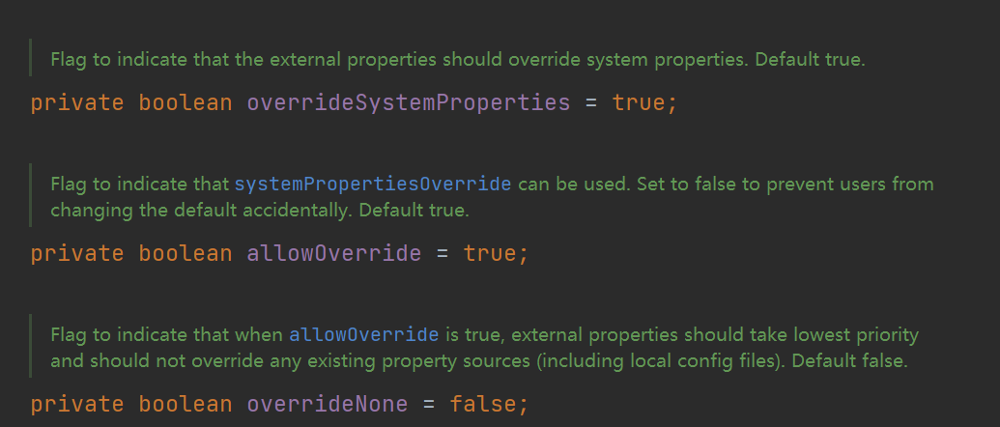

# Spring Cloud 概览

项目中使用的注册中心是**Eureka**。

* Eureka Server
* Eureka Client
  * Eureka Client Consumer
  * Eureka Client Provider

**网关（gateway）**：系统唯一对外的入口，介于服务器端与客户端之间，用于对请求进行鉴权、限流、路由、监控等功能。

* **Zuul：**路由和过滤，这两个功能最重要（Router and Filter）。

对于分布式系统，不应该在每个应用，每个应用下去分别修改配置文件，再重启应用（直接抛弃了可用性）

**Spring Cloud Config**：既能对配置文件统一进行管理，又能在项目运行时统一，动态修改配置文件。（将各个应用/系统/模块的配置文件存放到统一的地方管理——Git或SVN）。

# SpringCloud配置文件加载顺序

**优先级由高到低：**

* 操作系统配置项（System properties）——JVM的配置。
* 环境变量（env vars）
* config server中的远程配置文件
* 本地application.yml
* 本地bootstrap.yml

加载顺序：bootstrap.yml——config server——application.yml——环境变量——操作系统配置，即从优先级低的开始加载，虽然config server中的远程配置先加载，但是在**默认配置**下，不会被本地的配置文件覆盖。

通过`spring.cloud.config.allowOverride`、`spring.cloud.config.overrideNone`、`spring.cloud.config.overrideSystemProperties`来配置本地配置文件能否覆盖远程配置文件，**默认配置下**远程配置文件的优先级最高，不会被本地配置文件覆盖。

