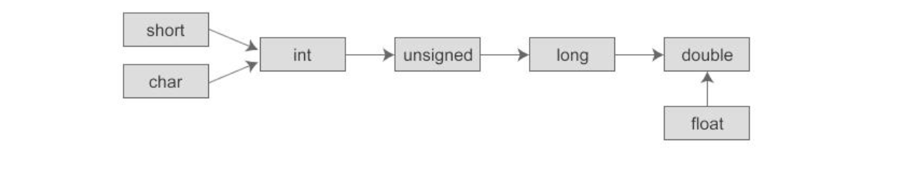

# Unicode 和 UTF-8 的区别

* Unicode是一种标准，包含了[字符集]和编码方式（UTF-8，UTF-16，UTF-32等）

* UTF-8是 [ 编码规则 ]，即Unicode的实现方式，维基百科上解释为***\*编码方式（Character Encoding）\****

  Java中char类型占用的字节，取决于采用的编码方式，使用UTF-8，则英文字符占用一个字节，汉字占用三个字节。

字符集：为每一个「字符」分配一个唯一的 ID（学名为码位 / 码点 / Code Point）

编码规则：将「码位」转换为字节序列的规则（编码/解码 可以理解为 加密/解密 的过程）


# 超类变量引用子类对象

超类变量引用子类对象时，不能调用超类中没有而子类中存在的方法。

如果子类中覆写（overwrite）了超类中的方法，那么调用的是覆写（overwrite）后的方法，否则调用超类中原来的方法。

如果为了要使用子类的方法，那么可以**重新将引用了子类的超类对象强转成子类对象**（即恢复成子类对象）。


# foreach无法初始化对象数组

```java
// 声明一个链表数组，但其中的每一个元素（链表）并没有初始化，全部是null
LinkedList<Integer>[] a = (LinkedList<Integer>[]) new LinkedList[10];

for (int i = 0;i < 10;i++) {
    a[i] = new LinkedList<>(); // 需要使用带下标的for循环来对他进行初始化
}

for (LinkedList<Integer> list : a) {
    list = new LinkedList<>(); // 使用foreach循环，无法初始化
}
```

**原因：**

当对量数组是空的时候，比如这里的链表数组，foreach循环变量得到的指针实际上是null。

1. 如果对foreach的变量进行初始化操作，new 某个对象，确实是返回了一个指针，只不过这个指针赋给了foreach中的临时变量，而不是赋给了数组中元素的指针变量。所以并不会对数组初始化成功。
2. 采用带下标的for循环，a[i] 就是数组中元素的指针变量，new 对象之后，返回的指针直接赋给了数组中的元素，所以能够初始化对象。
3. 如果对象数组已经初始化成功了，使用foreach，临时变量拿到的是，数组元素的指针变量，指向堆内存中的实例，是可以修改对象数组中的元素的。（也可以这样说，**foreach可以修改对象数组中对象的内容，而不能修改对象数组中对象的本身**）。


# 包装类型不可变

所有原始的包装类（Integer，Byte，Long，Float，Double，Character，Boolean和Short），在Java中都是不可变的，加法，减法等改变数值的操作实际上是创建了一个新的对象，而不会修改旧的对象。


# Long和int

Java中输入数字默认是int类型，int类型强转成long类型不会丢失信息（32位int直接转成long的低32位）。

如果想要Long类型的数字，可以写成`60L`

int 类型范围：**-2147483648 ~ +2147483647**（左闭右开，左边可以取到2的32次方，右边取到2的31次-1）

**其他类型也是左闭右开**


# >> 和 >>> 的区别

```java
>> 表示带符号右移，符号位不变，次高位开始右移，高位补0
>>> 表示无符号右移，符号位也参与右移，高位补0
```


# HashMap的一些注意点

* HashMap**默认的长度是16**。

* JDK1.8中，**链表转换成红黑树的情况**：

  * 当**链表长度超过8时**，先判断table长度是否小于64，如果**长度小于64**，先通过扩容的方法解决冲突；如果**长度大于64**，通过把链表转换成红黑树解决冲突。

  * 链表长度大于8的情况：

    * table长度足够，hash冲突过多

    * hash没有冲突，但是在计算table下标的时候，由于table长度太小，导致很多hash不一致的key计算的下标一致

    * **第二种情况是可以通过扩容来解决的，所以先判断table的长度是否小于64**

      

* JDK1.8中，**红黑树转换成链表的情况：**

  * hashMap的红黑树不一定小于6的时候才会转换为链表，而是只有在resize的时候才会根据 UNTREEIFY_THRESHOLD 进行转换。


* a mod(%) b，模运算的消耗还是比较大的。

  **HashMap源码中使用位操作代替取模，加快速度**

  HashMap源码中固定链表数组长度为2的幂次，所以使用`a & (b - 1)` **等价于对length取模**，加快取模操作。


在JDK1.7中由于链表使用头插法，在并发的情况下有可能会导致循环链表的产生。在JDK1.8中进行了优化，使用了 loHead、loTail（保存数组下标不变化的节点链表）和hiHead、hiTail（保存移动到，原下标+oldCap，位置上的节点），不会导致循环链表的产生，但是会出现数据损失（有可能其他线程的hiHead还是null，在这个线程扩容的时候，可能会覆盖其他线程已经扩容完成的数组，导致数据损失）。


# 基本数据类型数组默认的初始值

```java
int[]       // 默认所有值为0
boolean[]   // 默认所有值为false
double[]    // 默认所有值为0.0
```


# 自动类型转换规则

低级的类型向更高级的类型转换。

