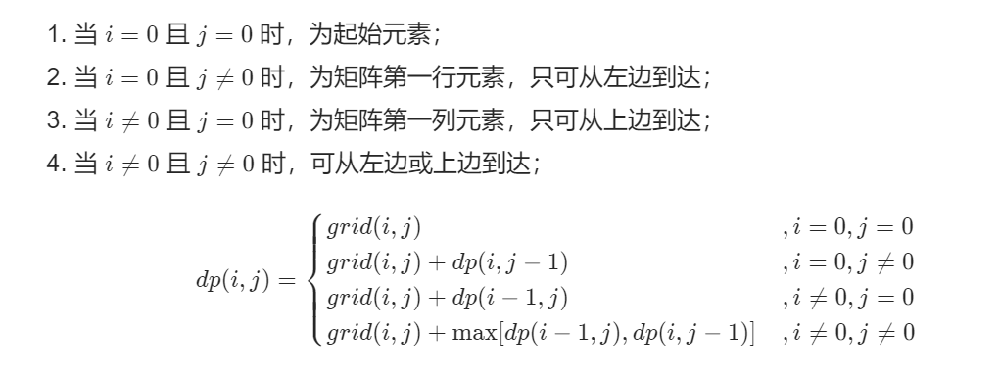
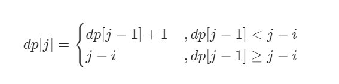

# DP问题

* 重叠子问题
* 最优子结构——求最值，**子问题间必须相互独立**

如何解决：

* 最简单的情况（Base Case）是什么？
* 有什么“状态”？
* 做什么“选择”使得“状态”发生改变？——状态转移方程
* 如何用dp数组表示“状态”和“选择”？


模板：

```
# 初始化base case
dp[0][0][...]
for 状态1 ：状态1的所有取值：
	for 状态2 ：状态2的所有取值：
		for ...
			dp[状态1][状态2][...] = 求最值（选择1，选择2，选择3）
```


# 70. 爬楼梯

**思路一：**动态规划

使用f(x)表示爬到第x级台阶的方案数，考虑最后一步可能跨了一级台阶，也可能跨了两级台阶，所以可以得到下面的式子：
$$
f(x) = f(x-1) + f(x-2)
$$
**公式的个人理解：**

最后一步跨一步 + 跨到第x-1级台阶的方案数 = 跨到第x级台阶的方案数

最后一步跨两步 + 跨到第x-2级台阶的方案数字 = 跨到第x级台阶的方案数

由于最后一步只跨一步，所以最后一步跨一步的组合方式就等于f(x - 1)，跨两步的组合方式就等于f(x - 2)。


正好就是斐波那契数列。

考虑边界问题，考虑从第0级开始往上爬，从0级爬到0级只有一种方案，f(0) = 1

从第0级爬到第1级，只有一种方案，f(1) = 1

使用**滚动数组的思想**把空间复杂度优化成O(1)。

```java
class Solution {
    public int climbStairs(int n) {
        int p = 0, q = 0, r = 1;
        for (int i = 0;i < n;i++) {
            p = q;
            q = r;
            r = p + q;
        }
        return r;
    }
}
```


思路二和思路三可以看官方题解

**思路二：**矩阵快速幂

**思路三：**特征方程，直接计算多项式


# 53. 最大子序和

使用 f(i) 表示以第 i 个数结尾的**连续子数组的最大和**，所以要求的就是 i 在0到 n - 1 之间的 f(i) 的最大值。

使用 a<sub>i</sub> 表示nums[i]，连续子数组考虑 a<sub>i</sub> 成为单独的一段还是加入 f(i - 1) 对应的那一段，这就取决于 a<sub>i</sub> 和 f(i - 1) + a<sub>i</sub> 的大小，我们希望获得一个比较大的。

得到动态规划转移方程：
$$
f(i) = max\{f(i-1)+a_i, a_i\}
$$
类似**滚动数组**的思想，使用pre来保存 f(i - 1) 的值，每次遍历新的 a<sub>i</sub> ，更新最大值。

每次遍历新的 a<sub>i</sub> 时，如果 f(i - 1) 加上了 a<sub>i</sub> ，比 a<sub>i</sub> 还小，f(i - 1) 就设置成 a<sub>i</sub> ，a<sub>i</sub> 重新作为新的子数组的起点。

因为后面的数再往上加，要保证只大不小，如果前面的字数组的和还不如 a<sub>i</sub> 大，就抛弃前面所有的值，从 a<sub>i</sub> 开始重新作为子数组的起点。

```java
class Solution {
    public int maxSubArray(int[] nums) {
        int pre = 0, maxResult = nums[0];
        for (int x : nums) {
            pre = Math.max(pre + x, x);
            maxResult = Math.max(pre, maxResult);
        }

        return maxResult;
    }
}
```


# 121. 买卖股票的最佳时机

**思路一：**暴力遍历求解，最直接明了的方法

**思路二：**一次遍历（动态规划）


**想象自己真的在买股票，我们肯定希望在历史最低点买入股票：由于我们知道所有的数据，所以可以耍赖皮。**

依次遍历数组，记录一个局部最小值 `minPrice`，那么在第 i 天卖出股票时得到的利润就是 `prices[i] - minPrice` 。

遍历的时候不断更新局部最小值和利润，这样遍历一遍数组之后就能得到最大利润。

```java
class Solution {
    public int maxProfit(int[] prices) {
        if (prices.length == 0) return 0;
        int minPrice = prices[0], profit = 0;
        for (int i = 0;i < prices.length;i++) {
            // 自己的方案
            // 先计算今天卖出的利润，如果比之前多，就更新利润；然后看今天的价格是不是局部最小
            if ((prices[i] - minPrice) > profit) profit = prices[i] - minPrice;
            if (prices[i] < minPrice) minPrice = prices[i];
            // 下面是官方题解，先一直遍历找到局部最小，然后更新利润
            // if (prices[i] < minPrice) minPrice = prices[i];
            // else if ((prices[i] - minPrice) > profit) profit = prices[i] - minPrice;
        }
        return profit;
    }
}
```


# 1477. 找两个和为目标值且不重叠的子数组


使用 *f*(j)， *f*(*j*) 表示当前 j 以及 j 之前的满足条件的最小区间长度，假如当前区间为`[i, j]`，

**状态更新规则**为：
$$
f(j) = min(f(j-1), j - i + 1),if\quad sum = target
$$

**答案更新规则**为：
$$
answer = min(answer, f(i-1) + j - i + 1)
$$
答案更新规则保证了两个区间是不重叠的，*f(i - 1)* 和 j - i + 1。

表示当前以j结尾的满足条件的区间长度与i-1之前的最小的区间长度之和，这样就能满足两个窗口不重叠且长度之和最小。

代码中当sum大于target时，把 i 向后移动一位，是因为要寻找连续的子数组，并且 dp 数组中存储的是以 j 结尾或 j 之前的区间长度。

```java
class Solution {
    public int minSumOfLengths(int[] arr, int target) {
        int n = arr.length;
        int[] dp = new int[n]; // 存储以j结尾，以及j之前，满足条件的连续子数组的最小长度
        // 使用MAX_VALUE的一半，比最大可能的和大，保证能够更新answer
        Arrays.fill(dp, Integer.MAX_VALUE / 2); // 不使用MAX_VALUE，answer相加会溢出
        int answer = Integer.MAX_VALUE;         
 
        for (int i = 0, j = 0, sum = 0;j < n;j++) {
            sum += arr[j];
            // 当sum大于target时，
            while (i <= j && sum > target) {
                sum -= arr[i++];
            }

            // 找到满足条件的一个区间
            if (sum == target) {
                dp[j] = j - i + 1;
                if (i != 0) {
                answer = Math.min(answer, dp[i-1] + j - i + 1); // 更新答案
                }
            }
            // 更新状态
            if (j != 0) {
                dp[j] = Math.min(dp[j - 1], dp[j]); // dp[j]默认是比最大的长度还要大的，如果不符合sum == target，dp[j]代表的就是j以前的最小区间长度
            }
        }
        return answer > arr.length ? -1 : answer;

    }
}
```


# 面试题42. 连续子数组的最大和

**参考官方题解：**

**状态定义：**设动态规划列表dp，dp[i] 代表以元素**nums[i]为结尾的连续子数组的最大和**。

* 包含dp[i]包含nums[i]的原因：保证dp[i - 1]递推到dp[i]的正确性；如果不包含nums[i]，递推时不满足 **连续子数组** 的要求。


**转移方程：**若dp[i - 1] **<=** 0，说明 dp[i - 1] 对 dp[i] 产生负贡献，即 dp[i - 1] + nums[i] 还不如 nums[i] 本身大。

* 当 dp[i - 1] > 0 时：执行 dp[i] = dp[i - 1] + nums[i]
* 当 dp[i - 1] <= 0 时：执行dp[i] = nums[i]


**初始状态：**dp[0] = nums[0]，当只有 nums[0] 一个数时，nums[0] 就是连续子数组和的最大值。


**返回值：**返回dp列表中的最大值，代表全局最大值。


**降低空间复杂度：**

* 由于 dp[i] 只与 dp[i - 1] 和 nums[i] 有关系，所以可以直接复用 nums[] 数组，将 nums[] 数组当成dp列表，在 nums[] 数组上做修改
* 省去了dp列表的额外空间，空间复杂度从O(N)降低至O(1)

```java
class Solution {
    public int maxSubArray(int[] nums) {
        int result = nums[0];
        for (int i = 1;i < nums.length;i++) {
            nums[i] += Math.max(nums[i - 1], 0);
            result = Math.max(nums[i], result);
        }
        
        return result;
    }
}
```


# 303. 区域和检索-数组不可变

**方法一：**暴力解

要什么范围就从什么范围for循环查询，时间复杂度 O(n)，空间复杂度O(1)


**方法二：**空间换时间（缓存）

把所有可能的结果全部算出来，放在HashMap中，要什么就返回什么，查询平均时间复杂度O(1)（O(n<sup>2</sup>)用来预运算），空间复杂度O(n<sup>2</sup>)


**方法三：**缓存

优化方法二，方法二需要的空间非常大

定义 **sum[k] 为nums下标 0 ~ k-1 的和，包含 0 和 k-1 两个端点**：
$$
sum[k] = \{ {\sum^{k-1}_{0} nums[i],k > 0  \atop 0,k = 0}
$$
sumrange（i，j）可以按下面的方式计算：
$$
sumrange(i,j) = sum[j + 1] - sum[i]
$$
sum[k] 定义为到 k-1 的和原因是为了，消除计算 sumrange（0，0）时需要做的额外判断。
$$
sumrange(0,0) = sum[1] - sum[0] = nums[0]
$$
如果 sum[k] 定义为到 k 的和，那么需要对0这种特殊情况做额外判断
$$
sumrange(0,0) = sum[0] - sum[-1]
$$


```java
class NumArray {
    private int[] sum;
    public NumArray(int[] nums) {
        sum = new int[nums.length + 1];
        sum[0] = 0;
        for (int j = 1;j < sum.length;j++) {
            sum[j] = sum[j - 1] + nums[j - 1];
        }
    }
    
    public int sumRange(int i, int j) {
        return sum[j + 1] - sum[i];
    }
}
```


# 面试题 17.16 按摩师

实际上和爬楼梯问题类似，只不过这里最密集的情况只能隔一个取和（最后得到的最长时间不一定是最密集的情况）。

设以第i号客人为结尾时最长的时长为 *f(i)* ，有以下的状态转移方程
$$
f(i) = max(f(i-1), f(i-2) + nums[i] \\
初始状态:\\f(0) = nums[0]\\f(1) = max(f(0), f(1))
$$
可以设一个dp数组，dp[i] 存放的就是以第i号客人为结尾时的最长时长。

由于这里的状态转移方程只涉及到了 f(i-1), f(i-2)，所以可以不需要用数组把所有数都存下来。

只使用三个变量 dp_2, dp_1, dp 代表 f(i-2)，f(i-1) 和 f(i)

```java
class Solution {
    public int massage(int[] nums) {
        int N = nums.length;
        if (N == 0) return 0;
        int dp_2 = 0, dp_1 = 0, dp = nums[0];
        for (int i = 0;i < N;i++) {
            dp = Math.max(dp_1, dp_2 + nums[i]);
            dp_2 = dp_1;
            dp_1 = dp;
        }
        return dp;
    }
}
```


# 392. 判断子序列

**方法一：**双指针，遍历

```java
class Solution {
    public boolean isSubsequence(String s, String t) {
        // if (t.isEmpty() && s.isEmpty()) return false;
        if (s.isEmpty() || s.isEmpty()) return true;
        int index = 0;
        for (int i = 0;i < t.length();i++) {
            if (index >= s.length()) break;
            if (t.charAt(i) == s.charAt(index)) {
                index++;
            }
        }
        return index == s.length();
    }
}
```


**方法二：**动态规划（但是时间慢很多，为了解决进阶问题，当有很多个字符串 s 需要匹配的时候，不需要再去遍历字符串 t 了）

使用方法一，如果只匹配一个字符串的时候，速度确实比方法二快，但是要匹配多个字符串时，每次匹配都要去遍历字符串t，非常花时间

方法二的思路：https://leetcode-cn.com/problems/is-subsequence/solution/pan-duan-zi-xu-lie-by-leetcode-solution/

对官方题解的代码增加了一些注释

```java
class Solution {
    public boolean isSubsequence(String s, String t) {
        int n = s.length(), m = t.length();

        int[][] f = new int[m + 1][26];
        for (int i = 0; i < 26; i++) {
            f[m][i] = m;
        }

        for (int i = m - 1; i >= 0; i--) {
            for (int j = 0; j < 26; j++) {
                if (t.charAt(i) == j + 'a')
                    f[i][j] = i;  // 如果当前位置为字符j，将f[i][j]设置为i，
                                  // 保证f[i][j]保存的是i位置后字符j第一次出现的位置
                                  // 即使后面某个位置出现了字符j，但是当前位置也出现了，
                                  // 当前位置更靠前，所以直接设置成i（逻辑上是一种位置上的更新）
                else              
                    f[i][j] = f[i + 1][j];
            }
        }
        int add = 0;
        for (int i = 0; i < n; i++) {
            if (f[add][s.charAt(i) - 'a'] == m) { // 如果当前字符在i之后出现的位置是m，t中说明不存在这个字符
                return false;
            }
            add = f[add][s.charAt(i) - 'a'] + 1; // 如果存在，直接跳到字符下次出现位置的下一个位置，因为字符已经找到了，所以直接跳到下一个位置，并且f最大设置成m，不会越界
        }
        return true;
    }
}

```


# 面试题 16.17. 连续数列

和这道题一样

> 53. 最大自序和

这次放上第二次做的代码

```java
class Solution {
    public int maxSubArray(int[] nums) {
        int dp_1 = nums[0], dp = 0, answer = nums[0];
        for (int i = 1;i < nums.length;i++) {
            dp = Math.max(dp_1 + nums[i], nums[i]);
            dp_1 = dp;
            answer = Math.max(answer, dp); // 更新全局最大值
        }
        return answer;
    }
}
```


# 剑指offer 46. 把数字翻译成字符串

令$f(i)$为：以第i为数字为结尾时，能够得到的翻译的数量。

分两种情况：

* 第 i 位单独作为一位翻译的时候，对$f(i)$做的贡献为$f(i-1)$
* 由于数字范围在10-25之间，所以第 i 位只存在和第 i - 1 位构成数字的可能性。如果第 i 位能和第 i - 1 位构成数字，那么对$f(i)$做的贡献为$f(i-2)$。

**状态转移方程**为：
$$
f(i) = f(i-1)[i - 1 >= 0] + f(i - 2) [构成的数字在10-25之间]
$$
**初始状态：**

$f(-1) = 0$        $f(0) = 1$

**小细节：**`(chars[i - 1] - '0') * 10 + chars[i] - '0'` 的方式来计算，第 i - 1 位和第 i 位构成的数字是否在范围内，这样做没有办法排除 06，07，08 这种情况，所以需要对第 i - 1 位的数值做额外的判断。

```java
class Solution {
    public int translateNum(int num) {
        char[] chars = Integer.toString(num).toCharArray();

        int p = 1, q = 1, r = 1;
        for (int i = 1;i < chars.length;i++) {
            r = q; // f(i - 1)
            int tmp = (chars[i - 1] - '0') * 10 + chars[i] - '0';
            if ((chars[i - 1] - '0' != 0) && tmp >= 0 && tmp <= 25) { // 第i - 1位为0时，不能组成大于10，小于25的数，所以需要排除这种情况
                r += p; 
            }
            p = q;
            q = r;
        }

        return r;
    }
}
```


# 剑指offer 47. 礼物的最大价值

一开始使用dfs，发现在数组比较大的情况大就超时了。

使用动态规划。由题意可知，只可能从**左边**或者**上边**到达某个单元格。

* **状态定义：**令$f(i,j)$为，从左上角到达点（i，j）的礼物最大的累计价值，使用`dp[][]`数组来存储状态。

* **状态转移方程：**

  * 当 i = 0 ，j = 0 时，`dp[i][j] = grid[0][0]`
  * 当 i = 0 时，即在第一行时，只能从左边到达，`dp[0][j] = dp[0][j - 1] + grid[0][j]`
  * 当 j = 0 时，即在第一列时，只能从上边到达，`dp[i][0] = dp[i - 1][0] + grid[i][0]`
  * 当 i != 0 且 j != 0，`dp[i][j] = grid[i][j] + Math.max(dp[i - 1][j], dp[i][j - 1]) `

  

由于 `dp[i][j]` 只和 `grid[i][j]` 与 `dp[i][j - 1]` 和 `dp[i - 1][j]` 有关，所以可以直接使用grid数组来代替dp数组，直接岱grid数组上做修改，降低空间复杂度。


**第一种写法：**这种写法最契合上面的思路，但是当数组很大的时候，第一行和第一列只占很小的一部分，循环的时候每次对 i == 0 和 j == 0 做判断，会浪费很多时间。

```java
class Solution {

    private int res = Integer.MIN_VALUE;

    public int maxValue(int[][] grid) {

        for (int i = 0;i <grid.length;i++) {
            for (int j = 0;j < grid[0].length;j++) {
                if ((i == 0) && (j == 0)) continue;
                if (i == 0) grid[i][j] += grid[i][j - 1];
                else if (j == 0) grid[i][j] += grid[i - 1][j];
                else grid[i][j] += Math.max(grid[i - 1][j], grid[i][j - 1]);
            }
        }

        return grid[grid.length - 1][grid[0].length - 1];
    }
}
```


所以**先初始化第一列和第一行的dp数组**，再对剩下的单元格进行dp。

```java
class Solution {

    private int res = Integer.MIN_VALUE;

    public int maxValue(int[][] grid) {
        int m = grid.length, n = grid[0].length;

        for (int j = 1;j < n;j++) {  // 初始化第一行
            grid[0][j] += grid[0][j - 1];
        }

        for (int i = 1;i < m;i++) { // 初始化第一列
            grid[i][0] += grid[i - 1][0];
        }

        for (int i = 1;i < m;i++) { // 对剩下的坐标进行dp
            for (int j = 1;j < n;j++) {
                grid[i][j] += Math.max(grid[i - 1][j], grid[i][j - 1]);
            }
        }

        return grid[m - 1][n - 1];
    }
}
```


# 剑指offer 48. 最长不含重复字符的子字符串

* **状态定义：**设动态规划列表dp，dp[j]代表**以字符s[j]结尾**的“最长不重复子字符串”的长度。

* **状态转移方程：**固定右边界j，设字符s[j]左边距离最近的相同字符为s[i]，即s[i] = s[j]。

  1. 当 i < 0，即左边不存在相同字符的时候，dp[j] = dp[j - 1] + 1
  2. 当 j - i $>$ dp[j - 1] 时，说明s[i]，在 dp[j - 1] 的范围外，dp[j] = dp[j - 1] + 1
  3. 当 j - i $\leq$ dp[j - 1] 时，说明s[i]，在 dp[j - 1] 的范围内，dp[j]  = j - i

  其中1和2的结果相同，可以合并起来（处理时，如果不存在相同字符，返回索引 -1，所以情况1可以归成情况2的一种）

  

通过HashMap来存储**离 s[j] 最近**的相同字符的索引，如果字符第一次出现，返回-1，为了合并1和3两种情况。

```java
class Solution {
    public int lengthOfLongestSubstring(String s) {
        Map<Character, Integer> dic = new HashMap<>(); // 用来存储已经出现过的，离下标j字符最近的相同字符的下标

        int res = 0, tmp = 0; // tmp是以第j位字符结尾的，最长子序列的长度，即dp[j]
        for (int j = 0;j < s.length();j++) {
            int i = dic.getOrDefault(s.charAt(j), -1); // 取出离j最近的相同字符的下标i；如果不存在返回-1，此时j-i必定会大于dp[j-1]
            dic.put(s.charAt(j), j); // 更新j位置字符的最新下标，或新增s[j]字符的下标
            tmp = (j - i) > tmp ? tmp + 1 : j - i; 
            if (tmp > res) res = tmp;
        }

        return res;
    }
}
```


**还可以使用双指针的做法：**

双指针实际是，以每一个字符为起点，然后向右一直遍历，直到遇上在字串中重复的字符，最后取全局最大值。**使用Set来保存当前字串中出现的所有字符，用来判断下一个字符是否重复了**

左指针每往右移动一位，就从set中删除左指针指向的上一个字符；接着右指针向右继续查找，直到遇上重复字符，每向右移动一位，向set中添加一个字符。

**子串起始位置递增时，结束的位置也是递增的。**因为起始位置向右移动一位时，新的起点到原来的结束位置都是不重复的，此时右指针可以继续向右查找到重复的字符。

```java
class Solution {
    public int lengthOfLongestSubstring(String s) {
        Set<Character> set = new HashSet<>(); // 使用set来存储当前子串中的所有字符
        int N = s.length();
        int res = 0, rk = -1; // rk为-1，表示右指针在字符串的左侧，还未开始移动，所以在下面的循环中，要先取rk + 1下标的字符，判断这个字符是否已经出现过
        for(int i = 0;i < N;i++) {
            if (i != 0) { // 左指针向右移动一位，当i=0时，不需要从set中删除字符
                set.remove(s.charAt(i - 1)); // 进入下一个循环后，删除集合中上一个下标表示的字符
            }
            while(rk + 1 < N && !set.contains(s.charAt(rk + 1))) { // 右指针一直向右移动，直到碰上重复字符；先确定下一个字符是不重复的，才将右指针向右移动一位
                set.add(s.charAt(rk + 1));
                rk++;
            }
            if (rk - i + 1 > res) res = rk -i + 1;
        }

        return res;

    }
}
```


# 剑指offer 49. 丑数

**关键思路：**丑数只包含质因子2，3，5，因此有“**丑数=某较小丑数$\times$某因子(2,3,5)**，例如10=5$\times$2“，因为质数乘上质数一定不为质数，所以，丑数乘上(2,3,5)中的其中一个因子后，新数的质因子仍然是(2,3,5)。


**状态定义：**dp[i] 代表第 i + 1 个丑数。

**转移方程：**

1. 当索引a、b、c满足下列，dp[i]为三种情况的最小值

2. 每轮计算dp[i]后，需要更新a、b、c索引的值，使其始终满足方程条件。**分别独立判断** dp[i] 和 dp[a]$\times$2、dp[b]$\times$3 和 dp[c]$\times$5 是否相等。
   $$
   \begin {cases} 
   dp[a] \times 2 > dp[i - 1] \geq dp[a-1] \times 2\\
   dp[b] \times 3 > dp[i-1] \geq dp[b-1] \times3 \\
   dp[c] \times 5 > dp[i-1] \geq dp[c-1] \times 5
   \end {cases}
   $$

**初始状态：**dp[0] = 1，第一个丑数为1

**返回值：**dp[n - 1]，第n个丑数


评论中的另一种理解：每一个丑数都要乘上因子2、3、5，这样才不会漏掉某些丑数。这个时候，索引a、b、c 表示的是，已经乘上了因子2、3、5的丑数的个数。


虽然思路看起来很多过程，但是代码实现起来比较简单，因为从第一个丑数（既1）开始递推，dp数组中的丑数始终是递增的，所以a、b、c三个索引只要逐个递增即可，每次取三种情况的最小值。

```java
class Solution {
    public int nthUglyNumber(int n) {
        
        int a = 0, b = 0, c = 0; // a是乘2的数字的下标，b是乘3的，c是乘5的
        int[] dp = new int[n];   // dp[i]表示第i+1个丑数
        dp[0] = 1;

        for (int i = 1;i < n;i++) {
            int n2 = dp[a] * 2, n3 = dp[b] * 3, n5 = dp[c]*5;
            dp[i] = Math.min(Math.min(n2, n3), n5);
            if (dp[i] == n2) a++;  // 如果dp[i]等于前面的丑数乘上2，那么说明a索引加一
            if (dp[i] == n3) b++;  // 同上
            if (dp[i] == n5) c++;  // 同上，a，b，c三个索引全部要判断一次，因为有可能出现三个同时相同的情况
        }

        return dp[n-1];
}
}
```


# 剑指offer 60. n个骰子的点数

动态规划一般分三步：

1. 状态定义（**分析状态时不要分析整体，分析最后一个阶段即可**。因为动态规划问题都是分为多个阶段的，各个阶段的状态表示都是一样的，而我们想要的结果在最后一个阶段）
2. 状态转移方程
3. 边界条件（初始条件）


**状态定义：**

使用一个 `dp[n][j]` 数组来保存抛n个骰子的时候，数字和$j$出现的次数。第一维表示抛n个骰子，第二维下标$j$表示数字和，二位数组中存放的值是数字和$j$出现的次数。


**状态转移方程：**
$$
dp[n][j] = \sum ^{6}_{cur = 1}dp[n-1][j-cur]
$$
每一阶段的状态都由上一阶段的前六个状态决定（这个阶段的和$j$出现的次数，和上一阶段和$j-1, j-2,j-3,j-4,j-5,j-6$出现的次数有关，因为多一个骰子，所以这个数出现的次数和上一阶段的这几个数相关）。


**初始状态：**

每种数的总和都是1

`dp[1][j] = 1`，$j\in[1,6]$


最后统计出n个骰子所有数的次数总和后，计算概率即可。

**n个骰子可能会出现的总和在$[n,6n]$范围中，n个骰子都是1点时，总和最小为n，n个骰子都是6点时，总和最大为6n，且中间每个数都会出现。这是由动态规划递推关系得到，每个阶段的各种总数和都由上个阶段推出，初始状态是连续的，所以后面的阶段也一定是连续的**

```java
class Solution {
    public double[] dicesProbability(int n) {
        int[] dp = new int[70]; // dp数组,数组下标就是点数和，dp[j]代表某个阶段（投n个骰子时）点数j出现的次数

        for (int i = 1;i <= 6;i++) { // 初始化数组，即抛一枚骰子的情况
            dp[i] = 1;
        }

        for (int i = 2;i <= n;i++) { // 从两枚骰子开始dp
            for (int j = 6 * i;j >= i;j--) { // 为了复用dp数组，j从 6*i 开始（即从后往前开始存计算新一阶段点数的次数），如果j从i开始（即从前往后计算），那么上一阶段的信息被覆盖后就丢失了
                dp[j] = 0; // 覆盖上一阶段在点数j出现次数的信息，因为这一阶段的点数j出现的次数只和上一阶段[j-6,j-1]点数出现的次数有关
                for (int cur = 1;cur <= 6;cur++) {
                    if (j - cur < i - 1) break;
                    dp[j] += dp[j - cur];
                }
            }
        }
        
        // 抛n个骰子，点数和的可能值为[n, 6*n]，n个1时最小，n个6时最小，
        // 并且范围中的所有数都存在，因为每个阶段的数j，可以由上个阶段前六个数得到
        double[] res = new double[6 * n - n + 1];
        double all = Math.pow(6, n); // n个骰子所有可能的点数的总数
        for (int i = 0;i < 6 * n - n + 1;i++) {
            res[i] = dp[n + i] / all;
        }
        return res;
    }
}
```


# 剑指offer 66. 构建乘积数组

本质思想是，用两个$dp$数组来保存下标$i$左侧的乘积和下标$i$右侧的乘积。

题解只用了一个数组优化了这个步骤，并只使用了两次循环。

* 第一次循环将每一个下标$i$左侧的乘积直接保存在$b[i]$中，即从上到下计算对角线下三角的部分。

* 第二次循环，下标$i$右侧的乘积保存在 `tmp` 临时变量中，计算出 `tmp` 之后并与$b[i]$相乘，最后得到的就是结果。


**题解：**

```java
class Solution {
    public int[] constructArr(int[] a) {
        if (a.length == 0) return a;
        int N = a.length;
        int[] b = new int[N];

        b[0] = 1;
        for (int i = 1;i < N;i++) { // 第一遍循环，b[i]中保存的是i左侧的乘积
            b[i] = b[i - 1] * a[i - 1];
        }

        int tmp = 1; // 实际上保存的是i右侧的乘积，直接乘b[i]后保存到b[i]中就是最后的结果
        for (int i = N - 2;i >= 0;i--) { // 计算i右侧乘积时，需要由下向上计算，因为递推肯定是从少到多递推的
            tmp *= a[i + 1];
            b[i] *= tmp;
        }

        return b;
    }
}
```


**直接按照dp思路的解法：**

```java
class Solution {
    public int[] constructArr(int[] a) {
        if (a.length == 0) return a;
        int N = a.length;
        // left保存的是下标i左侧的乘积，right保存的是下标i右侧的乘积。
        int[] b = new int[N], left = new int[N], right = new int[N];

        left[0] = 1;right[N - 1] = 1;
        for (int i = 1;i < N;i++) {
            left[i] = left[i - 1] * a[i - 1];
        }
        for (int i = N - 2;i >= 0;i--) {
            right[i] = right[i + 1] * a[i + 1];
        }
        for (int i = 0;i < N;i++) {
            b[i] = left[i] * right[i];
        }
        return b;
    }
}
```


# 剑指offer 19. 正则表达式的匹配

https://leetcode-cn.com/problems/zheng-ze-biao-da-shi-pi-pei-lcof/solution/zhu-xing-xiang-xi-jiang-jie-you-qian-ru-shen-by-je/

```java
class Solution {
    public boolean isMatch(String s, String p) {
        int m = s.length();
        int n = p.length();

        boolean[][] dp = new boolean[m + 1][n + 1]; // dp[i][j]表示字串的前i个字符和正则串的前j个字符是否匹配

        for (int i = 0;i <= m;i++) {
            for (int j = 0;j <= n;j++) { // 空正则串
                if (j == 0) {
                    dp[i][j] = (i == 0); // 空正则串可以和空字串匹配，其他不行
                }                 
                else { // 非空正则串
                    if (p.charAt(j - 1) != '*') { // 正则串第j个字符，为字母或者'.'
                        if (i > 0 && (p.charAt(j - 1) == s.charAt(i - 1) || p.charAt(j - 1) == '.')) {
                            dp[i][j] = dp[i-1][j-1];
                        }
                    }
                    else { // 正则串第j个字符，为'*'
                        if (j >= 2) { // 不看c*，计数为0次
                            dp[i][j] |= dp[i][j - 2]; 
                        }
                        if (i >= 1 && j >= 2 && (s.charAt(i - 1) == p.charAt(j - 2) || p.charAt(j - 2) == '.')) { // 看c*，计数为1次
                            dp[i][j] |= dp[i - 1][j]; // 一定要用或，因为如果看和不看有一种可以匹配成功的话，那dp[i][j]一定为true，而不是直接赋值
                        }
                    }

                }
            }
        }
        

        return dp[m][n];
    }
}

```


# Hot100-5. 最长回文子串

**状态定义：**$dp[i][j]$表示：起点下标为$i$，终点下标为$j$的子串，是否是回文串。

如果$s[i:j]$是回文串，那么$s[i+1:j-1]$（即两边同时往里缩进一位也是回文串）

从短子串到长子串的**状态转移方程**分为三种情况：

1. 当子串长度为1时，必定是回文串：$dp[i][i]=true$
2. 当子串长度为2时，取决于两个字符是否相等：$dp[i][j]=(s.charAt(i)==s.charAt(j))$
3. 当子串长度大于3时，取决于$dp[i+1][j-1]$的状态和两端的字符是否相同：$dp[i][j]=dp[i+1][j-1]\&\&(s.charAt(i)==s.charAt(j))$
4. 代码实现，动态规划是从单个字符开始递推的，即$l$从0开始，一直到n-1。从短回文串一直递推到长回文串。

```java
class Solution {
    /**
        动态规划的方法，相当于是把所有可能长度的子串都验证了一遍是否是回文串
        使用额外的空间减少了验证回文串需要的时间
        （原先自己的方法，验证回文串是比较每一个对称的字符是否相同，时间复杂度比较大）
    */
    public String longestPalindrome(String s) {
        String res = "";    // 不能是null，否则第一次取长度会报空指针一样，初始化为""空字符串
        int n = s.length();
        boolean[][] dp = new boolean[n][n]; // dp[i][j]表示字串中起始下标i，结尾下标j的子字串，是否为回文串
        for(int l = 0;l < n;l++) { // l是字符串的长度-1，从0开始是为了让单个字符也构成一个字串，保证单个字符的回文串情况也计算进去
            for (int i = 0;i + l < n;i++) { // i + l是字串的结尾下标
                int j = i + l;
                if(l == 0) { // 当子串长度为1的情况
                    dp[i][j] = true;
                }
                else if(l == 1) { // 当子串长度为2的情况
                    dp[i][j] = (s.charAt(i) == s.charAt(j));
                }
                else { // 当子串长度大于2的情况
                    dp[i][j] = dp[i+1][j-1] && (s.charAt(i) == s.charAt(j)); 
                }
                if(dp[i][j] && (l + 1) > res.length()) {
                    res = s.substring(i, j + 1);
                }
            }
        }
        return res;

    }
}
```

