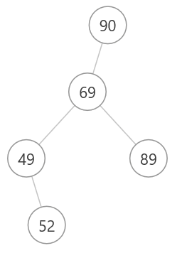

# 树的递归结构（个人理解）

**向二叉搜索树中的插入操作：**

递归终止条件

1. 对当前节点的操作
2. 向左（右）子树递归，并更新根节点的左节点的指针
3. 向右（左）子树递归，并更新根节点的右节点的指针
4. 更新根节点的指针（**因为函数返回更新后的根节点的指针，所以最后还需要一条返回，否则递归无法返回**）


# 面试题 17.12. BiNode

题目采用输出方式是层序遍历。

思路：

(1、2步骤可以调换)

1. 将当前指针（根节点root）的左节点置空 ```root.left = null```
2. 将前置指针（prev）的右节点指向当前节点 ```prev.right = root```
3. 将前置指（prev）针移到当前节点的位置 ```prev = root```

**难点：**

第一个头节点该如何保存？

初始化两个成员变量（属性），一个额外的节点head、一个前置指针prev（初始化为null）。

将prev初始化为null，通过判断prev是否为空来判断是否为第一个头节点。

使用一个额外的节点，将它的右节点指向第一个头节点。

解决第一个头节点的保存问题后，后面的逻辑即为上面的思路。

```java
class Solution {
    private TreeNode head = new TreeNode(-1);
    private TreeNode pre = null;

    public TreeNode convertBiNode(TreeNode root) {
        
        helper(root);
        return head.right;

    }

    public void helper(TreeNode root) {
        if (root == null) return;
        helper(root.left);
        if (pre == null) {
            head.right = root;
        }else {
            pre.right = root;
        }
        root.left = null;
        pre = root;
        helper(root.right);
    }
}
```


# 104. 二叉树的最大深度

使用递归的思路：

**后序遍历整棵树(DFS)**

**整棵树的最大深度 = max（当前根节点左子树的深度，当前根节点右子树的深度） + 1**

上述逻辑可以使用递归完成：

递归终止条件，当前节点为空（没有高度），返回0。

递归是从下（叶子节点）到上（整棵树的root）的

```java
public int maxDepth(TreeNode root) {
    if (root == null) return 0;
    ldepth = maxDepth(root.left);
    rdepth = maxDepth(root.right);
    
    return Math.max(ldepth, rdepth) + 1;
}
```


# 面试题04.02. 最小高度树

为了让**二叉搜索树(BST)**的高度尽量小，需要左子树和右子树的节点数量尽量相同。

所以每次插入时，插入数组中的中位数（数组已经排序，所以这个中位数是数组中间的那个值）。

思路（先序遍历，递归）：

1. 以数组的中间值（mid）作为根节点。左子数组构建左节点，右子数组构建右节点
2. 向左子数组递归，向树中插入左子数组的的中间值（重复第一步）
3. 向右子数组递归，向树中插入右子数组的中间值（重复第一步）

即左子树的根节点是左子数组的中位数，右子树的根节点是右子树的中位数，保证了子树的左右子树数量都尽可能相同。


# 剑指Offer 55 - II. 平衡二叉树

**判断一颗二叉树是否平衡**：

任意节点的左右子树高度相差不超过1。

树的深度（高度） = 二叉树中最大深度（离根节点最远的子节点的路径 + 1）

是 **104.二叉树最大深度** 和 **面试题55 - I.二叉树的深度** 的扩展。

* **某一个节点为根节点子树的深度** = max（左子树深度，右子树深度）+ 1


通过辅助函数 `height( )` 计算子树的高度，判断所有节点的左右子树高度差不超过1。

思路：

前序遍历 + 判断所有节点左右子树的高度差值不大于1


**代码逻辑：**

递归终止条件：节点为空，返回true。

**节点为空有两种情况：**

* 根节点为空，树中无节点
* 穿过叶子节点，无子节点
* 只有一个子节点的节点（左右子树高度差 = 1，满足平衡条件）

当前节点为根节点的子树平衡条件（与，即以下三个条件全部都要满足）：

* 左子树高度和右子树高度差值不大于1
* 左子树平衡
* 右子树平衡


# 剑指Offer 55 - I. 二叉树的深度

> 树的遍历方式总体分为两类：深度优先搜索（DFS）、广度优先搜索（BFS）；
>
> 常见的 DFS ： 先序遍历、中序遍历、后序遍历；
> 常见的 BFS ： 层序遍历（即按层遍历）。

求树的深度需要遍历树的所有节点，有基于 后序遍历（DFS） 和 层序遍历（BFS） 的两种解法。


**思路一：使用递归的后序遍历（DFS），速度快**

根节点所在子树的高度  =  左子树和右子树高度的最大值 + 1


代码递归逻辑：

递归终止条件：根节点为null，说明穿过了叶子节点，返回0（没有高度）

1. 向左子树递归
2. 向右子树递归
3. 当前节点的高度 = max（左子树的高度，右子树的高度）+ 1


典型的后序遍历递归，对当前根节点的操作在最后。

时间复杂度：O(N)，需要遍历每个节点

空间复杂度：最差的情况下是O(N)，树为线性链表的时候，递归深度为N


**思路二：使用队列的层序遍历（BFS）**

使用一个主队列和一个辅助队列，主队列不为空的时候，一直遍历主队列

每次遍历主队列的时候，将每个节点的左右子节点添加到辅助队列中。

遍历完毕后（遍历了一层），将主队列的指针指向辅助队列，高度加一。

**（广度优先遍历的思想：主队列中一直有值存在，且主队列中的值都在同一层上，距离根节点的距离相同，每遍历一次主队列，就走过了一层）**


# 111. 二叉树的最小深度

思路和最大深度（104）相同，同样是用后序遍历（DFS）来递归计算最小深度。

但是有一个注意点：

如果单纯返回左子树和右子树高度的最小值，**如果有一个子节点为空（那个节点的子树高度一定为0）**，两者取最小直接返回0，那么不为空的那个子树的高度会被直接忽略。

所以需要做额外的判断：

递归结束条件：节点为空，返回0（穿过叶子节点）

1. 递归左子树的最小高度，left

2. 递归右子树的最小高度，right

3. 如果，左右节点有一者为空，或者两者都为空，返回 **left + right + 1**（**实际上是返回不为空的那个节点的子树最小高度 + 1，直接用相加可以省去判断返回哪颗不为空的子树高度**）

4. 如果，左右节点都不为空，返回 **max（左子树高度，右子树高度）+ 1**

   ```java
   class Solution {
       public int minDepth(TreeNode root) {
           if (root == null) return 0;
           
           int left = minDepth(root.left);
           int right = minDepth(root.right);
           // 当左节点和右节点有一个为空或者两者都为空时，为空的子节点高度为0
           // 所以只要返回不为空的那个节点的最小高度
           if (root.left == null || root.right == null) return left + right + 1; 
           return Math.min(left, right) + 1;
       }
   }
   ```


# 108. 将有序数组转换为二叉搜索树

本质上逻辑和  **面试题04. 02. 最小高度树**  相同，为了让二叉搜索树是平衡的，每次插入数组中的中位数，且左子树在数组中，中位数的左边递归；右子树在数组中，中位数的右边递归。

这样既满足了二叉搜索树的性质（左节点小于根节点，右节点大于根节点），又保证了平衡性。


递归逻辑：**采用先序遍历（新建节点）**

递归终止条件：当超出数组的边界时（lo > hi），返回空（不再新建节点）

1. 如果节点为空，取中位数，新建节点并初始化
2. 向左子数组递归，左节点 = 向左子数组递归
3. 向右子数组递归，右节点 = 向右子数组递归


# 617. 合并二叉树

**1. 使用深度优先搜索（递归方式）**

思路，三种情况：

1. 两个节点中，有一个节点为空，保留不为空的那个节点（返回不为空的节点）

2. 两个节点都不为空，合并两个节点的值，显式地合并（新建一个新的节点）

3. 对新的节点的左右节点进行递归

   **1.没有复用原来的节点：**

   ```java
   public TreeNode mergeTrees(TreeNode t1, TreeNode t2) {
       // 其中一个节点为空，保留另一个节点
       if (t1 == null) return t2;
       if (t2 == null) return t1;
       // 两个节点都不为空，合并两个节点的值
       TreeNode merged = new TreeNode(t1.val + t2.val);
       merged.left = mergeTrees(t1.left, t2.left);
       merged.right = mergeTrees(t1.right, t2.right);
   
       return merged;
   }
   ```

   **2.复用了原来的节点**

   ```java
   public TreeNode mergeTrees(TreeNode t1, TreeNode t2) {
           // 其中一个节点为空，保留另一个节点
           if (t1 == null) return t2;
           if (t2 == null) return t1;
           // 两个节点都不为空，合并两个节点的值
           t1.val += t2.val;
           t1.left = mergeTrees(t1.left, t2.left);
           t1.right = mergeTrees(t1.right, t2.right);
   
           return t1;
       }
   ```

   

# 783. 二叉搜索树节点最小距离

一开始，采用的思路是，最小距离只可能出现在根节点和左右节点的差值中（采用了先序遍历，优先深度搜索）。后来发现并不是这样，比如下面这种情况，最小距离是90和89的差值。**采用这种思路遗漏了左子树最大值和根节点的差值，和右子树的最小值和根节点的差值**

正确的思路应该是，按顺序查找（中序遍历），然后比较相邻节点的节点的差值是否是当前最小值。



**递归思路**：

递归终止条件：根节点为空，返回（当前节点穿过叶子节点）

1. 向左子树递归
2. 判断是否是第一个节点，即lastVal是否为null。如果为null，说明是第一个节点，把当前节点值保存给lastVal；如果不为null，说明不是第一个节点，上一个节点有值，得到两节点的差值。
3. 向右子树递归

一开始使用了int lastVal = Integer.MIN_VALUE做了标记，把int替换成Integer后，如果没有值，lastVal就是null。使用包装类型来做初始值标记，更为清楚。

```java
private int minDiff = Integer.MAX_VALUE;
private Integer lastVal;

public int minDiffInBST(TreeNode root) {
    helper(root);
    return minDiff;
}

public void helper(TreeNode root) {
    if (root == null) return;
    helper(root.left);

    if (lastVal != null) {
        int diff = root.val - lastVal;
        if (diff < minDiff) minDiff = diff;
    } 
    lastVal = root.val;

    helper(root.right);
}
```


# 100. 相同的树

思路：

相同的树要保证两点：1.结构相同，2.节点值相同


代码递归思路：（先序遍历，DFS）

递归终止条件：两者都为null，说明越过叶子节点，返回true（说明前面的结构与节点值都相同）

1. 排除两者都为null后，判断结构是否相同，即两个节点中有一个为null，一个不为null。如果是，说明结构不同，返回false

2. 排除结构不同之后，最后判断节点值是否相同。如果不相同返回false。

3. 递归左子树和右子树是否为相同的树。如果左右子树都是相同的树，返回true，否则返回false。

   ```java
   public boolean isSameTree(TreeNode p, TreeNode q) {
       if (p == null && q == null) return true;
       if (p == null || q == null) return false;
       if (p.val != q.val) return false;
   
       boolean l = isSameTree(p.left, q.left);
       boolean r = isSameTree(p.right, q.right);
   
       return (l && r);
   }
   ```

   

# 101. 对称二叉树

递归思路：

判断一棵树是否对称，需要递归判断它的左右子树是否对称。

判断两棵树对称的方法：

* 根节点值相同
* 每个树的左子树和另一个树的右子树对称

使用同步移动两个指针（p，q）的方法来遍历整棵树，p右移时，q左移，p左移时，q右移。每次检查p，q值是否相同，再判断左右子树是否对称。


递归终止条件：

* 两个节点都为null，返回true（穿过叶子节点，或者某个两个子节点中某一个节点为null）

* 两个节点其中有一个为null，返回false，结构不对称
* 如果两个节点都不为空，判断节点值是否相同，递归一个节点的左子树和另一个节点的右子树是否对称


```java
public boolean isSymmetric(TreeNode root) {
    if (root == null) {
        return true;
    }
    else {
        return check(root.left, root.right);
    }

}

public boolean check(TreeNode p, TreeNode q) {
    if (p == null && q == null) return true;
    if (p == null || q == null) return false;

    return p.val == q.val && check(p.left, q.right) && check(p.right, q.left);
}
```


# 107. 二叉树的层序遍历II(从下向上层序遍历，被被问到过)

这里需要从最后一层开始层序遍历。

一开始，我想了个笨方法，使用两个存放List的List来实现倒序，相当于用两个队列实现了栈。但是这样很花时间，并且使用了额外的空间。

优化：

1. 对每一层遍历的时候，将节点的数值存放在ArrayList中，而不是LinkedList中，因为只需要存储，不需要查询和插入，所以选择数组形式的列表是最快的。

2. 层序遍历的时候，实现队列的复用，直接将下一层的节点直接入队，每一层只出队这一层节点数量的节点。

3. 最重要的一点，实现倒序：每一层遍历完之后，将当前层的节点值列表添加到列表的头部，而不是添加到列表的尾部（实现了栈的功能）。

4. 实现列表头部插入有两种选择：

   * 使用List接口，`void add(int index, E element)` ，在指定位置插入元素，

     使用`add(0, E element)`，就实现了在列表头部插入元素。

   * 使用双向链表LinkedList( )，使用 `addFirst(E element)` 在头部插入元素。

```java
public List<List<Integer>> levelOrderBottom(TreeNode root) {

    if (root == null) {return new LinkedList<List<Integer>>();}
    Queue<TreeNode> queue = new LinkedList<>(); // 存放每一层根节点
    LinkedList<List<Integer>> listQueue = new LinkedList<List<Integer>>();
    queue.add(root);
    listQueue.add(new LinkedList<Integer>(){{add(root.val);}}); 

    while (!queue.isEmpty()) {
        List<Integer> nums = new ArrayList<>(); // 存放每一层节点的值
        int length = queue.size();
        for (int i = 0;i < length;i++) {
            TreeNode node = queue.poll();
            if (node.left != null) {
                queue.add(node.left);
                nums.add(node.left.val);
            }
            if (node.right != null) {
                queue.add(node.right);
                nums.add(node.right.val);
            }
        }
        if (!nums.isEmpty()) listQueue.addFirst(nums); // 在返回列表的头部插入存放每一层
                                                       // 节点的列表
    }

    return listQueue;
}
```


# 112. 路径综合

这一题的关键是**区分叶子节点和非叶子节点**，因为题目问的是根节点到叶子节点的路径。

* **叶子节点：**两个子节点都为空。`root.left == null && root.right == null`
* **非叶子节点：**一个子节点为空，或者两个子节点都不为空。`root.left != null || root.right != null`


DFS（递归思路）：

先序遍历，

**每递归一个节点，都把初始的sum值减掉当前节点的值。**

* 如果是叶子节点，判断当前sum是否和叶子节点的值相同。

* 如果不是叶子节点，递归判断，在左右子树中是否存在一条路径满足和等于**sum - root.val**。

**递归终止条件**：

1. 如果根节点为空，返回false。这里的根节点为空判断不是越过叶子节点，而是对空树的判断。
2. 如果是叶子节点，不继续递归，判断sum是否等于当前节点的值
3. 如果不是叶子节点，递归判断左右子树是否hasPath(sum - root.val)，只要左右子树其中有一者满足，就返回true（左右子树递归结果的或）。

```java
public boolean hasPathSum(TreeNode root, int sum) {
    return helper(root, sum);
}

boolean helper(TreeNode root, int sum) {
    if (root == null) return false;

    if (root.left == null && root.right == null) return root.val == sum;   // 叶子节点

    return helper(root.left, sum - root.val) || helper(root.right, sum - root.val);   // 非叶子节点，一个子节点为空或子节点都不为空
```


BFS（非递归思路）：

使用两个队列，一个队列存储节点，一个队列存储从**根节点到当前节点的路径和**，

每次两个队列一起出队，判断出队的节点是否是叶子节点：

* 如果是叶子节点，判断路径和是否和sum相同。如果相同结束循环，返回true；如果不相同，返回继续循环。
* 如果不是叶子节点，继续入队左右子节点，将他们的值加到他们的根节点的路径和上并入队。


# 226. 翻转二叉树

思路，**先序遍历（DFS）**：

新建一颗二叉树，先序遍历原来的二叉树，原二叉树的左节点的值为新二叉树右节点的值（个人认为也可以这么理解，旧二叉树向左子树递归时，翻转后的新二叉树需要向右子树递归）。


**细节：**

先序遍历时，**一定要new一个和当前根节点值相同的节点，指向不同的实例**。而不能直接将当前节点指向旧的节点。如果直接指向旧的节点，那么递归会导致旧节点的左子节点直接指向右子节点（或者右子节点直接指向左子节点）。这样就直接修改了原来的子树，导致结果不正确，也不会报错。

```java
public TreeNode invertTree(TreeNode root) {
    if (root == null) return null;
    // 如果这里指针直接指向了原来的节点，下面的递归相当于原树的左子节点也指向了右子节点
    // 会导致根节点每一层对的其他节点都和最右边的那个节点相同。
    // 实际上是，根节点的左节点先指向了右节点；然后右节点又重复递归指向了左节点
    // TreeNode inverseNode = root; 
    TreeNode inverseNode = new TreeNode(root.val);
    inverseNode.left = invertTree(root.right);
    inverseNode.right = invertTree(root.left);

    return inverseNode;
}
```

> 会导致根节点的左子树的右半部分和左半部分相同，根节点的右子树的左半部分和右半部分相同。

比如，测试用例[4,2,7,1,3,6,9]，翻转后会变成[4,7,7,9,9,9,9]。


# 235. 二叉搜索树的最近公共祖先

思路一，遍历两次二叉树：

由于是BST，**可以很快找到到达某个节点的路径，不需要像普通二叉树一样遍历整颗二叉树，并且可以保存到达它的路径**

遍历两次二叉树，找出到达两个指定节点的路径。两个节点的公共祖先是这两条路径的**分岔点**，也就是最后一个相同的节点。如果把路径节点存储到一个列表中（ArrayList），公共祖先就是满足下面这个条件，下标最大的那个节点：
$$
path[i] = pathq[i]
$$


思路二：

核心思路和思路一相同，也是找到**分岔点**。

按下列思路一次遍历，就能找到分岔点，并且可以不使用递归。只需一次遍历就找出公共节点的原因是BST的性质，左节点小于根节点，右节点大于根节点，恰好和分岔点的两种情况对应。

**分岔点有两种情况**：

1. 两个节点在不同的子树中。
2. 其中一个节点在另一个节点的子树中（在上层的那个节点就是最近公共祖先）。


**代码思路，分成三种情况**：

* p，q值都比当前节点的值大（严格大于），说明p，q都在当前节点的右子树

* p，q值都比当前节点的值小（严格小于），说明p，q都在当前节点的左子树

* 上面两种情况以外，说明当前节点就是分岔点

  仔细讨论最后一种情况，为分岔点的几种情形：

  * p节点和q节点，一个在当前节点的左子树，一个在当前节点的右子树，说明在这个节点它们的路径分开了，所以这个节点是分岔点
  * p节点和q节点，一个值等于当前节点值，说明当前节点为p，q中的其中一个，另一个节点不论在左子树，还是在右子树，它都在另一个节点的子树中，所以当前节点就是分岔点。


**非递归解法：**

```java
public TreeNode lowestCommonAncestor(TreeNode root, TreeNode p, TreeNode q) {
    while (true) {
        if (p.val < root.val && q.val < root.val) { // p和q都在根节点的左子树
            root = root.left;
        }
        else if (p.val > root.val && q.val > root.val) { // p和q都在根节点的右子树
            root = root.right;
        }
        else { // p和q在根节点的两侧，或者p和q右一个节点是根节点。
            return root; // 这两种情况，根节点就是最近公共祖先，可以合并在一起
        }
    }
}
```


**递归解法：**

```java
/**
 * Definition for a binary tree node.
 * public class TreeNode {
 *     int val;
 *     TreeNode left;
 *     TreeNode right;
 *     TreeNode(int x) { val = x; }
 * }
 */

class Solution {
    public TreeNode lowestCommonAncestor(TreeNode root, TreeNode p, TreeNode q) {
        if (p.val < root.val && q.val < root.val) { // p和q都是根节点的左子树，向左子树递归
            return lowestCommonAncestor(root.left, p, q);
        }
        else if (p.val > root.val && q.val > root.val) { // p和q都是根节点的右子树，向右子树递归
            return lowestCommonAncestor(root.right, p, q);
        }
		
        // p和q在根节点两侧，或者p和q其中一个是根节点，这两种情况可以归在一起，根节点就是最近公共祖先
        return root; 
    }
}
```


# 257. 二叉树的所有路径

使用DFS（先序遍历）


主要是判断是不是叶子节点，如果是叶子节点，那么将最后拼接的字符串添加到StringBuilder（因为字符串经常需要拼接，所以使用StringBuilder比使用String要快很多）


递归思路：

递归终止条件：如果节点是空，返回，不添加任何字符串；如果是叶子节点，将当前节点值添加进字符串，并把路径字符串加入List中，返回；

如果不是叶子节点，则把当前的节点值添加进路径字符串中，并添加"->"符号。

然后向左子树和右子树递归。

```java

class Solution {

    private List<String> result;

    public List<String> binaryTreePaths(TreeNode root) {
        String s = "";
        result = new ArrayList<>();
        hepler(root, s);
        return result;
    }

    public void hepler(TreeNode root, String s) {
        if (root == null) return; // 空节点
        if (root.left == null && root.right == null) { // 判断是否是叶子节点
            StringBuilder ss = new StringBuilder(s);
            ss.append(root.val);
            result.add(ss.toString()); // 叶子节点，添加最终的路径字符串
            return;
            }
        StringBuilder ss = new StringBuilder(s); // 不是叶子节点
        ss.append(root.val);
        ss.append("->");
        s = ss.toString();
        hepler(root.left, s);
        hepler(root.right, s);
    }
}
```


# 404. 左叶子之和

这道题没有研究别人的题解。

个人思路

1. 首先判断是否是叶子节点
2. 在判断是叶子节点的基础上，还要另外判断是否是左叶子节点
3. 为了判断是否是左叶子节点，我在参数里多加了一个isLeft变量，指示下一个节点相对当前节点是否是左节点。
   * 向左节点递归的时候，isLeft为true，有可能是左叶子节点
   * 向右子节点递归的时候，isLeft为false，下一个节点必定不为右叶子节点


helper递归终止条件：

如果节点为空(说明穿过了叶子节点），不对sum进行累加。

如果是叶子节点，且为左叶子节点(isLeft=true)，对sum进行累加。

```java
class Solution {

    private int sum = 0;

    public int sumOfLeftLeaves(TreeNode root) {
        if (root == null) return 0;
        helper(root.left, true);
        helper(root.right, false);
        return sum;
    }

    public void helper(TreeNode root, boolean isLeft) {
        if (root == null) return;
        if (root.left == null && root.right == null && isLeft) {
            sum += root.val;
        }
        helper(root.left, true);
        helper(root.right, false);
    }
}
```


# 501. 二叉搜索树中的众数

最近有些烦躁，这道题就直接复制官方的题解吧

作者：LeetCode-Solution
链接：https://leetcode-cn.com/problems/find-mode-in-binary-search-tree/solution/er-cha-sou-suo-shu-zhong-de-zhong-shu-by-leetcode-/
来源：力扣（LeetCode）
著作权归作者所有。商业转载请联系作者获得授权，非商业转载请注明出处。

```java
class Solution {

    private List<Integer> answer = new ArrayList<>();
    private int base, count, maxCount;

    public int[] findMode(TreeNode root) {
        if (root == null) return new int[0];
        helper(root);
        int[] mode = new int[answer.size()];
        for (int i = 0;i < answer.size();i++) {
            mode[i] = answer.get(i);
        }
        return mode;
    }

    public void helper(TreeNode root) {
        if (root == null) return;
        helper(root.left);
        update(root.val);
        helper(root.right);
    }

    public void update(int x) {
        if (x == base) {
            count++;
        }
        else {
            base = x;
            count = 1;
        }

        if (count == maxCount) {
            answer.add(x);
        }
        else if (count > maxCount) {
            answer.clear();
            answer.add(base);
            maxCount = count;
        }
    }
}
```


# 543. 二叉树直径

思路：

最长路径一定是以**某个节点为根节点（注意这个节点不一定是整颗树的根节点）**，从它的左子树的叶子节点到它的右子树的叶子节点的路径。

再转化一次，以某个节点为根节点的最长路径，实际上就是某个节点的左子树的高度加右子树的高度。


代码递归思路：

在计算某个节点的深度的时候，就可以顺带计算以这个节点为根节点的子树的直径了，这样只需要递归遍历一次每个节点就行了。

原先，我的思路是，遍历所有点，每个点对它进行左右子树的高度计算，这么做的话，重复进行了很多次高度计算。

```java
class Solution {
    int ans;
    public int diameterOfBinaryTree(TreeNode root) {
        if (root == null) return 0;
        depth(root);
        return ans;
    }
    public int depth(TreeNode node) {
        if (node == null) {
            return 0; // 访问到空节点了，返回0
        }
        int L = depth(node.left); // 左儿子为根的子树的深度
        int R = depth(node.right); // 右儿子为根的子树的深度
        ans = Math.max(ans, L+R); // 计算以这个节点为根节点的子树的直径，如果比前面的大，替换
        return Math.max(L, R) + 1; // 返回该节点为根的子树的深度
    }
}
```


# 563. 二叉树的坡度

思路：

整棵树的坡度 = 所有节点的坡度之和

某个节点的坡度 = abs（该节点左子树所有节点的和 - 该节点右子树所有节点的和）


**实际上是树求和的问题，在对每个节点的左右子树求和之后，就可以顺道计算出这个节点的坡度。**

和543求直径（本质是求树的高度，在算出左右子树高度的时候，顺道计算出这个节点的直径）很像。


```java
class Solution {
    private int tilt;

    public int findTilt(TreeNode root) {
        if (root == null) return 0;
        helper(root);

        return tilt;

    }

    public int helper(TreeNode x) { // helper实际上是求以某个节点为根节点的子树的和
        if (x == null) return 0;
        int L = helper(x.left);     // 左子树的和
        int R = helper(x.right);    // 右子树的和
        
        tilt += Math.abs(L - R);    // 在求出左右子树的和之后，顺道计算出这个节点的坡度
                                    // 坡度的概念正好和求和递归顺序符合
        return L + R + x.val;
    }
}
```


# 572. 一个树的另一个子树

**思路一：**暴力dfs，

由题目可知，树s的节点个数是大于等于树t的节点个数的。

判断两颗树是否相同，用双指针递归两颗子树，如果每一个节点值都相同，那么，这两颗树相同。

那么问题来了，s中哪一个顶点和t的根节点相同呢（我自己试了一下，总是有些情况考虑不到），为了避免去考虑这个复杂的问题，官方题解采用了暴力的方法，**遍历s中的每一个节点，把每一个节点的子树和t去做比较，只要其中一个子树和t相同，那么t就是s的一个子树。**


```java
class Solution {
    public boolean isSubtree(TreeNode s, TreeNode t) {
        return dfs(s, t);
    }

    public boolean dfs(TreeNode s, TreeNode t) {  // 遍历s中的每一个节点
                                                  // 比较以这个节点为根节点的子树是否和t相同
        if (s == null) return false;

        return helper(s, t) || dfs(s.left, t) || dfs(s.right, t);
    }

    public boolean helper(TreeNode s, TreeNode t) { // 比较两棵树是否相同。
        if (s == null && t == null) return true;
        if (s == null || t == null) return false;
        boolean L = helper(s.left, t.left);
        boolean R = helper(s.right, t.right);

        return L && R && s.val == t.val;
    }
}
```


**思路二：**DFS序列上做字符串匹配

trick：一棵子树上的点在 **DFS 序列（先序遍历）**中是连续的。

把s和t转换成DFS序列（先序遍历），**判断t的DFS序列是否在s的DFS序列中**。但是这只是t是s的子树的**必要不充分条件**。

比如，下面两颗子树，虽然DFS序列相同，但是明显第二颗树不是第一颗树的子树：

```
    1               1
   /                 \
  2                   2
```


为了保证DFS序列的唯一性，引入两个空值 `lNull=s和t中的元素最大值 + 1` 和 `rNull=s和t中的元素最大值 + 2` ，在左节点为空的地方加上 `lNull` ，在右节点为空的地方加上 `rNull`：

```
        1                  1
       / \                / \
      2   rNull       lNUll  2
     / \                    / \
 lNull  rNull           lNUll  rNUll
```


字符串匹配：

在判断**s的DFS序列是否包含t的DFS序列时**，可以使用**KMP**或者**Rabin-karp**算法。


# 669. 修剪二叉搜索树

根据BST的性质：

* 根节点如果小于下界，那么左子树的所有节点必定小于下界，全部失效

* 根节点如果大于上界，那么右子树的所有节点必定大于上界，全部失效
* 如果根节点在范围内，那么递归左子树和右子树

直接返回当前的节点即可，因为**上面的筛选实际上就是抛弃的过程，能够进入递归的节点是符合要求在范围内的节点。**

```java
class Solution {
    public TreeNode trimBST(TreeNode root, int low, int high) {
        if (root == null) return null;   // 越过叶子节点，递归终止，然后从叶子节点开始返回递归
        // 如果根节点小于下界，左子树及根节点全部失效，递归右子树
        if (root.val < low) return trimBST(root.right, low, high); 
        // 如果根节点大于上界，右子树和根节点全部失效，递归左子树
        if (root.val > high) return trimBST(root.left, low, high); 

        // 如果大于等于下界，小于等于上界，更新指向左节点和右节点的链接
        root.left = trimBST(root.left, low, high);
        root.right = trimBST(root.right, low, high);

        return root; // 返回更新后的节点
    }
}
```


# 671. 二叉树中的第二小节点

实际上还是一个找最小值的问题。

从题目的叙述可以知道，**如果一个节点有子节点，它必定有两个子节点，并且其中一个子节点和他相等，另一个子节点大于等于它。**

也就是说根节点子树中的所有节点必定小于等于根节点。再翻译一下，找整颗树中的第二小值就是寻找除根节点值外的最小值，所以实际上还是找最小值的问题。


递归思路：

递归终止条件：如果越过叶子节点（节点为空），返回。

由于树中的值从1到2的31次减一（int的上限），所以这里**使用Integer判空，来判断存不存在第二小值**

使用secondMin来存放树的最小值。

* 判断左右子树中那个节点的值和根节点相同，不处理值相同的节点，判断值不同的那个节点是否比secondMin目前存储的值要小。**如果secondMin值为空（说明第一次存储值）**，或者secondMin值比这个节点值大，更新secondMin的值
* 继续递归左子树和右子树

**实际上第一步的操作保证了只与根节点值不同的节点比较**

```java
class Solution {

    private Integer secondMin;

    public int findSecondMinimumValue(TreeNode root) {
        // secondMin = null;
        helper(root);
        return secondMin == null ? -1 : secondMin;
    }

    public void helper(TreeNode root) {
        if (root == null) return;
        if (root.left == null) return;
        if (root.left.val != root.val) {
            if (secondMin == null || root.left.val < secondMin) secondMin = root.left.val;
        }
        if (root.right.val != root.val) {
            if (secondMin == null || root.right.val < secondMin) secondMin = root.right.val;
        }

        helper(root.left);
        helper(root.right);
    }
}
```


# 剑指Offer 07. 重建二叉树

思路：

**前序遍历的第一个节点是根节点**，通过根节点去中序遍历中找到这个节点，**中序遍历中这个节点的左边就是所有左子树的节点，这个节点的右边就是所有右子树的节点**。（通过把中序遍历中的节点值和对应的下标存放在一个Map中，来快速查找对应的根节点的下标，来确定左右子树的节点数）。

通过中序遍历得到对应根节点的左右子树节点数，来确定先序遍历中的左右子树对应的节点范围。


```java
/**
 * Definition for a binary tree node.
 * public class TreeNode {
 *     int val;
 *     TreeNode left;
 *     TreeNode right;
 *     TreeNode(int x) { val = x; }
 * }
 */
class Solution {
    public TreeNode buildTree(int[] preorder, int[] inorder) {
        if (preorder == null || inorder == null) return null;

        int length = preorder.length;
        Map<Integer, Integer> indexMap = new HashMap<>(); // 将中序遍历的值和下标存放在一个map中
                                                         // 方便找到值对应的下标
        for (int i = 0;i < length;i++) {
            indexMap.put(inorder[i], i);
        }

        TreeNode root = buildTree(preorder, 0, length - 1, inorder, 0, length - 1, indexMap);
        return root;
    }

    public TreeNode buildTree(int[] preorder, int preStart, int preEnd, int[] inorder, int inStart, int inEnd, Map<Integer, Integer> indexMap) {
        if (preStart > preEnd) return null; // 前序遍历子树的起点大于终点的时候，表明子树没有节点
        int rootVal = preorder[preStart];
        TreeNode root = new TreeNode(rootVal); // 前序遍历第一个节点为根节点
        int inIndex = indexMap.get(rootVal);
        // 通过中序遍历找出根节点的左右子树的个数
        int leftNodes = inIndex - inStart, rightNodes = inEnd - inIndex; 
        
        TreeNode leftSubTree = buildTree(preorder, preStart + 1, preStart + leftNodes, inorder, inStart, inIndex - 1, indexMap); // 递归左子树，右边第一个值是左子树的根节点
        TreeNode rightSubTree = buildTree(preorder, preStart + leftNodes + 1, preEnd, inorder, inIndex + 1, inEnd, indexMap);   // 递归右子树，右子树第一个值是右子树的根节点
        root.left = leftSubTree;
        root.right = rightSubTree;
        return root;

    }
}
```


**更简洁的代码：**

```java
/**
 * Definition for a binary tree node.
 * public class TreeNode {
 *     int val;
 *     TreeNode left;
 *     TreeNode right;
 *     TreeNode(int x) { val = x; }
 * }
 */
class Solution {
    public TreeNode buildTree(int[] preorder, int[] inorder) {
        Map<Integer,Integer> map = new HashMap<>();
        for (int i = 0;i < inorder.length;i++) {
            map.put(inorder[i], i);
        }
        return recur(map, preorder, inorder, 0, 0, inorder.length - 1);
    }
	/**
	root：先序遍历中根节点的下标
	left：子树在中序遍历中的左边界
	right：子树在中序遍历中的右边界
	*/
    public TreeNode recur(Map<Integer,Integer> indexMap, int[] preorder, int[] inorder, int root, int left, int right) {
        if (left > right) return null;
        TreeNode node = new TreeNode(preorder[root]); // 建立根节点
        int i = indexMap.get(preorder[root]);         // 通过先序遍历的根节点值，在Map中查找中序遍历中根节点的索引下标，用来得到左右子树的长度
        node.left = recur(indexMap, preorder, inorder, root + 1, left, i - 1); 
        node.right = recur(indexMap, preorder, inorder, root + (i - left) + 1, i + 1, right); // i - left 是当前根节点左子树的长度，一定要减left，才是真正的长度；右子树根节点的索引下标=根节点下标 + 左子树长度 + 1
        return node;
    }
}
```


# 剑指Offer 26. 树的子结构

思路比较明确：
现在树A中找到和B根节点值相同的节点，然后判断树B是否是以这个节点为根节点的子结构。


**由于题目没有明确指出，树中节点值是不重复的，**所以需要对树A中所有和树B根节点相同的节点，进行子结构判断，只需要有一个节点符合要求，就返回true。

**自己的代码：**

```java
/**
 * Definition for a binary tree node.
 * public class TreeNode {
 *     int val;
 *     TreeNode left;
 *     TreeNode right;
 *     TreeNode(int x) { val = x; }
 * }
 */
class Solution {

    private List<TreeNode> nodeList = new ArrayList<>();

    public boolean isSubStructure(TreeNode A, TreeNode B) {
        if (B == null) return false;
        
        findRoot(A, B);
        for (TreeNode node : nodeList) {
            if (helper(node, B)) return true;
        }
        return false;
    }

    public void findRoot(TreeNode A, TreeNode B) {
        if (A == null) return;

        if (A.val == B.val) nodeList.add(A);
        findRoot(A.left, B);
        findRoot(A.right, B);
    }

    public boolean helper(TreeNode A, TreeNode B) {
        if (B == null) return true; // B为越过子节点的时候，不论A还有没有子节点都为true
        if (A == null) return false; // B不为null时，A如果为空，必定不为子结构
        if (A.val != B.val) return false;
        return helper(A.left, B.left) && helper(A.right, B.right);
    }
}
```


**参考题解，优化后的代码：**

相比自己的思路，省去了从列表里存取节点指针的过程，**在dfs树A的时候，顺带就把判断子结构的工作完成了。**

```java
/**
 * Definition for a binary tree node.
 * public class TreeNode {
 *     int val;
 *     TreeNode left;
 *     TreeNode right;
 *     TreeNode(int x) { val = x; }
 * }
 */
class Solution {

    private List<TreeNode> nodeList = new ArrayList<>();

    public boolean isSubStructure(TreeNode A, TreeNode B) {
        if (A == null || B == null) return false; // A与B有一个根节点为空，就返回false
        
        if (A.val == B.val && helper(A, B)) return true; // 如果树A中当前节点值和B的根节点相同，判断B是否为A的子结构
        return isSubStructure(A.left, B) || isSubStructure(A.right, B); // 遍历树A中所有节点，判断是否存在和B根节点值相同的节点，同时判断B是否为A的子结构，
        // 这么做是因为树A中可能存在值重复的节点，确保所有这些节点都进行了子结构判断 
    }
	
    /**
    判断以B为根节点的树，是否是以A为根节点的树的子结构
    */
    public boolean helper(TreeNode A, TreeNode B) {
        if (B == null) return true; // B为越过子节点的时候，不论A还有没有子节点都为true
        if (A == null) return false; // B不为null时，A如果为空，必定不为子结构
        if (A.val != B.val) return false;
        return helper(A.left, B.left) && helper(A.right, B.right);
    }
}
```


# 剑指Offer 32 - III. 从上到下打印二叉树 III

**原来的代码：**

思路：存放节点使用双端队列，存放每一层值使用队列

* 奇数层时，存放节点的队列，头出尾进，左节点先于右节点入队
* 偶数层时，存放节点的队列，尾出头进，右节点先于左节点入队


自己的思路和题解的思路二相同，但是for循环有N次冗余的判断。

```java
/**
 * Definition for a binary tree node.
 * public class TreeNode {
 *     int val;
 *     TreeNode left;
 *     TreeNode right;
 *     TreeNode(int x) { val = x; }
 * }
 */
class Solution {
    public List<List<Integer>> levelOrder(TreeNode root) {
        if (root == null) return new ArrayList<>();
        Deque<TreeNode> queue = new LinkedList<>();
        queue.addLast(root);
        int size = 1, layer = 1;
        List<List<Integer>> res = new ArrayList<>();

        while (!queue.isEmpty()) {
            List<Integer> tmp = new ArrayList<>(); // 存放当前层的节点值
            for (int i = 0;i < size;i++) {
                if ((layer & 1) == 1) { // 奇数层，头出尾进，左节点先于右节点进
                    TreeNode node = queue.pollFirst();
                    tmp.add(node.val);
                    if (node.left != null) queue.addLast(node.left);
                    if (node.right != null) queue.addLast(node.right);
                }
                else { // 偶数层，尾出头进，右节点先于左节点进
                    TreeNode node = queue.pollLast();
                    tmp.add(node.val);
                    if (node.right != null) queue.addFirst(node.right);
                    if (node.left != null) queue.addFirst(node.left);
                }
            }
            res.add(tmp);
            size = queue.size();
            layer += 1;
        }

        return res;
    }
}
```


**题解思路一：**

使用双端队列存放每一层的值，这种思路最简单：

* 奇数层从尾巴入队
* 偶数层从头入队（这样就是倒序的）

关于双端队列，这里有一个细节，直接使用LinkedList，而不使用Deque接口变量，因为返回的结果要求`List<List<Integer>>`，而不是`List<Deque<Integer>>`

```java
/**
 * Definition for a binary tree node.
 * public class TreeNode {
 *     int val;
 *     TreeNode left;
 *     TreeNode right;
 *     TreeNode(int x) { val = x; }
 * }
 */
class Solution {
    public List<List<Integer>> levelOrder(TreeNode root) {
        if (root == null) return new ArrayList<>();
        Queue<TreeNode> queue = new LinkedList<>();
        queue.add(root);
        int size = 1, layer = 1;
        List<List<Integer>> res = new ArrayList<>();

        while (!queue.isEmpty()) {
            LinkedList<Integer> tmp = new LinkedList<>(); // 存放当前层的节点值，使用LInkedLIst，而不是用Deque接口变量，因为返回的结果要求List<List<Integer>>，而不是List<Deque<Integer>>
            for (int i = 0;i < size;i++) {
                TreeNode node = queue.poll();
                if ((layer & 1) == 1) tmp.addLast(node.val); // 奇数层，结果从尾进
                else tmp.addFirst(node.val); // 偶数层，结果从头进
                if (node.left != null) queue.add(node.left);
                if (node.right != null) queue.add(node.right);
            }
            res.add(tmp);
            size = queue.size();
            layer += 1;
        }

        return res;
    }
}
```


**题解思路二：**

将奇偶判断拆分开来，虽然代码比较多，但是出去了N次冗余的判断，思路和原来的思路相同

即一次while循环，扫描两层，第一层必定为偶数层，第二层必定为奇数层。

```java
/**
 * Definition for a binary tree node.
 * public class TreeNode {
 *     int val;
 *     TreeNode left;
 *     TreeNode right;
 *     TreeNode(int x) { val = x; }
 * }
 */
class Solution {
    public List<List<Integer>> levelOrder(TreeNode root) {
        if (root == null) return new ArrayList<>();
        Deque<TreeNode> queue = new LinkedList<>();
        queue.addLast(root);
        int size = 1;
        List<List<Integer>> res = new ArrayList<>();

        while (!queue.isEmpty()) {
            List<Integer> tmp = new ArrayList<>(); // 存放当前层的节点值
            for (int i = 0;i < size;i++) { // 奇数层，头出尾进，左节点先于右节点进
                TreeNode node = queue.pollFirst();
                tmp.add(node.val);
                if (node.left != null) queue.addLast(node.left);
                if (node.right != null) queue.addLast(node.right);
            }
            res.add(tmp);
            if (queue.isEmpty()) break; // 如果下一层没有节点，结束循环
            
            size = queue.size();
            tmp = new ArrayList<>();
            for (int i = 0;i < size;i++) { // 偶数层，尾出头进，右节点先于左节点进
                TreeNode node = queue.pollLast();
                tmp.add(node.val);
                if (node.right != null) queue.addFirst(node.right);
                if (node.left != null) queue.addFirst(node.left);
            }
            res.add(tmp);
            size = queue.size();
        }

        return res;
    }
}
```


# 剑指 Offer 34. 二叉树中和为某一值的路径

**思路：**

遍历所有从根节点到叶子节点的路径，在叶子节点检查，路径的值是否和目标值相同。

由于需要添加路径到结果列表中，所以每次向上返回的时候，要把这一层的节点弹出，即弹出队列尾部的元素。（目的是为了保证，每一条路径节点的正确性——回溯）

```java
/**
 * Definition for a binary tree node.
 * public class TreeNode {
 *     int val;
 *     TreeNode left;
 *     TreeNode right;
 *     TreeNode(int x) { val = x; }
 * }
 */
class Solution {

    public List<List<Integer>> pathSum(TreeNode root, int sum) {
        List<List<Integer>> res = new ArrayList<>();
        LinkedList<Integer> path = new LinkedList<>();
        helper(res, path, root, sum, 0);
        return res;
    }

    public void helper(List<List<Integer>> res, LinkedList<Integer> path, TreeNode root, int sum, int pathSum) {
        if (root == null) return; // 越过叶子节点

        pathSum += root.val;
        path.add(root.val);
        if (root.left == null && root.right == null) {// 如果是叶子节点，判断路径和是否是要求的值
            if (pathSum == sum) {
               List<Integer> tmp = new ArrayList<>(path);
               res.add(tmp); 
            }
        }
        helper(res, path, root.left, sum, pathSum);
        helper(res, path, root.right, sum, pathSum);
        path.pollLast();

        return;
    }
}


```


# 剑指 Offer 33.二叉搜索树的后序遍历序列

**思路：**

利用二叉搜索树的定义去判断是否是后序遍历：左子树的节点小于根节点，右子树的节点大于根节点

后序遍历序列的分布，最后一个数值，是当前树的根节点。

> |左子树|右子树|根节点|

* 先找到第一个大于等于根节点的数，即右子树的第一个节点值（下标记为m），这一步相当于是判断了左子树的范围，因为下标m左边的数都严格小于根节点
* 然后继续接着找小于等于根节点的第一个数，判断这个数的下标是不是和根节点下标相同（如果不相同，说明右子树中有小于或等于根节点的数值，并不是严格大于）
* 递归左子树（下标start ~ m - 1的数值）和右子树（下标m ~ end的范围的数值），只有左子树和右子树都满足要求并且当前树满足要求时（第二步下标相同），才可以确保是二叉搜索树。

```java
class Solution {
    public boolean verifyPostorder(int[] postorder) {
        if (postorder.length == 0) return true;
        return recur(postorder, 0, postorder.length - 1);
    }

    public boolean recur(int[] postorder, int start, int end) {
        if (start >= end) return true;
        int p = start;
        while (postorder[p] < postorder[end]) p += 1; // 找到第一个大于等于根节点的节点值
        int m = p; // 记录这个值的下标
        while (postorder[p] > postorder[end]) p += 1;

        return p == end && recur(postorder, start, m - 1) && recur(postorder, m, end - 1);
    }
}
```


# 剑指Offer 37. 序列化二叉树

难点在于反序列化。

```java
/**
 * Definition for a binary tree node.
 * public class TreeNode {
 *     int val;
 *     TreeNode left;
 *     TreeNode right;
 *     TreeNode(int x) { val = x; }
 * }
 */
public class Codec {

    // Encodes a tree to a single string.
    public String serialize(TreeNode root) {
        if (root == null) return "[]";
        StringBuilder res = new StringBuilder();
        Queue<TreeNode> queue = new LinkedList<>();
        queue.add(root);
        res.append("[");

        int size = queue.size();
        while (!queue.isEmpty()) {
            for (int i = 0;i < size;i++) {
                TreeNode node = queue.poll();
                if (node == null) {
                    res.append("null,");
                }
                else {
                    queue.add(node.left);
                    queue.add(node.right);
                    res.append(node.val);
                    res.append(",");
                }
            }
            size = queue.size();
        }
        res.delete(res.length() - 1, res.length()); // 删除最后一个逗号
        res.append("]");
        return res.toString();
    }

    // Decodes your encoded data to tree.
    public TreeNode deserialize(String data) {
        if (data.equals("[]")) return null;
        String[] vals = data.substring(1, data.length() - 1).split(",");
        Queue<TreeNode> queue = new LinkedList<>();
        TreeNode root = new TreeNode(Integer.parseInt(vals[0]));
        queue.add(root);

        int i = 1; // i指向的是当前根节点对应的下一层的左子节点在层序遍历中的下标
        while (!queue.isEmpty()) {
            TreeNode node = queue.poll(); // 弹出一个节点，接下来的两个i的下标对应它的子节点
            if (!vals[i].equals("null")) {
                node.left = new TreeNode(Integer.parseInt(vals[i]));
                queue.add(node.left);
            }
            i++;

            if (!vals[i].equals("null")) {
                node.right = new TreeNode(Integer.parseInt(vals[i]));
                queue.add(node.right);
            }
            i++;
        }

        return root;
    }
}

// Your Codec object will be instantiated and called as such:
// Codec codec = new Codec();
// codec.deserialize(codec.serialize(root));
```


# 剑指offer 28. 对称的二叉树

**思路：**

使用双指针，一个向左走，一个向右走，遍历整棵树，判断镜像位置上的节点值是否相同。

```java
/**
 * Definition for a binary tree node.
 * public class TreeNode {
 *     int val;
 *     TreeNode left;
 *     TreeNode right;
 *     TreeNode(int x) { val = x; }
 * }
 */
class Solution {
    
    public boolean isSymmetric(TreeNode root) {
        if (root == null) return true; // root为null时，额外做判断，否则下一句会出现空指针异常。
        TreeNode root1 = root.left, root2 = root.right; // 初始节点为根节点的左右儿子，如果直接将根节点作为参数，会遍历两遍二叉树
        return helper(root1, root2);
    }

    public boolean helper(TreeNode root1, TreeNode root2) { // 使用双指针递归
        if ((root1 == null) && (root2 == null)) return true;    // 如果两者都越过叶子节点，返回true
        if ((root1 == null) || (root2 == null)) return false;   // 如果两者只有一者为null，返回false
        // 判断当前节点的值是否相同；双指针一个向左走，一个向右走，判断镜像位置上的值是否相同
        return (root1.val == root2.val) && helper(root1.left, root2.right) && helper(root1.right, root2.left);
    }

}
```


# 剑指offer 54. 二叉搜索树的第k大节点

寻找第k大，实际上就是中序遍历中先遍历右子树。

* BST的中序遍历，先遍历左子树，返回的顺序是从小到大

* 这里需要从大到小，那么先遍历右子树即可

```java
/**
 * Definition for a binary tree node.
 * public class TreeNode {
 *     int val;
 *     TreeNode left;
 *     TreeNode right;
 *     TreeNode(int x) { val = x; }
 * }
 */
class Solution {
    
    private int cnt, val, K; // 使用cnt记录现在是第几个节点，val保存最后的结果，大K来记录参数里的k值

    public int kthLargest(TreeNode root, int k) {
        cnt = 0;val = 0;K = k;
        helper(root);
        return val;
    }

    public void helper(TreeNode root) {
        if (root == null) return;
        helper(root.right);
        cnt++;
        if (cnt == K) {
            val = root.val;
            return;
        }
        helper(root.left);
    }
}
```


# 剑指offer. 68-I. 二叉搜索树的最近公共祖先

**利用BST的特性加快搜索**

```java
/**
 * Definition for a binary tree node.
 * public class TreeNode {
 *     int val;
 *     TreeNode left;
 *     TreeNode right;
 *     TreeNode(int x) { val = x; }
 * }
 */
class Solution {
    public TreeNode lowestCommonAncestor(TreeNode root, TreeNode p, TreeNode q) {
        int m = p.val, n = q.val;
        while (root != null) {
            if (m < root.val && n < root.val) root = root.left; // 当两个节点值都小于根节点，说明公共祖先在左子树
            else if (m > root.val && n > root.val) root = root.right; // 当两个节点值都大于根节点，说明公共祖先在右子树
            else break; // 如果节点值在根节点值两边，或者某一个节点为当前根节点，此时根节点就是公共祖先
        }
        return root;
    }
}
```


# 剑指offer 68-II. 二叉树的最近公共祖先


```java
/**
 * Definition for a binary tree node.
 * public class TreeNode {
 *     int val;
 *     TreeNode left;
 *     TreeNode right;
 *     TreeNode(int x) { val = x; }
 * }
 */
class Solution {
    public TreeNode lowestCommonAncestor(TreeNode root, TreeNode p, TreeNode q) {
        if (root == null) return root; // 如果根节点为空，直接返回null
        if (root == p || root == q) return root; // 找到节点p和q时，返回节点
        // 后序遍历
        TreeNode left = lowestCommonAncestor(root.left, p, q);   // 当前根节点中，左子树里的p或q节点
        TreeNode right = lowestCommonAncestor(root.right, p, q); // 当前根节点中，右子树里p或q节点
        if (left == null) return right;  // 如果左子树中不存在p，q，说明公共节点在右子树中
        if (right == null) return left;  // 如果右子树中不存在p，q，说明公共节点在左子树中
        return root; // 如果p，q一个在左子树，一个在右子树，说明当前根节点为最近公共祖先
        
        // 由于采用了后序遍历，所以从下至上，找到第一个公共祖先后，这个节点会一直返回到最上层
    }
}
```

