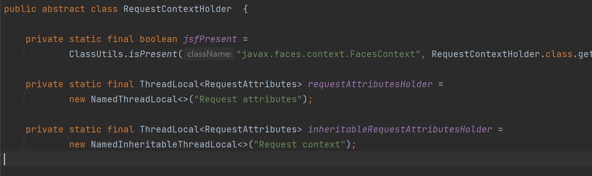
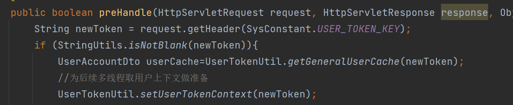
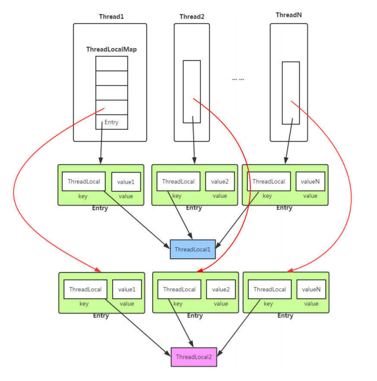
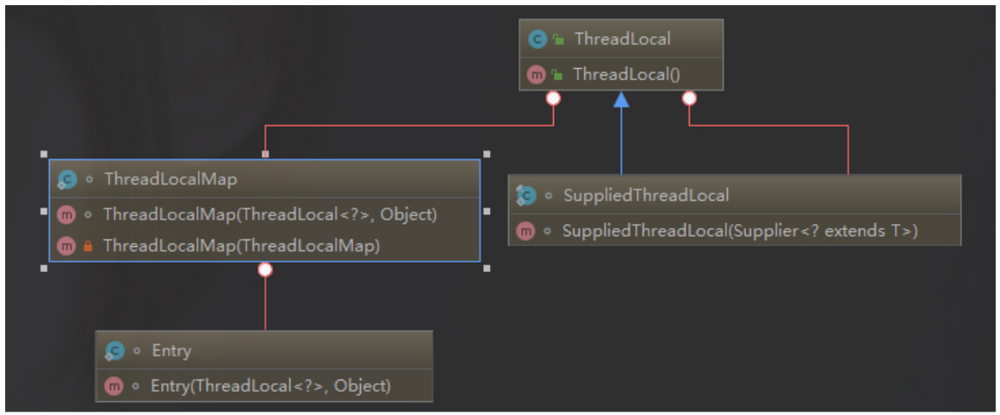

[toc]

# 在子线程下，使用RequestContextHolder无法获取到用户的Token

**一次请求，web服务器就会分配一个线程去处理。也就是说在Service方法中，获取到的HttpServletRequest需要满足：线程内共享，线程间隔离。恰好就是ThreadLocal的应用场景。**

在工具类中添加一个方法，使用RequestContextHolder可以在任意的业务中获取当前请求中的HttpServletRequest，从而避免在Controller中不断向Service中传递HttpServletRequest这个参数。

```java
HttpServletRequest request = RequestContextHolder.getRequestAttributes().getRequest();
HttpServletResponse response = RequestContextHolder.getRequestAttributes().getResponse();
HttpSession session = RequestContextHolder.getRequestAttributes().getSession();
```

由于RequestContextHolder中的ThreadLocal和inheritableThreadocal中存放的是RequestAttributes对象，而RequestAttributes对象中，又保存了HttpServletRequest、HttpServletResponse和HttpSession对象。

所以，即便在调用RequestContextHolder中的setRequstAttributes中参数设为true，使用inheritableThreadLocal来存放RequestAttribute对象，在子线程开启时能够copy父线程的RequestAttributes对象（在Thread类中的init方法里调用，ThreadLocal.createInheritablethreadLocalMap()来copy父线程中的值），但是只复制一层，无法复制到下一层的HttpServletRequest、Response和Session对象。


ThreadLocalMap是，ThreadLocal中的静态内部类，数据结构是一个Entry数组，Entry的key是ThreadLocal的弱引用。通过key的hash值，找到对应的下标，取到Entry。


RequestContextHolder中可以选择使用ThreadLocal和InheritableThreadLocal来存放属性值，默认使用ThreadLocal存放值。

使用ThreadLocal存放值，会导致子线程取不到父线程的属性。

然而将setRequestAttributes函数的inheritable参数改成true，采用InheritableThreadLocal存放Token后，子线程仍然取不到父线程的值。是因为InheritableThreadLocal，在子线程创建的时候（init方法）会copy一次父线程ThreadLocalMap，但是只copy第一层，由于这里的ThreadLocal中存放的类型是RequestAttributes，里面还有很多层对象，只拷贝一层，导致其他类的信息丢失。





**在线程初始化的时候，如果使用了InheritableThreadLocal，在init方法中会copy父线程中的InheritableThreadLocal的值：**

```java
if (inheritThreadLocals && parent.inheritableThreadLocals != null)
            this.inheritableThreadLocals =
                ThreadLocal.createInheritedMap(parent.inheritableThreadLocals);
```


**但是在创建新的ThreadLocalMap的时候，没有对父线程中的ThreadLocalMap中的value进行深拷贝，导致项目中的InheritableThreadLocal存放的RequestAttributes对象中的信息丢失：**

```java
private ThreadLocalMap(ThreadLocalMap parentMap) {
            Entry[] parentTable = parentMap.table;
            int len = parentTable.length;
            setThreshold(len);
            table = new Entry[len];

            for (int j = 0; j < len; j++) {
                Entry e = parentTable[j];
                if (e != null) {
                    @SuppressWarnings("unchecked")
                    ThreadLocal<Object> key = (ThreadLocal<Object>) e.get();
                    if (key != null) {
                        Object value = key.childValue(e.value);
                        Entry c = new Entry(key, value);
                        int h = key.threadLocalHashCode & (len - 1);
                        while (table[h] != null)
                            h = nextIndex(h, len);
                        table[h] = c;
                        size++;
                    }
                }
            }
        }
```


**如何解决：**

在UserTokenUtil工具类中，自定义一个 `InheritableThreadLocal<String>` 存放用户的Token信息，保证String信息，在子线程创建的时候能被复制到。

在用户登录的时候，在 `AuthInterceptor` 用户验证拦截器中，向InheritableThreadLocal中。set用户的token。




**ThreadLocal底层源码分析：**

```java
public class Thread implements Runnable {
 ......
//与此线程有关的ThreadLocal值。由ThreadLocal类维护
ThreadLocal.ThreadLocalMap threadLocals = null;
//与此线程有关的InheritableThreadLocal值。由InheritableThreadLocal类维护
ThreadLocal.ThreadLocalMap inheritableThreadLocals = null;
 ......
}
```

从上⾯ Thread 类 源代码可以看出 Thread 类中有⼀个` threadLocals` 和 ⼀个 `inheritableThreadLocals` 变量，它们都是` ThreadLocalMap `类型的变量,我们可以把 `ThreadLocalMap` 理解为 `ThreadLocal` 类实现的定制化的 HashMap 。默认情况下这两个变量都 是 null，只有当前线程调⽤ `ThreadLocal` 类的`set `或` get `⽅法时才创建它们，实际上调⽤这两 个⽅法的时候，我们调⽤的是 ThreadLocalMap 类对应的 `get() `、` set() `⽅法。 ThreadLocal 类的` set()` 方法。

```java
public void set(T value) {
 Thread t = Thread.currentThread();
 ThreadLocalMap map = getMap(t);
 if (map != null)
 map.set(this, value);
 else
 createMap(t, value);
 }
 ThreadLocalMap getMap(Thread t) {
 return t.threadLocals;
 }
```

通过上⾯这些内容，我们⾜以通过猜测得出结论：最终的变量是放在了当前线程的 `ThreadLocalMap` 中，并不是存在 `ThreadLocal `上， `ThreadLocal `可以理解为只 是 `ThreadLocalMap` 的封装，传递了变量值。 `ThrealLocal` 类中可以通过 `Thread.currentThread()` 获取到当前线程对象后，直接通过 `getMap(Thread t)` 可以访问到该线程的 `ThreadLocalMap` 对象。 `ThreadLocal` 内部维护的是⼀个类似 Map 的 `ThreadLocalMap` 数据结构， `key `为当前对象 的 `Thread` 对象，值为 `Object` 对象。

```java
ThreadLocalMap(ThreadLocal<?> firstKey, Object firstValue) {
 ......
}
```

⽐如我们在同⼀个线程中声明了两个 `ThreadLocal` 对象的话，会使⽤ `Thread` 内部都是使⽤仅有 那个 `ThreadLocalMap` 存放数据的， `ThreadLocalMap` 的 `key` 就是 `ThreadLocal `对象，`value `就是 `ThreadLocal `对象调⽤ `set` ⽅法设置的值。



`ThreadLocalMap` 是 `ThreadLocal` 的静态内部类。




**ThreadLocal内存泄漏：**

`ThreadLocalMap` 中使⽤的 `key` 为 `ThreadLocal` 的弱引⽤,⽽ `value` 是强引⽤。所以，如果 `ThreadLocal` 没有被外部强引⽤的情况下，在垃圾回收的时候，key 会被清理掉，⽽ `value` 不会 被清理掉。这样⼀来， `ThreadLocalMap` 中就会出现 key 为 null 的 `Entry`。假如我们不做任何措 施的话，`value` 永远⽆法被 GC 回收，这个时候就可能会产⽣内存泄露。`ThreadLocalMap` 实现 中已经考虑了这种情况，在调⽤ `set()` 、` get()` 、 `remove()` ⽅法的时候，会清理掉 key 为 null 的记录。使⽤完 ThreadLocal ⽅法后 最好⼿动调⽤ `remove()` ⽅法。

```java
static class Entry extends WeakReference<ThreadLocal<?>> {
 /** The value associated with this ThreadLocal. */
 Object value;
 Entry(ThreadLocal<?> k, Object v) {
 super(k);
 value = v;
 }
 }
```


**弱引用介绍：**

如果⼀个对象只具有弱引⽤，那就类似于可有可⽆的⽣活⽤品。弱引⽤与软引⽤的区别在 于：只具有弱引⽤的对象拥有更短暂的⽣命周期。在垃圾回收器线程扫描它 所管辖的内存 区域的过程中，⼀旦发现了只具有弱引⽤的对象，不管当前内存空间⾜够与否，都会回收它 的内存。不过，由于垃圾回收器是⼀个优先级很低的线程， 因此不⼀定会很快发现那些只 具有弱引⽤的对象。 弱引⽤可以和⼀个引⽤队列（ReferenceQueue）联合使⽤，如果弱引⽤所引⽤的对象被垃 圾回收，Java 虚拟机就会把这个弱引⽤加⼊到与之关联的引⽤队列中。


# 如何防止重复提交

通过唯一性主键，把对应的数据存放在redis中，防止重复提交。

请求来的时候，通过唯一性主键去redis里取数据，

* 如果redis中有数据，且和这次的数据相同，就不提交；
* 如果redis中没有数据，把数据存到redis里，并提交数据；

提交完成后，释放redis中的数据。


# Maven\<dependencyManagement>标签

<!-- 继承自该项目的所有子项目的默认依赖信息。这部分的依赖信息不会被立即解析,而是当子项目声明一个依赖（必须描述group ID和artifact ID信息），如果group ID和artifact ID以外的一些信息没有描述，则通过group ID和artifact ID 匹配到这里的依赖，并使用这里的依赖信息。 --> <dependencyManagement> 