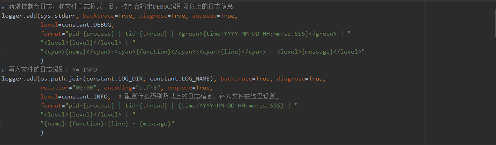

[toc]

# 修改过的地方：

## dbproxy.connection.py

在 `conn()` 和 `conn_close()` 方法里添加了数据库连接信息的日志


## controller.sched.py

1. 增加了方法 `loop_req`

2. 把原来的print替换成了日志

3. main方法新增了一个定时查询的任务
4. 把定时任务的逻辑抽象成独立的进程，从消息队列中提取flag


## controller.sched_pool.py

1. 增加了接口请求任务的部分

2. 把数据库查询方法统一替换成 `dbproxy.db_common.py`  里的方法（能够自动记录数据库日志）

3. 把scheduler单例生成的BlockingScheduler替换成BackGroundScheduler，改成非阻塞的scheduler


## util.constant.py

* 修改了数据库用户名、密码和url

* 增加了日志文件的路径 `LOG_DIR` 和 `LOG_NAME`

  * `LOG_DIR` 需要填写日志保存文件夹的绝对路径，现在是项目中log包下的out文件夹的绝对路径
  * `LOG_NAME` 日志文件名目前设置的是 `test_日期` ，日志按天自动生成，当天的日志都会记在同一个日志文件内，目前的日志文件名为：test_2021-08-19，前缀test可以自行修改，其中 `{time:YYYY-MM-DD}` 是日期格式化形式，精确到天

* 增加了日志等级常量

  TRACE, DEBUG, INFO, SUCCESS, WARNING, ERROR, CRITICAL
  
* 增加了任务类型标识的常量


## server.main.py

增加了req_handler对应的url路由

把tornado逻辑整合成单独的进程


# 完全新增的内容：
增加的文件：

*  `log.log_wrapper.py` 
*  `dbproxy.db_common.py` 
* `server.handlers.req_handler.py`
* `server.service.req_service`
* `server.templates.insert_req_cfg.html`
* `server.templates.req_param.html`
* `server.templates.update_req_cfg.html`
* `util.singleton_queue.py`
* `server.integration.py` 这个是现在程序的入口，把定时调度和tornado进程整合到一起
* `controller.sched_new.py` 这个是新的定时调度的部分
* `util.singleton_scheduler.py` scheduler单例

增加的包：

*  `enums`（下面有四个枚举类），放在项目根目录下


# 日志配置和使用方法


## 日志配置

日志配置在 `log.logger_wrapper.py` 中，在这里配置后，项目中所有的日志都使用此配置，不需要重复配置



使用`logger.add()` 方法新增日志handler

如上图所示，目前项目中使用了两个日志handler：第一个handler为控制台日志，第二个handler为文件日志的配置


add方法的参数就是日志handler的配置，参数介绍：

* `backtrace = True, diagnose = True`：日志会记录错误的栈信息
* `enqueue = True`： 保证进程安全，日志本身是线程安全的
* `level`: 设置什么级别（包括设置的级别）的日志信息会记录下来，控制台日志设置显示DEBUG级别以上的日志，文件日志设置保存INFO级别以上的日志信息
* `rotation`：日志生成的方式，可以按日期也可以按文件大小生成，目前设置成每天0：00自动生成
* `format`：日志样式设置


 以下是从源码中摘录出来的日志级别信息和日志样式信息：

更多配置可以参考官方文档、github和loguru源码内的注释：

https://loguru.readthedocs.io/en/stable/index.html

https://github.com/Delgan/loguru

        +----------------------+------------------------+------------------------+
        | Level name           | Severity value         | Logger method          |
        +======================+========================+========================+
        | ``TRACE``            | 5                      | |logger.trace|         |
        +----------------------+------------------------+------------------------+
        | ``DEBUG``            | 10                     | |logger.debug|         |
        +----------------------+------------------------+------------------------+
        | ``INFO``             | 20                     | |logger.info|          |
        +----------------------+------------------------+------------------------+
        | ``SUCCESS``          | 25                     | |logger.success|       |
        +----------------------+------------------------+------------------------+
        | ``WARNING``          | 30                     | |logger.warning|       |
        +----------------------+------------------------+------------------------+
        | ``ERROR``            | 40                     | |logger.error|         |
        +----------------------+------------------------+------------------------+
        | ``CRITICAL``         | 50                     | |logger.critical|      |
        +----------------------+------------------------+------------------------+
    
        .. _record:
    
        .. rubric:: The record dict
    
        The record is just a Python dict, accessible from sinks by ``message.record``. It contains
        all contextual information of the logging call (time, function, file, line, level, etc.).
    
        Each of its key can be used in the handler's ``format`` so the corresponding value is
        properly displayed in the logged message (e.g. ``"{level}"`` -> ``"INFO"``). Some record's
        values are objects with two or more attributes, these can be formatted with ``"{key.attr}"``
        (``"{key}"`` would display one by default). `Formatting directives`_ like ``"{key: >3}"``
        also works and is particularly useful for time (see below).
    
        +------------+---------------------------------+----------------------------+
        | Key        | Description                     | Attributes                 |
        +============+=================================+============================+
        | elapsed    | The time elapsed since the      | See |timedelta|            |
        |            | start of the program            |                            |
        +------------+---------------------------------+----------------------------+
        | exception  | The formatted exception if any, | ``type``, ``value``,       |
        |            | ``None`` otherwise              | ``traceback``              |
        +------------+---------------------------------+----------------------------+
        | extra      | The dict of attributes          | None                       |
        |            | bound by the user (see |bind|)  |                            |
        +------------+---------------------------------+----------------------------+
        | file       | The file where the logging call | ``name`` (default),        |
        |            | was made                        | ``path``                   |
        +------------+---------------------------------+----------------------------+
        | function   | The function from which the     | None                       |
        |            | logging call was made           |                            |
        +------------+---------------------------------+----------------------------+
        | level      | The severity used to log the    | ``name`` (default),        |
        |            | message                         | ``no``, ``icon``           |
        +------------+---------------------------------+----------------------------+
        | line       | The line number in the source   | None                       |
        |            | code                            |                            |
        +------------+---------------------------------+----------------------------+
        | message    | The logged message (not yet     | None                       |
        |            | formatted)                      |                            |
        +------------+---------------------------------+----------------------------+
        | module     | The module where the logging    | None                       |
        |            | call was made                   |                            |
        +------------+---------------------------------+----------------------------+
        | name       | The ``__name__`` where the      | None                       |
        |            | logging call was made           |                            |
        +------------+---------------------------------+----------------------------+
        | process    | The process in which the        | ``name``, ``id`` (default) |
        |            | logging call was made           |                            |
        +------------+---------------------------------+----------------------------+
        | thread     | The thread in which the         | ``name``, ``id`` (default) |
        |            | logging call was made           |                            |
        +------------+---------------------------------+----------------------------+
        | time       | The aware local time when the   | See |datetime|             |
        |            | logging call was made           |                            |
        +------------+---------------------------------+----------------------------+
    
        .. _time:
    
        .. rubric:: The time formatting
    
        To use your favorite time representation, you can set it directly in the time formatter
        specifier of your handler format, like for example ``format="{time:HH:mm:ss} {message}"``.
        Note that this datetime represents your local time, and it is also made timezone-aware,
        so you can display the UTC offset to avoid ambiguities.
    
        The time field can be formatted using more human-friendly tokens. These constitute a subset
        of the one used by the `Pendulum`_ library of `@sdispater`_. To escape a token, just add
        square brackets around it, for example ``"[YY]"`` would display literally ``"YY"``.
    
        If you prefer to display UTC rather than local time, you can add ``"!UTC"`` at the very end
        of the time format, like ``{time:HH:mm:ss!UTC}``. Doing so will convert the ``datetime``
        to UTC before formatting.
    
        If no time formatter specifier is used, like for example if ``format="{time} {message}"``,
        the default one will use ISO 8601.
    
        +------------------------+---------+----------------------------------------+
        |                        | Token   | Output                                 |
        +========================+=========+========================================+
        | Year                   | YYYY    | 2000, 2001, 2002 ... 2012, 2013        |
        |                        +---------+----------------------------------------+
        |                        | YY      | 00, 01, 02 ... 12, 13                  |
        +------------------------+---------+----------------------------------------+
        | Quarter                | Q       | 1 2 3 4                                |
        +------------------------+---------+----------------------------------------+
        | Month                  | MMMM    | January, February, March ...           |
        |                        +---------+----------------------------------------+
        |                        | MMM     | Jan, Feb, Mar ...                      |
        |                        +---------+----------------------------------------+
        |                        | MM      | 01, 02, 03 ... 11, 12                  |
        |                        +---------+----------------------------------------+
        |                        | M       | 1, 2, 3 ... 11, 12                     |
        +------------------------+---------+----------------------------------------+
        | Day of Year            | DDDD    | 001, 002, 003 ... 364, 365             |
        |                        +---------+----------------------------------------+
        |                        | DDD     | 1, 2, 3 ... 364, 365                   |
        +------------------------+---------+----------------------------------------+
        | Day of Month           | DD      | 01, 02, 03 ... 30, 31                  |
        |                        +---------+----------------------------------------+
        |                        | D       | 1, 2, 3 ... 30, 31                     |
        +------------------------+---------+----------------------------------------+
        | Day of Week            | dddd    | Monday, Tuesday, Wednesday ...         |
        |                        +---------+----------------------------------------+
        |                        | ddd     | Mon, Tue, Wed ...                      |
        |                        +---------+----------------------------------------+
        |                        | d       | 0, 1, 2 ... 6                          |
        +------------------------+---------+----------------------------------------+
        | Days of ISO Week       | E       | 1, 2, 3 ... 7                          |
        +------------------------+---------+----------------------------------------+
        | Hour                   | HH      | 00, 01, 02 ... 23, 24                  |
        |                        +---------+----------------------------------------+
        |                        | H       | 0, 1, 2 ... 23, 24                     |
        |                        +---------+----------------------------------------+
        |                        | hh      | 01, 02, 03 ... 11, 12                  |
        |                        +---------+----------------------------------------+
        |                        | h       | 1, 2, 3 ... 11, 12                     |
        +------------------------+---------+----------------------------------------+
        | Minute                 | mm      | 00, 01, 02 ... 58, 59                  |
        |                        +---------+----------------------------------------+
        |                        | m       | 0, 1, 2 ... 58, 59                     |
        +------------------------+---------+----------------------------------------+
        | Second                 | ss      | 00, 01, 02 ... 58, 59                  |
        |                        +---------+----------------------------------------+
        |                        | s       | 0, 1, 2 ... 58, 59                     |
        +------------------------+---------+----------------------------------------+
        | Fractional Second      | S       | 0 1 ... 8 9                            |
        |                        +---------+----------------------------------------+
        |                        | SS      | 00, 01, 02 ... 98, 99                  |
        |                        +---------+----------------------------------------+
        |                        | SSS     | 000 001 ... 998 999                    |
        |                        +---------+----------------------------------------+
        |                        | SSSS... | 000[0..] 001[0..] ... 998[0..] 999[0..]|
        |                        +---------+----------------------------------------+
        |                        | SSSSSS  | 000000 000001 ... 999998 999999        |
        +------------------------+---------+----------------------------------------+
        | AM / PM                | A       | AM, PM                                 |
        +------------------------+---------+----------------------------------------+
        | Timezone               | Z       | -07:00, -06:00 ... +06:00, +07:00      |
        |                        +---------+----------------------------------------+
        |                        | ZZ      | -0700, -0600 ... +0600, +0700          |
        |                        +---------+----------------------------------------+
        |                        | zz      | EST CST ... MST PST                    |
        +------------------------+---------+----------------------------------------+
        | Seconds timestamp      | X       | 1381685817, 1234567890.123             |
        +------------------------+---------+----------------------------------------+
        | Microseconds timestamp | x       | 1234567890123                          |
        +------------------------+---------+----------------------------------------


## 日志的使用

记录日志的方法：

```python
from loguru import logger
import util.constant as constant
# 首先在需要使用日志的文件导入logger
# 可以使用两种方式记录日志

# 使用和日志级别信息一样的方法记录
logger.debug("想要记录的信息")
logger.info("想要记录的信息")
logger.success("想要记录的信息")
logger.warning("想要记录的信息")
logger.error("想要记录的信息")
logger.critical("想要记录的信息")

# 使用log方法，手动指定日志级别
# 建议使用constant里的常量代替直接使用"DEBUG"
logger.log(constant.DEBUG, "想要记录的信息")
```


## 日志装饰器

改装饰器能够自动记录任务开始和结束的时间，代码位置，文件等，同时能够自动捕获装饰的任务出现的异常

**建议加在service方法上，以任务为单位来标记**

使用方法：

```python
from log.logger_wrapper import LoggerWrapper
# 先导入LoggerWrapper类
# 在想要装饰的函数上加上注解
# task_name参数填入任务的名称即可
@LoggerWrapper.info(task_name="任务名称")
def test_method():
    print("test_method")
    
使用@LoggerWrapper.debug(task_name="")
记录的是debug级别的日志
task_name可以不填，默认值为None
```

如果在注解修饰的函数内部手动捕获了某个异常，那么需要自己手动记录这个异常信息，不会再自动记录异常了。


**注意：**

请勿嵌套使用该注解，如果外部内部已经有注解了，外部函数不建议再加注解，比如

```python
@LoggWrapper.info()
def m1():
    pass

@LoggerWrapper.info()
def m2():
    pass

# 不建议这样使用
@LoggerWrapper.info()
def m3():
    m1()
    m2()
```


具体使用方法可以参考 `server.handlers.req_handler.py` 和 `server.service.req_service.py` 里的使用


# 新的定时调度的逻辑

新的程序入口在 `server.integration.py` 这个文件里，新建了两个进程，两个进程共用了一个消息队列。


新的定时调度逻辑，全部在 `sched_new.py`，这个文件下面，任务调度进程的入口，在这个文件的main方法下。

1. 首先把任务的逻辑抽象成一个serivice函数

   函数名命名为  任务类型_service，如 req_service, msg_service, chk_service，

   sevice函数的参数为一个字典，传入的是任务具体的配置信息，这个信息从消息队列里取出

   什么时候把配置信息传进消息队列，请看消息队列的数据格式，可以先把定时调度的逻辑看完

   任务类型建议为小写，定义在 `util.constant.py` 里: constant.REQ, constant.MSG, constant.CHK

2. 然后把写好的 service 函数 import 到 sched_new.py 里即可

   定时调度通过反射的方式去获取service，通过 `sched_new.py` 里的 `get_service` 方法实现


上面是如何把service方法注册到定时调度进程内。

初始化定时调度，仍然需要针对每个任务重新编写，初始化的逻辑和原来是一样的，都是去查表，add到scheduler里


初始化方法参考 `sched_new.py` 里的 `init_req` 方法；编写好初始化方法之后，需要像配置tornado的handler一样，在main方法中，把所有的init方法配置到列表 `init_list` 里。


修改任务状态的方法为 `exchange_scheduled_service` ，会根据消息队列传入的任务类型，通过反射去找到对应的service方法（前提是service方法，import到 sched_new.py 下了，**这一点很重要**）


# 消息队列数据格式

```json
{
    "service_type": constant.REQ,
    "status": "INSERT" OR "UPDATE" OR "DELETE",
    "info": 任务具体的配置信息的字典，假设这个键对应的字典叫cfg
}
```

消息队列传入的对象是一个字典，每一个字典，必须要有上面三个字段：

* "service_type"：任务的类型，和 contant.py 里定义的任务类型一致，为字符串

* "status"：任务的状态，有三种 "INSERT", "UPDATE", "DELETE" ，状态出现的方式和原来的逻辑是一样的

* "info"：任务的具体配置信息，即从数据库表里查出来的信息，其中 info这个字典里一定要有一个id字段,即：

  cfg["id"] = constant.REQ + req_oid

  任务类型 + 任务的oid，举例：req19，msg20

  这个字段是用来唯一标识一个任务的，也是apscheduler里任务的id，**一定要手动在info对应的字典里添加这个键值对，这样定时调度修改任务，才可以通过id找到这个任务**


消息队列取出数据到更新任务，都在上面的定时调度逻辑里，只需要编写好service，导入 sched_new.py 即可


什么时候插入消息队列：

在tornado增删查改的时候，即出现 `INSERT`, `UPDATE`, `DELETE` 这三种状态的时候，把这个字典写入到消息队列里，具体可以参考 `server.handler.req_handler.py`


# 上线步骤

1. 安装loguru，进入 `loguru-0.5.3-py3-none-any.whl` 所在目录，切换到正确的python环境，安装loguru `pip install loguru-0.5.3-py3-none-any.whl`
2. 修改 `util.constant` 文件中日志存放目录的绝对路径
3. 数据库建表，运行 `createReqCfgTable.sql` 和 `createReqSeq.sql`
4. 更新以上python代码
5. 运行`server.integration.py`

**目前只有接口请求的定时调度使用了消息队列，其他两个定时任务都开放了接口，需要在对应的handler里增加消息队列部分的逻辑。**

原来定时调度方式仍然成立，单独起 `main.py` 和 `sche.py` ，是可以运行的，并且接口请求的功能也添加进去了，后续修改了另外两个的handler之后，就可以切换到 `integration.py`

