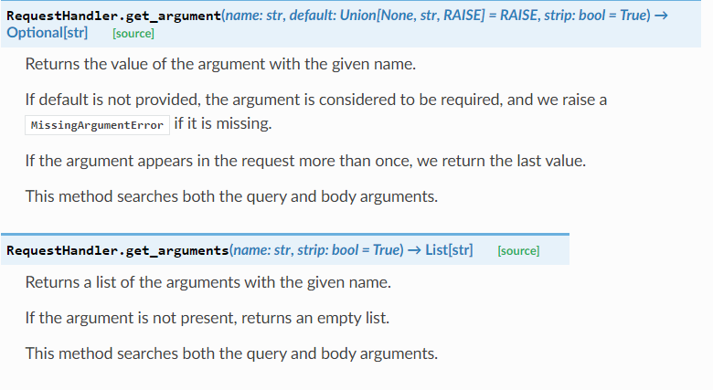
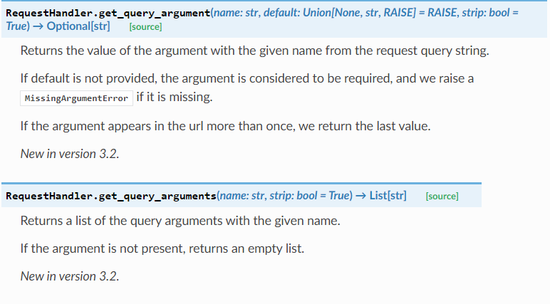
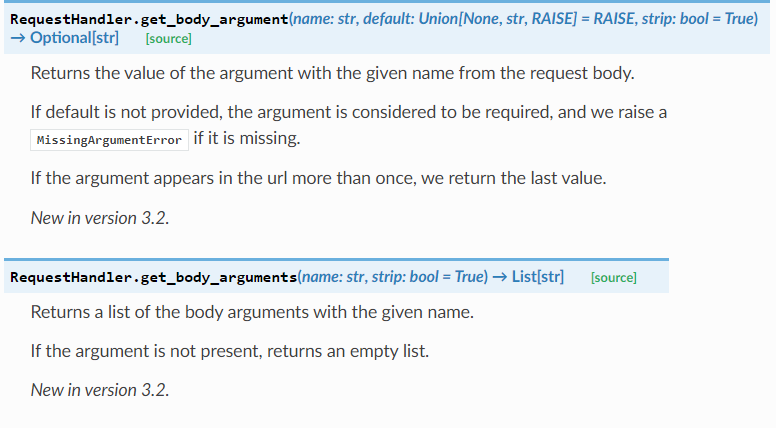

# 概述

tornado使用单线程事件循环（single-threaded event loop），降低并发连接成本。所以所有应用都应该以异步和非阻塞为目标，因为一次只有一个操作处于存活状态。


tornado中讨论的阻塞一般都是在**网络IO**背景下，当然其他类型的阻塞也需要最小化。


application对象负责**路由表配置**和**web请求与handler的映射**


# Request.get_argument()



# Request.get_query_argument()



## Request.get_body_argument()




# ajax前端

1. 如果ajax前端这样写

   ```html
   data:JSON.stringify({start_time: 2020, end_time: 2021})
   ```

   那么后端接收到的是json字符串,`b'{"start_time":2020,"end_time":2021}'`

   tornado要这样解析

   ```python
   data = json.loads(self.request.body)
   ```

2. 如果ajax这样写

   ```html
   data:{start_time: 2020, end_time: 2021}
   ```

   那么后端收到的是key=val&key=val格式

   tornado要这样解析

   ```python
   start_time = self.get_body_argument("start_time")
   ```

   


# 遇到的问题

chrome最多只允许与同一个服务器建立六个socket连接，如果这六个都被阻塞了，那么其他请求都会被阻塞。

Http1.1实现了长连接，一个请求结束后，TCP连接并不会断开，虽然可以复用TCP连接，但是同一个TCP连接上的HTTP请求的生命周期是不会重叠的，如果发起了多个HTTP请求，是顺序执行的。
