# 一些概念

前端mvvm结构（模块化），对应后端mvc结构

m：model（模型）

v：view（视图）

vm：view model，视图模型（对应后端controller）

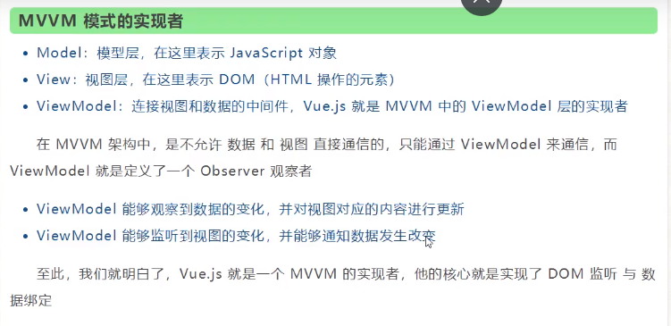

vue：集合mvvm（angular）和虚拟DOM（react）

Axios：前端通信框架。Vue专注于视图处理，所以需要一个通信框架与服务器进行交互。Vue推荐使用Axios或ajax


Spring MVC分发请求过程：

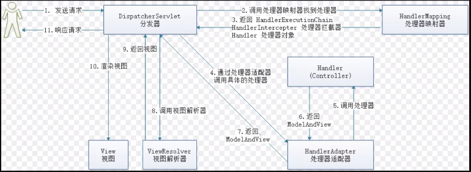


vue里，view和model通过vm(view model)实现双向绑定（监听），可以在view上动态改变数据，不需要刷新页面。

测试的时候在控制台直接改变vm对象中的数值，页面上会动态变化

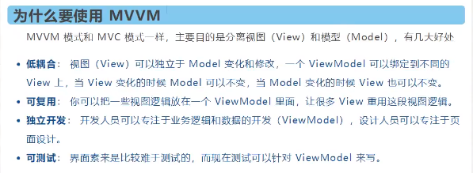


**vm（view model）：**

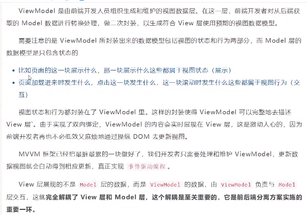


**vue.js实际上是mvvm的实现者，实现了DOM监听和数据绑定**


# 一些语法

**Vue基于ES6语法**

## 判断

注意：

* html判断相等要用 `===`

* 在标签内使用，判断条件关键字：`v-if`、`v-else-if`

  

```html
<body>

    <div id="app">
        <p v-if="type==='A'">A</p>
        <p v-else-if="type==='B'">B</p>
        <p v-else-if="type==='C'">C</p>
        <p v-else>D</p>
    </div>

    <script src="https://cdn.jsdelivr.net/npm/vue@2.6.14/dist/vue.js"></script>
    <script>
        let vm = new Vue({
            el: "#app",
            data: {
                type: "A"
            }
        })
    </script>
</body>
```


## 循环

* 循环关键字：`v-for`
* 循环语法和python类似：`v-for="item in items"`
* 数组使用 `[]` 表示，对象使用 `{}` 表示

```html
<body>

    <div id="app">
        <p v-for="C in list">
            {{C}}
        </p>
    </div>

    <script src="https://cdn.jsdelivr.net/npm/vue@2.6.14/dist/vue.js"></script>
    <script>
        let vm = new Vue({
            el: "#app",
            data: {
                list: [
                    "A",
                    "B",
                    "C"
                ]
            }
        })
    </script>
</body>
```

数组存储对象的例子：

* v-for有一个自带的属性，叫index（数组下标）

```html
<body>

    <div id="app">
        <!-- 不需要下标 -->
        <p v-for="C in list">
            {{C.message}}
        </p>
        <p v-for="(C, index) in list">
            {{C.type}}--{{index}}
        </p>
    </div>

    <script src="https://cdn.jsdelivr.net/npm/vue@2.6.14/dist/vue.js"></script>
    <script>
        let vm = new Vue({
            el: "#app",
            data: {
                list: [
                    {message: "A", type: "String"},
                    {message: "B", type: "Integer"},
                    {message: "C", type: "Character"}
                ]
            }
        })
    </script>
</body>
```


## 事件

* 使用 `v-on:` 关键字监听事件，如 `v-on:click="count += 1"` ，双引号中的内容是监听到事件后的行为

```html
<body>

    <div id="app">
        <button v-on:click="count += 1">点击加一</button>
        <p>
            The button above has been click {{count}} times.
        </p>

    </div>

    <script src="https://cdn.jsdelivr.net/npm/vue@2.6.14/dist/vue.js"></script>
    <script>
        let vm = new Vue({
            el: "#app",
            data: {
                count: 0
            }
        })
    </script>
</body>
```


## 方法

**在当前Vue对象中取属性，需要使用this指针**

如果只有一个方法，使用 `method` 关键字

如果有多个方法，使用 `methods` 关键字

```html
<body>

    <div id="app">
        <button v-on:click="hello">点击</button>
    </div>

    <script src="https://cdn.jsdelivr.net/npm/vue@2.6.14/dist/vue.js"></script>
    <script>
        let vm = new Vue({
            el: "#app",
            data: {
                message: "Hello"
            },
            methods: { // vue的方法一定要定义在method,methods对象中
                hello: function () {
                    // 在当前Vue对象中取属性，需要使用this指针
                    alert(this.message);
                    console.log(this.message)
                }
            }
        })
    </script>
</body>
```


## 双向绑定

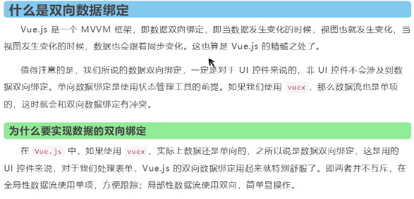

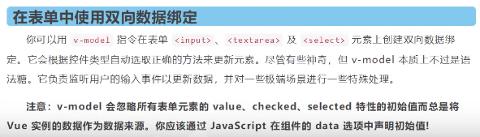


使用 `v-model` 在表单 `<input>` 、 `<textarea> ` 以及 `<selecct>` 元素上实现双向数据绑定，将输入框中的内容和变量绑定起来

**双向绑定文本框的值：**

```html
<body>
    <div id="app">
        输入文本：<input type="text" v-model="message">  {{message}}
    </div>

    <script src="https://cdn.jsdelivr.net/npm/vue@2.6.14/dist/vue.js"></script>
    <script>
        let vm = new Vue({
            el: "#app",
            data: {
                message: ""
            },
        })
    </script>
</body>
```


**双向绑定单选框的value：**

```html
<body>
    <div id="app">
        <input type="radio" name="sex" value="male" v-model="sex">男
        <input type="radio" name="sex" value="female" v-model="sex">女<br/>
        当前性别：{{sex}}
    </div>

    <script src="https://cdn.jsdelivr.net/npm/vue@2.6.14/dist/vue.js"></script>
    <script>
        let vm = new Vue({
            el: "#app",
            data: {
                sex: "",
                maleChecked: false
            },
        })
    </script>
</body>
```


**双向绑定下拉框：**

```html
<body>
    <div id="app">
        <select v-model="selected">
            <option value="" disabled>--请选择--</option>
            <option value="我是A">A</option>
            <option value="我是B">B</option>
            <option value="我是C">C</option>
        </select><br/>
        选中的内容:{{selected}}
    </div>

    <script src="https://cdn.jsdelivr.net/npm/vue@2.6.14/dist/vue.js"></script>
    <script>
        let vm = new Vue({
            el: "#app",
            data: {
                sex: "",
                selected: ""
            },
        })
    </script>
</body>
```


## 组件


**一个组件的 `data` 选项必须是一个函数**，因此每个实例可以维护一份被返回对象的独立的拷贝：

```html
<body>
    <div id="app">
        <test-component/>
    </div>

    <script src="https://cdn.jsdelivr.net/npm/vue@2.6.14/dist/vue.js"></script>
    <script>

      Vue.component("test-component", {
        data: function() {
          return {
            count: 0
          }
        },
        template: '<button v-on:click="count += 1">点击了{{count}}次</button><br/>'
      })
    </script>
</body>
```


**使用props向组件传递数据**：

* 组件中props数组存放的是所有的变量名，在使用组件时通过 `v-bind:=` 绑定外部变量和组件内参数

* `v-bind:` 后面的参数是component中，props数组指定的参数，等号后面的是组件标签中定义的变量，比如for循环的变量

  

```html
<body>
    <div id="app">
      <test-component v-for="language in languages" v-bind:message="language"></test-component>
      <test-component v-for="city in cities" v-bind:message="city"></test-component>
      <test-component v-for="country in countries" v-bind:message="country"></test-component>
    </div>

    <script src="https://cdn.jsdelivr.net/npm/vue@2.6.14/dist/vue.js"></script>
    <script>

      Vue.component("test-component", {
        props: ['message', 'otherVar'],
        template: '<li>{{message}}</li>'
      })

      let vm = new Vue({
        el: "#app",
        data: {
          languages: ["English", "Spanish", "Chinese"],
          cities: ["Beijing", "Toronto", "Tokyo"],
          countries: ["China", "American", "England"]
        },
      })
    </script>
</body>
```


## 计算属性

**计算属性(computed属性)**：计算出来的结果放在属性中，内存中运行；计算属性实际上是一个属性

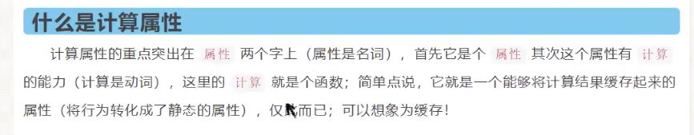

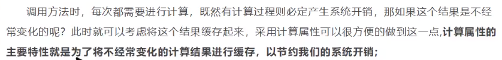

计算属性和方法的区别

```html
<!DOCTYPE html>
<html lang="en">
<head>
    <meta charset="UTF-8">
    <title>Title</title>
</head>
<body>

    <div id="app">
        <p>{{currentTime1()}}</p> // 调用方法要加括号
        <p>{{currentTime2}}</p>   // 调用计算属性，直接用属性名即可
    </div>

    <script src="https://cdn.jsdelivr.net/npm/vue@2/dist/vue.js"></script>
    <script>
        let vm = new Vue({
            el: "#app",
            data: {
                msg: "hello"
            },
            methods: {
                currentTime1: function() { // 注意方法和计算属性不要重名，重名会优先调用方法
                    return Date.now();
                }
            },
            computed: {
                currentTime2: function() {
                    return Date.now();
                }
            }
        })
    </script>
</body>
</html>
```


## slot插槽

官方文档的解释：

`<slot></slot>` 可以被替换成任何模板代码，宝库哦HTML。

这里是将插槽替换成 component 里的html语句：

* 声明插槽时，使用 name 属性来标记插槽

* 使用 component 组件的时候，slot 属性填入插槽的 name，绑定需要填充的插槽
* 然后使用 vue 对象中的data属性，动态将参数传入 component 组件中（使用 axios 将接收到的后端数据动态传入到 coponent 组件中

```html
<!DOCTYPE html>
<html lang="en">
<head>
    <meta charset="UTF-8">
    <title>Title</title>
</head>
<body>
<div id="app">
    <todo>
        <todo-title slot="todo-title" v-bind:phase="title"></todo-title>
        <todo-items slot="todo-items" v-for="item in items" v-bind:content="item"></todo-items>
    </todo>
</div>

<script src="https://cdn.jsdelivr.net/npm/vue@2/dist/vue.js"></script>
<script>

    Vue.component("todo", {
        template: '<div>' +
                '<slot name="todo-title"></slot>' +
                '<ul>' +
                    '<slot name="todo-items"></slot>' +
                '</ul>' +
            '</div>'
    });

    Vue.component("todo-title", {
        props: ["phase"],
        template: '<p>{{phase}}</p>'
    });

    Vue.component("todo-items", {
        props: ["content"],
        template: '<li>{{content}}</li>'
    })

    let vm = new Vue({
        el: "#app",
        data: {
            title: "书籍",
            items: ["Java", "Python", "C++"]
        }
    })
</script>
</body>
</body>
</html>
```


# 网络通信Axios

Axios异步通信框架

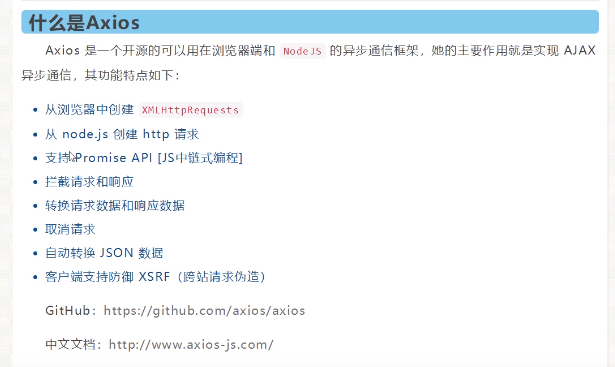


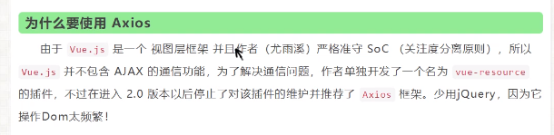

vue生命周期：https://cn.vuejs.org/v2/guide/instance.html

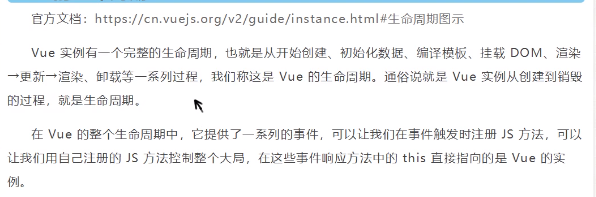

**建议在生命周期中的 mounted 阶段加载 axios**


**用get请求取本地json文件做测试**

```html
<!DOCTYPE html>
<html lang="en">
<head>
    <meta charset="UTF-8">
    <title>Title</title>
</head>
<body>

  <div id="vue">
      <a v-bind:href="info.url">点击跳转百度</a>
      <p>地址：{{info.address.市}}--{{info.address.区}}--{{info.address.街道}}</p>
  </div>

  <script src="https://cdn.jsdelivr.net/npm/vue@2.6.14/dist/vue.js"></script>
  <script src="https://unpkg.com/axios/dist/axios.min.js"></script>

  <script>
    let vm = new Vue({
        el: "#vue",

        // 从网络取得数据要使用data函数，不是data属性
        data() {
            return {
                // 请求的返回参数格式必须要和json字符串一样
                info: {
                    name: null,
                    url: null,
                    address: {
                        市: null,
                        区: null,
                        街道: null
                    }
                }
            }
        },
        mounted() { // 钩子函数，链式调用
            //  在当前Vue对象中取属性，需要使用this指针
            axios.get('../data.json').then(response=>(this.info=response.data));
        }
    });
  </script>

</body>
</html>
```


# 自定义事件

在 component 组件中使用 `this.$emit()` 方法完成自定义事件分发，**组件远程调用 vm 实例中的方法**。 

由于在html中，事件名不区分大小写，所以**事件名如果使用驼峰会绑定不到对应的事件**，建议使用下划线格式命名。

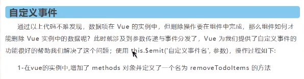


在**使用（引用）** component 组件的时候，使用 `v-on` 关键字绑定组件里的事件和外部vm对象中的方法（这里是填充slot组件里的button中的onclick），然后button，通过 `v-on:click` 绑定组件内部的方法，该方法将事件转发到一开始绑定的组件外部的vm对象（比较绕）。


简略版：

前端（`<todo-items>`标签）与 todo-title 组件绑定，前端与 vm 实例绑定。

组件通过 `this.$emit()` 组件中的事件，转发到 vm 实例中的事件。

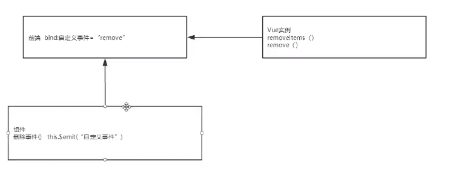

```html
<!DOCTYPE html>
<html lang="en">
<head>
    <meta charset="UTF-8">
    <title>Title</title>
</head>
<body>
<div id="app">
    <todo>
        <todo-title slot="todo-title" v-bind:phase="title"></todo-title>
        <todo-items slot="todo-items" v-for="(item, index) in items"
                    v-bind:content="item" v-bind:index="index" v-on:remove_item="removeAtIndex(index)"></todo-items>
    </todo>
</div>

<script src="https://cdn.jsdelivr.net/npm/vue@2/dist/vue.js"></script>
<script>

    Vue.component("todo", {
        template: '<div>' +
            '<slot name="todo-title"></slot>' +
            '<ul>' +
            '<slot name="todo-items"></slot>' +
            '</ul>' +
            '</div>'
    });

    Vue.component("todo-title", {
        props: ["phase"],
        template: '<p>{{phase}}</p>'
    });

    Vue.component("todo-items", {
        props: ["content", "index"],
        template: '<li>{{index}}----{{content}}<button v-on:click="remove_item">删除</button></li>',
        methods: {
            remove_item: function(index) {
                this.$emit("remove_item", index);
            }
        }
    })

    let vm = new Vue({
        el: "#app",
        data: {
            title: "书籍",
            items: ["Java", "Python", "C++"]
        },
        methods: {
            removeAtIndex: function (index) {
                console.log("删除了：" + this.items[index]);
                this.items.splice(index, 1);
            }
        }
    })
</script>
</body>
</body>
</html>
```


# 常用属性和实际开发

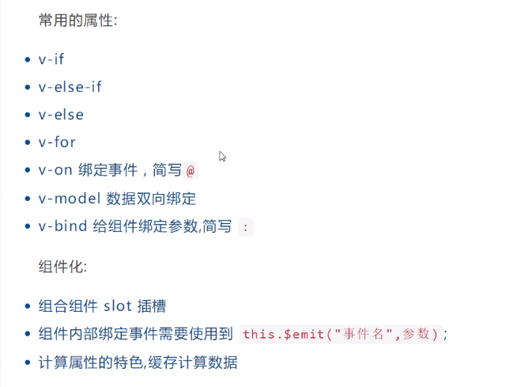

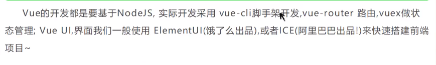


# vue-cli

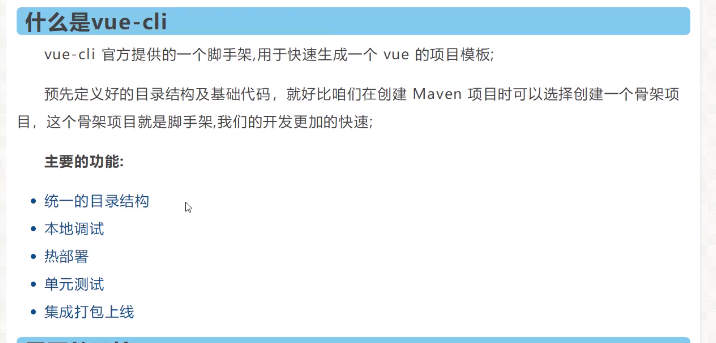


# 创建vue项目

先安装nodejs，去nodejs官网下载安装包（安装会自动配置环境变量，nodejs安装完后，npm也一并安装好了）


全局安装淘宝镜像：npm install cnpm -g
npm install --registry=https://registry.npm.taobao.org

安装的位置：C:\Users\对应的用户名\AppData\Roaming\npm

安装vue-cli：
npm install vue-cli -g   （-g表示全局安装）

安装webpack：
npm install webpack -g


* `vue init webpack project_name`：在初始化项目的时候，所有配置都需要自己配置，所有选项都选no
* 进入项目文件夹，执行 `npm install` ，安装环境


# webpack

**package.json**

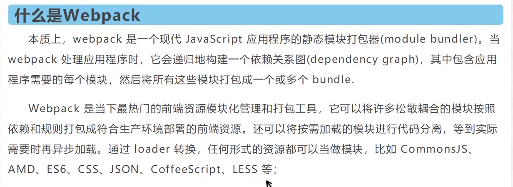

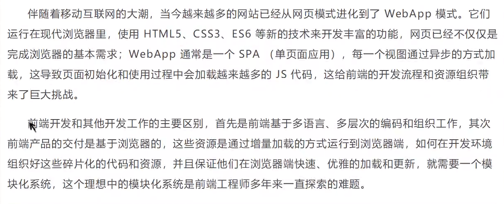

安装webpack和webpack-cli

```
npm install webpack -gnpm install webpack-cli -g
```


# 一些配置

入口配置在：build/webpack.base.conf.js 的entry属性中定义

vue项目的url访问地址在：config/index.js 的 host 和 port 属性中定义

package.js 中包包含了项目中所有依赖的版本

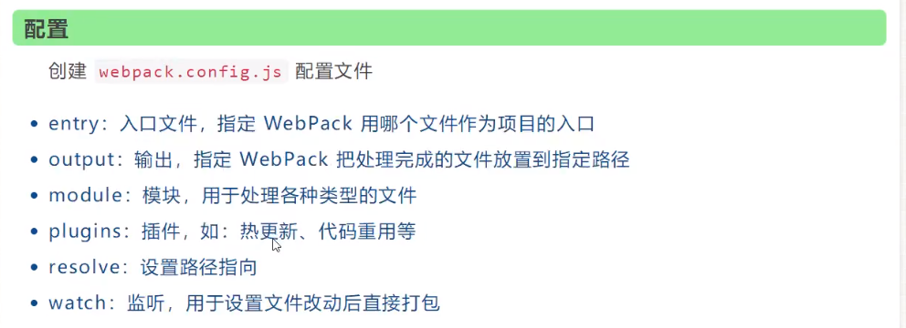


# vue-route路由

在router目录下的index.js配置文件中设置mode属性为 `"history"` ，可以将url中的#去掉

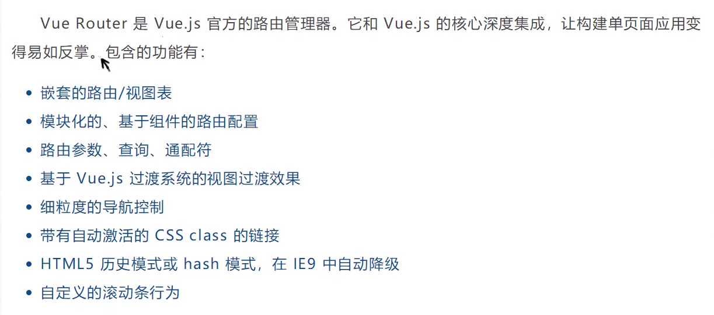


## 安装vue-router

在项目目录下执行带有 `--save-dev` 的命令，会在当前项目的 node-modules 目录下安装这个库

`npm install vue-router --save-dev` **注意是router，不是route（安装vue-route，也能安装上，但安上的是另一个库了)**

执行带有 `-g` 的命令，会在 C盘用户目录下的 AppData/npm 文件夹下安装这个库


## 安装axios

`npm install --save axios vue-axios `


# Vue + ElementUI（依赖安装命令）

vue-cli 2.0 项目创建过程

```
// 新建项目
vue init webpack project_name

// cd进项目目录
cd project_name

// 在项目本地安装vue-roouter，可以在初始化项目的时候选择安装
npm install vue-router --save-dev

// 安装element-ui
npm i element-ui -S

// 安装axios和vue-axios
npm install --save axios vue-axios

// 安装package.json里的依赖，在初始化项目的时候选择使用npm管理安装，会自动安装这些依赖
npm install

// 安装SASS加载器
npm install sass-loader node-sass --save-dev

// 启动项目测试
npm run dev
```


# npm命令

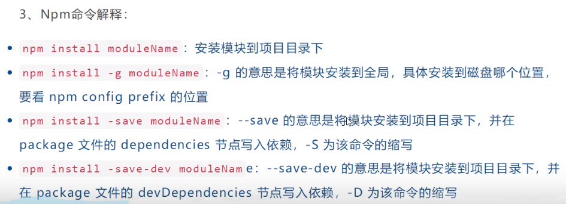


# 路由嵌套

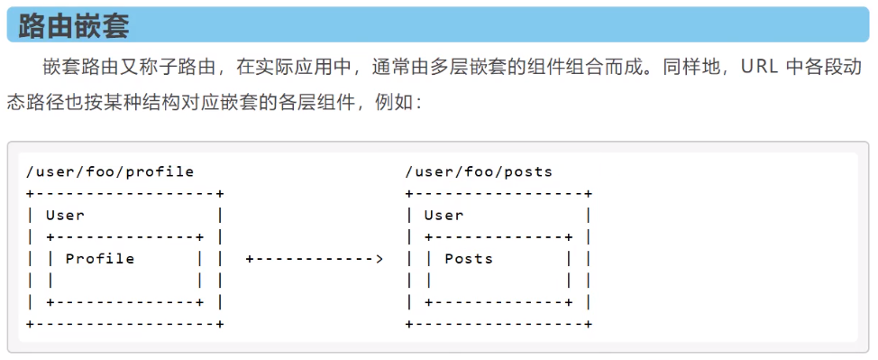


# 路由钩子

两个属性在组件中设置

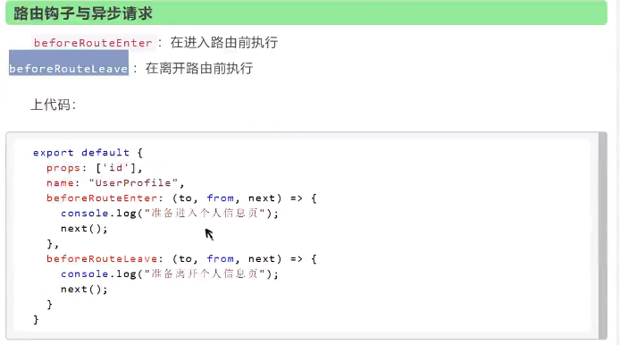


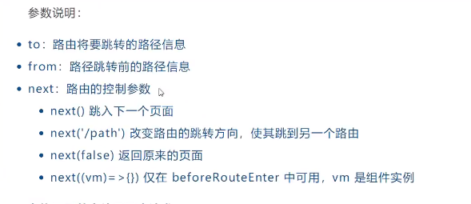


## 在路由钩子中使用axios

http://www.axios-js.com/zh-cn/docs/vue-axios.html
