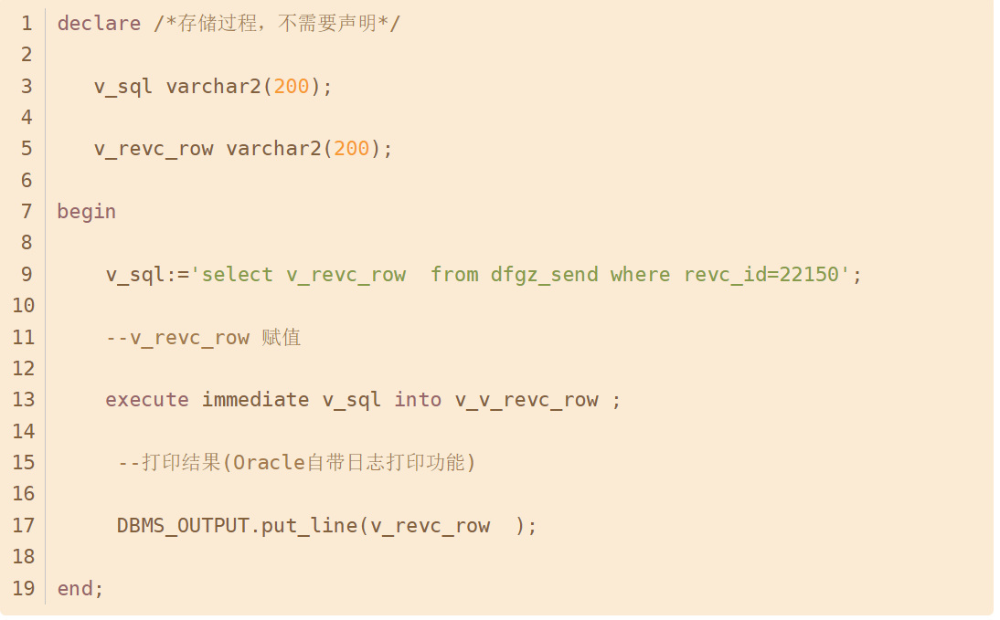
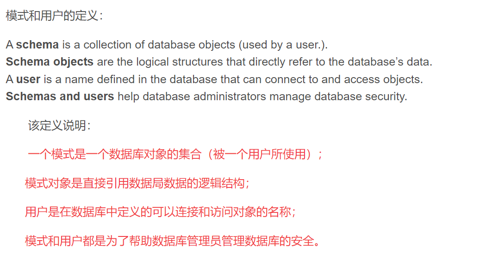
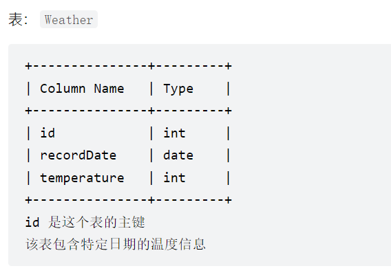

# varchar2 类型

在Oracle Database中，VARCHAR字段类型，最大值为4000。

当VARCHAR2容纳不下我们需要存储的信息时，就需要使用Oracle的大数据类型LOB（Large Object，大型对象）


# Oracle中的LOB类型

1. 在Oracle中，LOB（Large Object，大型对象）类型的字段现在用的比较多。这种字段的容量大（最多能容纳4GB的数据），且一个表中可以有u东哥这种类型的字段，比较灵活，适用于数量非常大的业务领域（如图像、档案）
2. LOB类型分为BLOB和CLOB两种：
   * **BLOB（Binary Large Object）**即二进制大型对象，适用于存储非文本的**字节流**数据（如程序、图像、影音）
   * **CLOB（Character Large Object**）即字符型大型对象，则与字符集相关，适于存储**文本型**的数据（如历史档案、大部头著作等）。


# Oracle中的distinct使用

distinct和group by是等效的。

distinct关键字后有多个字段，表示后面所有的字段组合不重复。

```sql
select distinct PLACEHOLDER, UI_KEY from UI_CONF_FORM; -- PLACEHOLDER + UI_KEY不重复
select distinct LABLE, UI_KEY from UI_CONF_FORM;
select distinct LABLE, PLACEHOLDER, UI_KEY from UI_CONF_FORM; -- PLACEHOLDER + LABLE + UI_KEY不重复
```

与distinct等效的group by语句。

```sql
select distinct PLACEHOLDER, UI_KEY from UI_CONF_FORM group by PLACEHOLDER, UI_KEY; -- PLACEHOLDER + UI_KEY不重复
```


# Oracle中start with connect by prior用法

`START WITH CONNECT BY PRIOR` 实际上是一个递归查询。

如果表中存在层次数据，则可以使用层次化查询子句，查询出表中行记录之间的**层次关系**。


START WITH 用来标识哪一行作为树形结构的第一行（即根节点，可以指定多个根节点）

CONNECT BY PRIOR 后面是递归条件，指定层次结构中**父节点与子节点之之间的关系**。

```sql
SELECT *
FROM SYS_MENU_PERMISSION
START WITH NAME ='Forecast'
CONNECT BY PRIOR ID=PARENT_ID;
```


以下是查询结果：

PARENT_ID是ID的子节点，NAME = 'Forcast' 是第一行根节点，根据指定的 PARENT_ID = ID 这种层级关系，来递归查询子节点


# Left join和Where谁先执行

Left join时，先使用ON的条件生成临时表（left join，无论条件是否为真，都返回左表中的记录），然后再使用WHERE对临时表的内容进行筛选（此时不再有left join的概念）。


# 存储过程

## 代码块结构

XXXX  **IS**

**BEGIN**

处理过程逻辑

**EXCEPTION**

**END**


# 变量定义

**针对存储过程的变量定义，不需要DECLAREA声明**

1. 变量名 表明.字段名%TYPE；  新变量与指定变量类型一致
2. 变量名 变量类型；
3. 变量名 表明%ROWTYPE； 新变量的数据类型与指定表的指定行记录（所有字段）的类型一致


# 变量赋值

1. 对于前两种命名方式可以直接使用 `:=` 赋值，比如 `V_CLO := 1`，也可以在变量声明的时候同时赋值

2. SELECT XXX INTO 变量名

3. execute immediate sql语句字符串 into 变量 

   


# Oracle Schema和User（用户）的区别

User（用户）是用来找到Schema的，Schema包含数据库对象，比如表、分区、视图、索引、包、存储过程、函数、触发器、类型、序列和同义等。



# Oracle中分区概念

**表空间：**

表空间指的是一个或多个数据文件的集合，所有的数据对象都存放在指定的表空间中，但主要存放的是表， 所以称作表空间。
　　通俗来讲，数据库（一套房子，可以有多个房间），表空间（房间），数据库文件（房间中的书架），表（书架上的书）。


**分区表：**

当表中的数据量不断增大，查询数据的速度就会变慢，应用程序的性能就会下降，这时就应该考虑对表进行分区。表进行分区后，即分区表，逻辑上表仍然是一张完整的表，只是将表中的数据在物理上存放到多个表空间(物理文件上)，这样查询数据时，不至于每次都扫描整张表。


# NVL与NVL2的区别

NVL(E1, E2)，如果E1为空，那么返回E2；E1不为空返回E1

NVL2（E1， E2， E3），如果E1为空，那么返回E3；E1不为空返回E2


# 当查询没有结果时

当查询没有结果时，可以理解成返回一个空的列表，不会返回NULL，所以这个时候用NVL判断是无效的。

如果结果只需要一个，且查询为空的时候需要判断是否有返回，可以使用聚合函数（Trick）

**聚合函数一定会返回一个值，是期望的返回值或者NULL**


# 四个排序函数

Oracle中有四个常用的排序函数

* rank函数（相同大小排名相同，但是下一个排名从当前行数开始，排名不连续）
* dense_rank函数（相同大小排名相同，排名连需）
* row_number函数（从1开始标上序号）
* ntile(n)函数（讲数据尽可能均匀地分到参数n个桶中，每个桶标上序号，从1开始）

```sql
create table scores
(   id number(6)
   ,score number(4,2)
);
insert into scores values(1,3.50);
insert into scores values(2,3.65);
insert into scores values(3,4.00);
insert into scores values(4,3.85);
insert into scores values(5,4.00);
insert into scores values(6,3.65);
commit;

select
    id 
   ,score
   ,rank() over(order by score desc) rank               --按照成绩排名，纯排名
   ,dense_rank() over(order by score desc) dense_rank   --按照成绩排名，相同成绩排名一致
   ,row_number() over(order by score desc) row_number   --按照成绩依次排名
   ,ntile(3) over (order by score desc) ntile         --按照分数划分成绩梯队，三个桶
from scores;
```


# CROSS JOIN

1. **交叉联结会让两张表数据两两组合（N X N 条数据）**

   同一张表可以和自己联结


<center>交叉联结</center>


<center>交叉联结结果</center>




```sql
SELECT 
        a.id AS id1, a.recordDate AS d1, a.Temperature AS t1, 
        b.id AS id2, b.recordDate AS d2, b.Temperature AS t2
FROM Weather a CROSS JOIN Weather b 
WHERE a.recordDate - b.recordDate = 1
```


# 时间处理

加法

　　select sysdate,add_months(sysdate,12) from dual; --加1年

　　select sysdate,add_months(sysdate,1) from dual; --加1月

　　select sysdate,to_char(sysdate+7,'yyyy-mm-dd HH24:MI:SS') from dual; --加1星期

　　select sysdate,to_char(sysdate+1,'yyyy-mm-dd HH24:MI:SS') from dual; --加1天

　　select sysdate,to_char(sysdate+1/24,'yyyy-mm-dd HH24:MI:SS') from dual; --加1小时

　　select sysdate,to_char(sysdate+1/24/60,'yyyy-mm-dd HH24:MI:SS') from dual; --加1分钟

　　select sysdate,to_char(sysdate+1/24/60/60,'yyyy-mm-dd HH24:MI:SS') from dual; --加1秒

　　减法

　　select sysdate,add_months(sysdate,-12) from dual; --减1年

　　select sysdate,add_months(sysdate,-1) from dual; --减1月

　　select sysdate,to_char(sysdate-7,'yyyy-mm-dd HH24:MI:SS') from dual; --减1星期

　　select sysdate,to_char(sysdate-1,'yyyy-mm-dd HH24:MI:SS') from dual; --减1天

　　select sysdate,to_char(sysdate-1/24,'yyyy-mm-dd HH24:MI:SS') from dual; --减1小时

　　select sysdate,to_char(sysdate-1/24/60,'yyyy-mm-dd HH24:MI:SS') from dual; --减1分钟

　　select sysdate,to_char(sysdate-1/24/60/60,'yyyy-mm-dd HH24:MI:SS') from dual; --减1秒

　　Oracle关于时间/日期的操作

　　1.日期时间间隔操作

　　当前时间减去7分钟的时间

　　select sysdate,sysdate - interval '7' MINUTE from dual

　　当前时间减去7小时的时间

​        select sysdate - interval '7' hour from dual

　　当前时间减去7天的时间

　　select sysdate - interval '7' day from dual

　　当前时间减去7月的时间

　　select sysdate,sysdate - interval '7' month from dual

　　当前时间减去7年的时间

　　select sysdate,sysdate - interval '7' year from dual

　　时间间隔乘以一个数字

　　select sysdate,sysdate - 8 *interval '2' hour from dual

　　2.日期到字符操作

　　select sysdate,to_char(sysdate,'yyyy-mm-dd hh24:mi:ss') from dual

　　select sysdate,to_char(sysdate,'yyyy-mm-dd hh:mi:ss') from dual

　　select sysdate,to_char(sysdate,'yyyy-ddd hh:mi:ss') from dual

　　select sysdate,to_char(sysdate,'yyyy-mm iw-d hh:mi:ss') from dual

　　参考oracle的相关关文档(ORACLE901DOC/SERVER.901/A90125/SQL_ELEMENTS4.HTM#48515)

　　3. 字符到日期操作

　　select to_date('2003-10-17 21:15:37','yyyy-mm-dd hh24:mi:ss') from dual

　　具体用法和上面的to_char差不多。

　　4. trunk/ ROUND函数的使用

　　select trunc(sysdate ,'YEAR') from dual（'YEAR'时间截取为当年第一天，'DAY'时间截取为上周日，'MONTH'时间截取为本月第一天）

　　select trunc(sysdate ) from dual   （截取到当日，去掉时分秒）

　　select to_char(trunc(sysdate ,'YYYY'),'YYYY') from dual