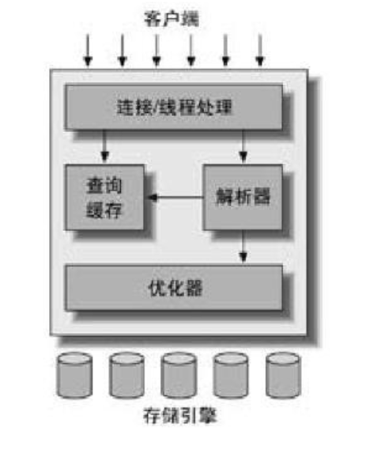

[toc]

# 1.MySQL逻辑架构

* 最上层并不是MySQL所独有的，大多数基于网络的客户端/服务器的工具或者服务都有类似的架构。比如连接处理、授权认证、安全等等。
* 第二层架构是服务器层。大多数MySQL核心功能都在这一层，包括查询**解析、分析、优化、缓存以及所有的内置函数（例如，日期、时间、数学和加密函数）**，所有**跨存储引擎的功能**都在这一层实现：**存储过程、触发器、视图等**。
* 第三层包含了存储引擎。存储引擎负责MySQL中数据的存储和提取。



<center>MySQL服务器逻辑架构图</center>


# 2.表锁和行锁

**表锁（table lock）：**表锁是开销最小的策略，锁定整张表。其中写锁比读锁有更高的优先级，一个写锁请求可能会插入到读锁队列前面（**写锁可以插入到锁队列中的读锁的前面**，反之读锁不能插入到写锁的前面）。


**行级锁（row lock）：**行级锁最大程度支持并发处理（粒度小，同时带来的开销最大）。InnoDB实现了行级锁，MyISAM只有表锁。行级锁**只在存储引擎层实现，在MySQL服务器层没有实现。**服务器层完全不了解存储引擎中的的锁实现。


# 3. 数据库选型

**优先考虑的因素：**

* **事务**

  如果需要事务支持，优先用InooDB。如果不需要事务，主要是SELECT和INSERT操作，那么MyISAM是一个不错的选择。一般日志应用比较符合这个特性。

* **备份**

  **备份的需求**也会影响存储引擎的选择。如果可以定期地关闭服务器来执行备份，那么备份的因素可以忽略。反之，**如果需要在线热备份，那么选择InnoDB就是基本的要求。**

* **崩溃恢复**

  据量比较大的时候，系统崩溃后如何快速地恢复是一个需要考虑的问题。相对而言，MyISAM崩溃后发生损坏的概率比InnoDB要高很多，而且恢复速度也要慢。

* **特有特性**

  * 如有些应用依赖聚簇索引的优化，那么考虑使用InnoDB
  * 如果需要使用地理空间搜索，那么可以选择MyISAM


# 4. 索引

在MySQL中，索引在**存储引擎层**实现，而不是在**服务器层**实现。

所以并没有统一的索引标准：不同存储引擎索引的工作方式不一样，而且也不是所有存储引擎都支持索引，如MyISAM。

**InnoDB的索引**使用的数据结构是**B+Tree**。


## 3.1 索引类型


### 3.1.1 B-Tree索引

InnoDB存储引擎实际上使用的是B+Tree索引，建立在B-Tree结构上。

InnoDB中的B+Tree在**叶子节点中存储了列的所有信息**（非叶子节点没有数据），并且**叶子节点中数据的存储是连续**的，这样进行范围查找的时候，硬盘的IO次数更少。如果是B树，磁盘则需要根据指针去不同的地方查找数据，IO开销太大。相当于用叶子节点的空间换时间（**这一点可以算B+Tree相对B-Tree的优点**）。


```mysql
CREATE TABLE People (
	last_name    varchar(50)    not null,
    first_name   varchar(50)    not null,
    last_name    varchar(50)    not null,
    dob          date           not null,
    gender       enum('m', 'f') not null,
    key(last_name, first_name, dob)  
);
```


关于B-Tree索引的限制，以上面的People表为例子，使用了联合索引（顺序为：姓，名，生日）：

* 如果不是按照索引的最左列开始查找，则无法使用索引——最左前缀原则。如，直接查按照某个特定生日的人，无法使用索引。

* 不能跳过索引中的列。如，寻找特定姓，和特定出生日期的人，则无法使用索引，跳过了名这一列。

* 如果查询中有某个列的范围查询，则其右边所有列都无法使用索引优化查找。

  例如查询：`WHERE last_name = 'Smith' AND first_name LIKE'J%' AND dob = '1976-12-23';`

  这个查询只能使用索引的前两列，dob这一列无法使用索引查询。**如果范围查询列值的数量有限，那么可以通过使用多个等于条件来代替范围条件。**


### 3.1.2 哈希索引(hash index)

哈希索引（Hash Index）基于哈希表实现，只有**精确匹配**索引所有列的查询才有效。对于**每一行数据**，存储引擎会对所有索引列计算一个哈希码（Hash Code），哈希码是一个比较小的值，并且不同键值对应的哈希码不同。

哈希索引将所有哈希码（键）存储在索引中，同时在哈希表（值）中保存**指向每个数据行的指针**。


下面是一个简单的例子:

```mysql
CREATE TABLE testhash (
	fname VARCHAR(50) NOT NULL,
    lname VARCHAR(50) NOT NULL,
    KEY USING HASH(fname)
)ENGINE=MEMORY;
```


**表中的内容：**


**每个列值对应的Hash Code：**

    f('Arjen')= 2323
    f('Baron')= 7437
    f('Peter')= 8784
    f('Vadim')= 2458


**哈希索引的数据结构：**


哈希索引中的槽（Slot）中存放的是所有列值的Hash Code，存放的值是**指向对应数据行的指针**。

**注意点：**Hash Code是顺序的，但是数据行不是排好序的。

查找 'Peter' 的时候，先计算 'Peter' 的Hash Code，然后通过哈希表查找对应Hash Code保存的数据行指针，在通过指针去查找数据，通过查找到的数据比较是不是 'Peter'。


**哈希索引的限制：**

* 哈希索引只包含**哈希值**和**行指针**，而不存储字段值，所以**不能使用索引中的值（指针）来避免读取行**。不过，**访问内存中的行**的速度很快，大部分情况下对性能影响不明显。
* 哈希索引**不是按照索引值顺序来存储的（按照Hash Code）**，所以**无法用于排序**。
* 哈希索引**不支持部分索引列匹配查找**，因为Hash Code是使用索引列中的所有内容来计算Hash Code的。例如，在数据列（A，B）上建立索引，如果只查询列A，则无法使用索引。
* 哈希索引**只支持等值比较查询**，包括 =、In()、<=>（<=>是MySQL专用符号，用来与null比较，对于a<=>null，如果a为null，返回True，否则返回False）。不支持任何范围查询。
* 访问哈希索引的速度非常快，除非有很多哈希冲突（不同的索引值有相同的HashCode）。当出现哈希冲突的时候 ，存储引擎必须要遍历链表中所有行指针，逐行进行比较，知道找到所有符合条件的行。
* 如果哈希冲突很多的话，一些索引维护操作的代价就会很高。例如，在某个哈希冲突很多的列上建立索引，在删除一行数据的时候，需要遍历哈希值链表上的每一行，找到并删除对应行的引用，冲突越多，代价越大。