[toc]

# FAL视频课笔记

## 1、建模流程

1. 模型定位ABC

   贷前：A卡，一般是超过这个分通过，不超过这个分拒绝

   贷中：B卡，评分高提额，评分低降额

   贷后：C卡，根据催收分数决定是否需要更早去催收

### 1.1、A卡-贷前准入

贷前流程大致如下：

1. 授信定价：初次授信额度

2. 审批：信用评估、反欺诈评估，都是策略相关；部分情况需要人工审核
   * 信用评估策略中，有一部分是A卡分数
3. 拒绝的用户，在更新数据后可以重新申请。通过的客户如果不提款，那么这部分客户称为流失

### 1.2、B卡-贷中管理

多次借贷或循环额度

上面的图，暂时以一次借贷（单笔单批）的流程举例。

客户还款后，不再次借款，称为流失。

客户再次借款，需要复贷审批（策略部分），和贷前基本一致。评分卡替换成B卡评分。

### 1.3、C卡-贷后催收

逾期一段时间后，列入黑名单，一般是30天或者90田以上。

C卡用来做三件事：

* 早期预警：可能是忘了，或者不会还款操作。这个跟逾期前提醒是不一样的。逾期前预警一般是短信提醒之类的，比较简单。
* 早期催收：忘记还，或者是信用问题，用其他方式解决还款问题。
* 委外处置：信用实在是有问题，需要找外部机构。

### 1.4、模型定位

用户响应模型：在互联网行业中，对用户进行拉新操作，和流量平台合作，吸引用户注册申请信贷产品。

用户流失模型：在各个环节用户都可能不选择贷款，对客户进行挽留。

用户分群：不同客群，不同风控模型是不同的。

用户画像：不同用户的特性是不同的，需要针对不同用户采用不同的风控方法。

失联修复：用户联系方式可能失效，通过现有数据，找到用户更多的联系方式。

洗钱识别：除银行外的机构可能不是特别关注。

使用的数据：

内部数据：

* 自有数据：银行内部数据（信用数据，还款数据）、电商内部数据。（内部数据的质量是最好的）。
* 手机设备数据。GPS、IP；APP列表（安卓）；设备信息：设备指纹（判断设备唯一性）、电池使用、手机参数
* KYC（Know Your Customer）。身份信息（四要素）、申请表单、APP行为数据（如表单填写速度，速度过快说明不是真人操作；贷款额度，贷款利率界面停留时间过短，说明客户对这部分不够严肃；截图行为，在申请过程中有大量截图，可能不太正常，有人指导或者指导他人）

外部数据：

* 授权类数据。手机通讯录、社保、公积金、学历、职业、运营商等等
* 第三方数据服务。人行征信、黑名单、信用分。

### 1.5、建模步骤

模型交付：需要做好模型说明和模型管理

模型部署：和开发沟通

模型监控：拿到线上真实的表现，进行模型的迭代

#### 1.5.1、明确需求

1. 风控产品做什么。比如小微企业贷、消费贷、现金贷等。通过产品定位，去收集具体的数据。
2. 建模人群：申请新客（针对首次申请不同的产品是否算新客，建模之前的考虑。客户分类需要模型、策略、运营一起去沟通这），优质老客，入催人群。

#### 1.5.2、标签设计

如何定义好坏用户，对于银行来说一般逾期周期会比较长，对于银行来说用户本身是不太缺乏的；对于消金公司来说，逾期天数一般没有那么长（类似现金贷这种）。

上面的例子，假设既提供消费贷也提供现金贷（比如花呗、借呗）。

现金贷的风险高于消费贷，可以把现金贷的坏用户，纳入消费贷中。即使现金贷的逾期了，消费贷没逾期，也认为有逾期风险（现金贷逾期了，大概率消费贷也会逾期）。

消费贷逾期时间不长可以容忍，消费贷逾期时间太长，在现金贷中也可以认为是个坏客户。

抵押类的贷款，一般不会用到模型，才策略中会涉及到。

一般是信用贷会用到模型。

表现期越长，标签会越稳定，但是建模样本就少了。（需要在样本量和表现期之间做一个权衡）。

如果不是现金贷，坏客户标签定义尽量不要选逾期30天以内。催收一般会在30天以内有大动作，就导致催收对标签影响和会比较大。

通过滚动率判断坏标签的逾期天数范围，通过Vintage选择表现期的长度。

当产品比较稳定的时候，就会考虑将坏标签的时间拉长。

**业内，一般认为样本最少需要3000总样本，200坏样本。**

分数段一般分成10份，高分段的人数一般会多一些，低分段的人数少。每份用户量少30人，每份占总体比利不小于2%。

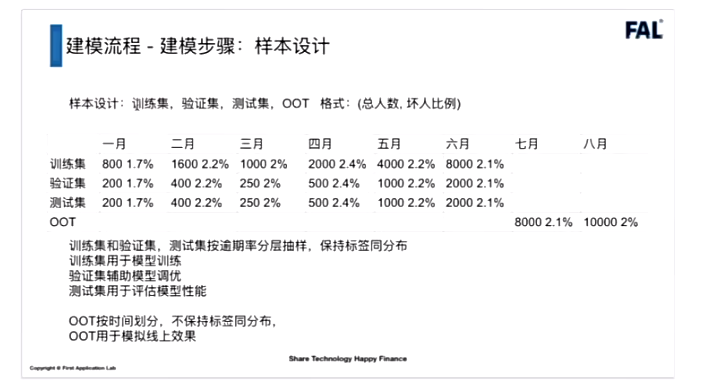

训练集和验证集是同分布的（比如训练集和测试集的坏样本都是2%）。

OOT和训练集与验证集的时间是完全不重合的。

比如训练集和验证集从1-6月份选择，测试集7-8月份选择。

当数据规模比较小的时候，可以不划分验证集，直接并入训练集，比如采用交叉验证的方法。

#### 1.5.3、特征构建

##### 数据调研

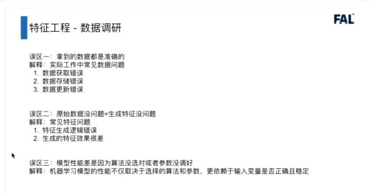

误区一：拿到的数据都是准确的

实际工作中常见的数据问题（需要先理顺数据逻辑，查看是否存在异常数据）：

（1）数据获取错误

（2）数据存储错误

（3）数据更新错误

误区二：原始数据没问题=生成特征没问题

常见特征问题：

（1）特征生成逻辑错误

（2）生成的特征效果很差（不同背景的产品，特征加工逻辑可能需要改变，不适合直接套用以前的特征加工逻辑）

误区三：模型性能差是不一定是模型的问题，大部分形况可能是数据本身有问题。

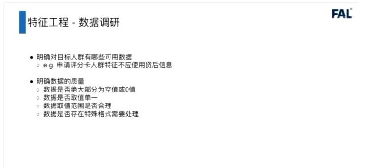

常用数据质量考虑点：

1、空值率，0值率

2、数据是否单一，比如国家代码都是中国

3、数据是否存在特殊格式，比如数据中夹杂了特殊值，数据格式（比如时间）不一致等等

##### 特征选择方法

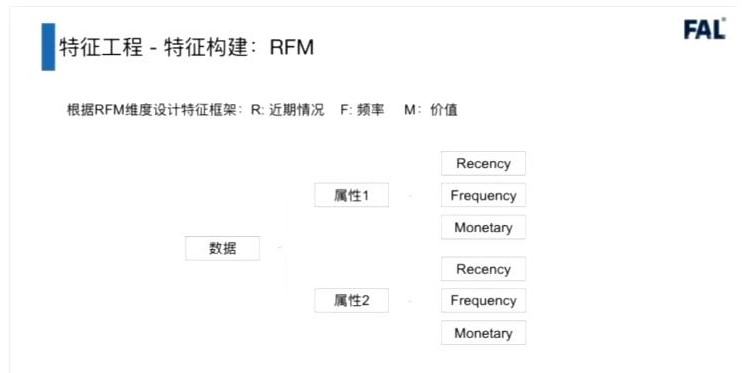

在**特征构建过程中，先列出特征框架，考虑好要使用哪些特征**，再去写代码比较合适。

根据RFM维度设计特征框架。R：近期情况、F：频率、M：价值

以GPS数据为例：

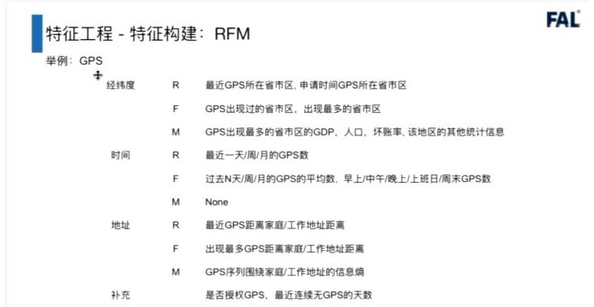

从经纬度可以衍生出，经纬度、时间、地址几个特征。再根据这几个特征，从RFM入手，从三个方面去想特征，想不到就写None。

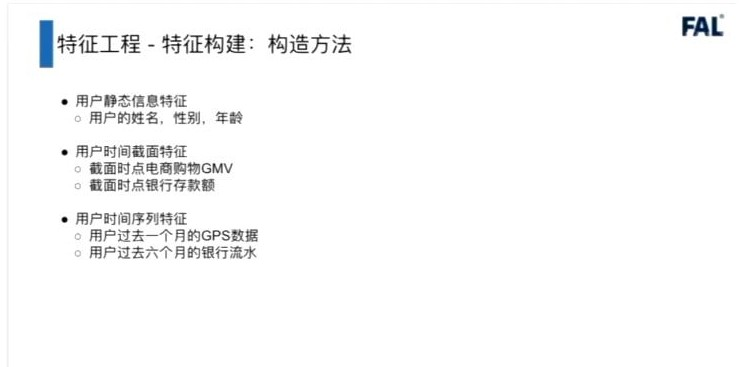

特征开发的几个方法：

一般先把特征分成几个类型，每个类型有不同的方法。

同一个特征，在不同场景和产品下可能会是不同类型的特征

（1）用户静态信息特征（一定时间段内，信息不怎么发生改变）。

* 如用户姓名、性别、年龄（一般是取当前时间和出生年月日的差，所以也认为是静态的）。

（2）用户时间截面特征（在当前时间点下的统计量，一般是加总求和等等）

* 截面时点电商购物GMV（比如说1月份，到当前时间点的总额）
* 界面时点银行存数额

（3）用户时间序列特征（更多的是数据变化的趋势，起伏、涨跌幅、环比同比等等）

* 用户过去一个月的GPS数据

* 用户过去六个月的银行流水

  

通常来说，静态特征和时间序列特征的构造是比较模板化的，特别是统计类特征，如下：

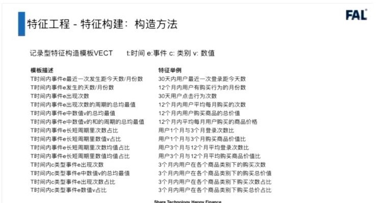

记录型特征（一般是客户有行为后，数据库里会增加一条记录。比如客户的登录记录，下单后有订单记录，转账后有转账记录日志等）

记录型特征模板（VECT）如上：t-时间，e-事件，c-类别，v-数值。

##### 特征评估

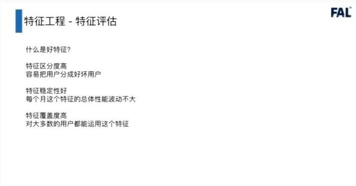

好特征的几个特点：

1. 特征区分度高

   容易将好坏客户区分出来

2. 特征稳定性好

   随着部署时间边长，模型性能变化小。信贷模型不像反欺诈或者其它模型，按天或者按周迭代。信贷模型一般用2-3个月，或者半年至一年时间。

   如果特征稳定性不好，可能会导致模型效果不稳定，会打乱风控整体的节奏。

3. 特征覆盖度高

   对大多数用户都能使用这个特征。比如说黑名单，进入黑名单的客户一般是坏客户，但是大多数客户都不在黑名单内，所以模型的效果一般不好。一般认为，有80%（缺失率）的客户没有数据，可以认为这个特征覆盖度不高。

###### 分箱

特征评估时，一般会做分箱操作。

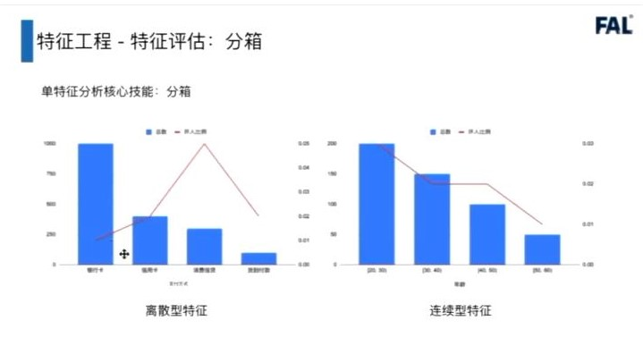

对于离散型特征的分箱：就是每个特征值的数量

对于连续性特征的分箱：对特征进行**等距切分**，然后统计每个区间范围内的数量。主要能够看出特征的趋势。一般来说，**连续性特征如果是单调的，那么这个特征的稳定性一般比较好**；有些特征是个U型的，说明中间某些拐点对特征影响较大，稳定性就没有那么好。

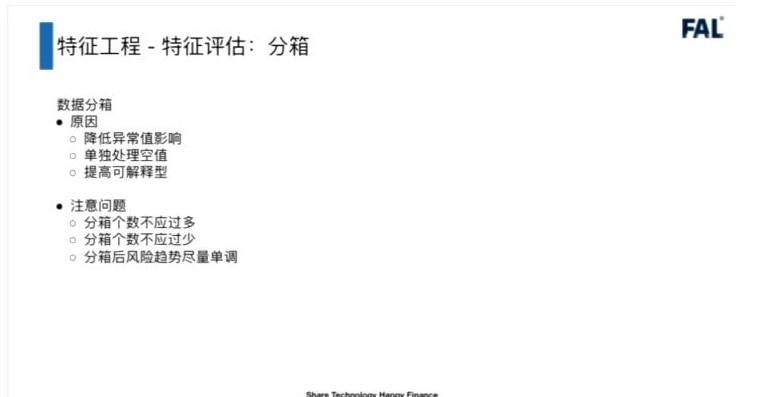

为什么要特征分箱：

1. 降低异常值影响。特征值如果差异性较大，直接拿特征本身的值，出现异常值后会对模型有不好的影响。例如，某个人的年龄理论上为20-60岁，突然出现了年龄为200岁的人，如果仍然选取该值作为样本，就不太合适，这种情况，需要将异常值剔除；或者负数为异常值，作为单独的分箱。
2. 单独处理空值。不同场景下的空值，表示的含义不同，可以处理成不同的分箱。
3. 提升可解释性。通过特征分箱的趋势，能够提高模型的可解释性。
4. 对机器学习而言，分箱可以提升模型的稳定性和鲁棒性；防止模型过拟合；加快模型训练速度；处理空值与缺失值；增强逻辑回归的拟合力。

分箱过程中注意的问题：

1. 分箱个数不应该过多或过少。常规经验来说，分数分箱是十个箱体，其它分箱是五个箱体。
2. 分箱后风险趋势尽量单调。有些特征是不单调的，比如年龄、收入情况；有些特征是比较单调的，比如登录次数，app安装次数等。整体上来说，单调的特征对模型的泛化性能要好很多。

常用的分箱方法：

TOAD包，包含了常用的分箱方法：

https://github.com/amphibian-dev/toad

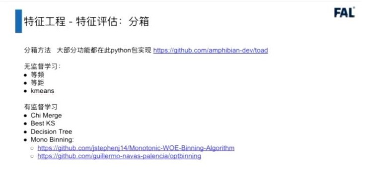

无监督：

1. 等频：将数据由大到小排列后，以数据量为依据，将数据分为N等份，保证每个分箱中的数据量是一致的
2. 等距：以特征值的最大和最小值为依据，将数据分为N等份，保证每个箱的长度一致
3. kmeans

有监督：

1. Chi Merge（卡方分箱）
2. Best KS（KS分箱）
3. Decision Tree（决策树分箱）
4. Mono Bining

分箱示例：等频（特征评估）和等距（分数，评分之类）

卡方分箱：

将数据按等频或等距分箱后，计算卡方值，**将卡方值较小的两个相邻箱体合并**，使得不同箱体的好坏样本比例区别放大，容易获得高IV

首先算出平均坏人数比例

再算出卡方值，对每个箱体都要计算

每个箱体的卡方值 =  （每个箱体的坏人数 - 平均坏人比例 * 每个箱体的总人数）^2^ / （平均坏人比例 * 每个箱体总人数）

卡方分箱合并到，某一个箱体的最小值大于人为设置的阈值，或者是箱体个数小于等于设置的数量时（一般是五个），停止合并，固定分箱个数

###### WOE

WOE——weight of evidence

表示每个分箱中好坏客户的比例差异。WOE越大表示好坏客户比例差异越明显；WOE越小表示好坏客户比例差异越小。

WOE越大风险越小，WOE越小风险越大。WOE越大可以认为该分箱样本的用户在整体样本中的偏好

当WOE=0，说明该分箱好客户=坏客户，说明该分箱无预测能力

p^k^ ~good~ = 该分箱的好人 / 所有分箱的好人总数

p^k^ ~bad~ = 该分箱的坏人 / 所有分箱的坏人总数

###### IV

IV（information value）与WOE关联比较紧密，常用来评估变量的预测能力，**区分度**。可以用来快速筛选变量。

> 1. *WOE describes the **relationship** between a predictive variable and a binary target variable.*
> 2. *IV measures the **strength** of that relationship.*

p^k^ ~good~ = 该分箱的好人 / 所有分箱的好人总数

p^k^ ~bad~ = 该分箱的坏人 / 所有分箱的坏人总数

IV = （好用户概率 - 坏用户概率）* WOE

一般认为IV > 0.02是个可用特征（一般在0.02~0.1之间）

IV过大可能是标签泄露，需要仔细排查

###### PSI

PSI衡量不同时间段内，同一特征的分布差异，通常用于评价特征的稳定性（PSI越大，不同时间段分布差异越大，稳定性越差）。

p^k^ ~actual~ = 第一段时间的好样本 / 第一段时间所有分箱的好人总数

p^k^ ~expect~ = 第二段时间的好样本 / 第二段时间所有分箱的好人总数

不同时间段内特征的差异越明显，那么表示这个分箱的稳定性越差

一般认为PSI < 0.1 是比较稳定的特征，PSI数值过大时需要重点检查是否有数据问题。

分箱数量一般在2-5左右，比较少的情况会取10个分箱，一般是根据经验选择分箱的个数。一般是选择5个分箱，然后去跑数据。

###### 单特征评估（总结）

