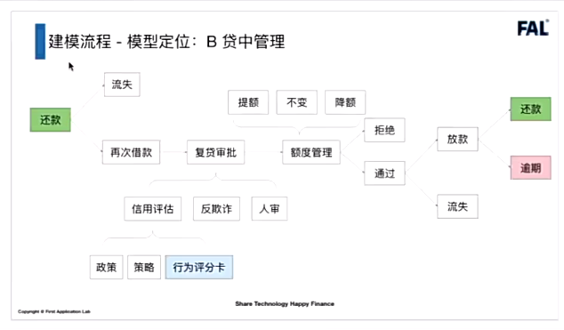
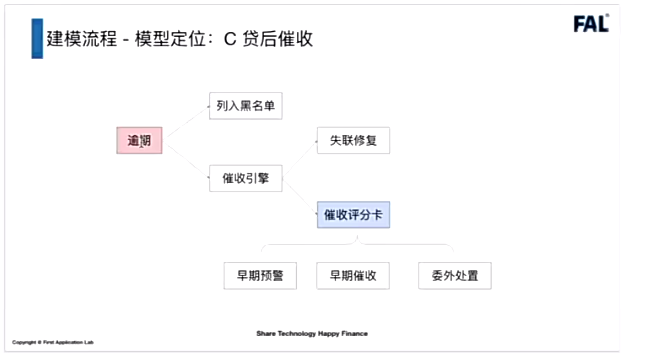
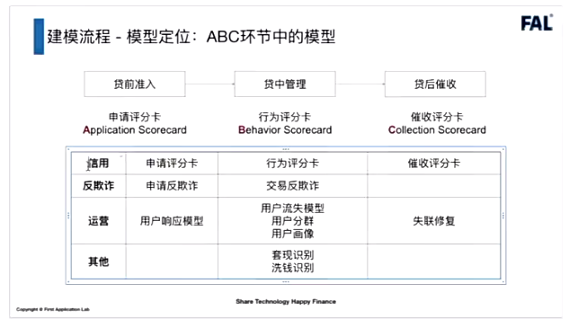
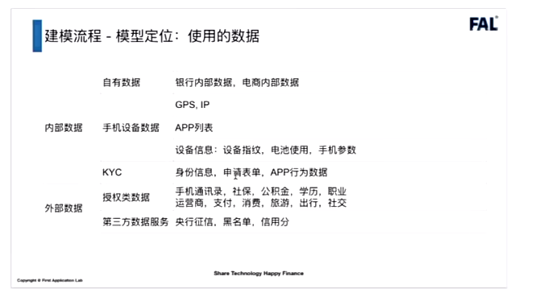
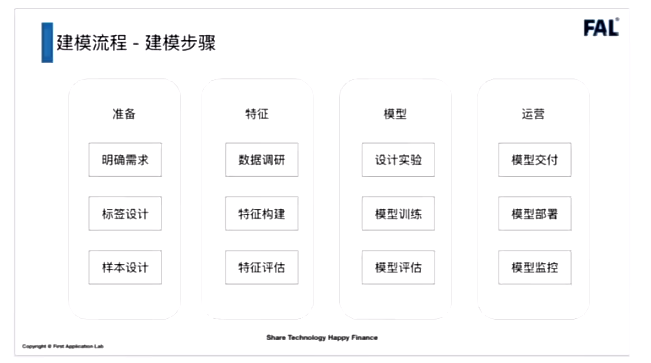
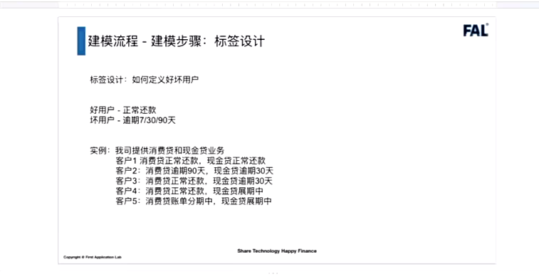
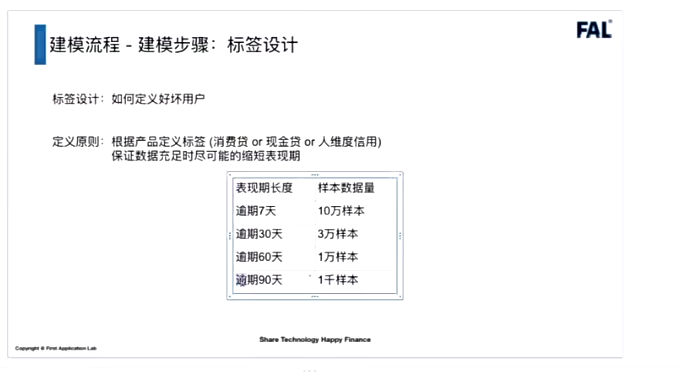
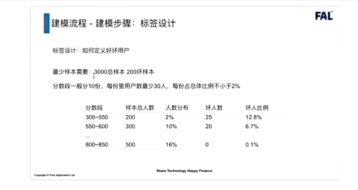

[toc]

# FAL视频课笔记

## 1、建模流程

1. 模型定位ABC

   贷前：A卡，一般是超过这个分通过，不超过这个分拒绝

   贷中：B卡，评分高提额，评分低降额

   贷后：C卡，根据催收分数决定是否需要更早去催收

### 1.1、A卡-贷前准入

贷前流程大致如下：

1. 授信定价：初次授信额度

2. 审批：信用评估、反欺诈评估，都是策略相关；部分情况需要人工审核
   * 信用评估策略中，有一部分是A卡分数
3. 拒绝的用户，在更新数据后可以重新申请。通过的客户如果不提款，那么这部分客户称为流失

### 1.2、B卡-贷中管理

多次借贷或循环额度

上面的图，暂时以一次借贷（单笔单批）的流程举例。

客户还款后，不再次借款，称为流失。

客户再次借款，需要复贷审批（策略部分），和贷前基本一致。评分卡替换成B卡评分。

### 1.3、C卡-贷后催收

逾期一段时间后，列入黑名单，一般是30天或者90田以上。

C卡用来做三件事：

* 早期预警：可能是忘了，或者不会还款操作。这个跟逾期前提醒是不一样的。逾期前预警一般是短信提醒之类的，比较简单。
* 早期催收：忘记还，或者是信用问题，用其他方式解决还款问题。
* 委外处置：信用实在是有问题，需要找外部机构。

### 1.4、模型定位

用户响应模型：在互联网行业中，对用户进行拉新操作，和流量平台合作，吸引用户注册申请信贷产品。

用户流失模型：在各个环节用户都可能不选择贷款，对客户进行挽留。

用户分群：不同客群，不同风控模型是不同的。

用户画像：不同用户的特性是不同的，需要针对不同用户采用不同的风控方法。

失联修复：用户联系方式可能失效，通过现有数据，找到用户更多的联系方式。

洗钱识别：除银行外的机构可能不是特别关注。

使用的数据：

内部数据：

* 自有数据：银行内部数据（信用数据，还款数据）、电商内部数据。（内部数据的质量是最好的）。
* 手机设备数据。GPS、IP；APP列表（安卓）；设备信息：设备指纹（判断设备唯一性）、电池使用、手机参数
* KYC（Know Your Customer）。身份信息（四要素）、申请表单、APP行为数据（如表单填写速度，速度过快说明不是真人操作；贷款额度，贷款利率界面停留时间过短，说明客户对这部分不够严肃；截图行为，在申请过程中有大量截图，可能不太正常，有人指导或者指导他人）

外部数据：

* 授权类数据。手机通讯录、社保、公积金、学历、职业、运营商等等
* 第三方数据服务。人行征信、黑名单、信用分。

### 1.5、建模步骤

模型交付：需要做好模型说明和模型管理

模型部署：和开发沟通

模型监控：拿到线上真实的表现，进行模型的迭代

#### 1.5.1、明确需求

1. 风控产品做什么。比如小微企业贷、消费贷、现金贷等。通过产品定位，去收集具体的数据。
2. 建模人群：申请新客（针对首次申请不同的产品是否算新客，建模之前的考虑。客户分类需要模型、策略、运营一起去沟通这），优质老客，入催人群。

#### 1.5.2、标签设计

如何定义好坏用户，对于银行来说一般逾期周期会比较长，对于银行来说用户本身是不太缺乏的；对于消金公司来说，逾期天数一般没有那么长（类似现金贷这种）。

上面的例子，假设既提供消费贷也提供现金贷（比如花呗、借呗）。

现金贷的风险高于消费贷，可以把现金贷的坏用户，纳入消费贷中。即使现金贷的逾期了，消费贷没逾期，也认为有逾期风险（现金贷逾期了，大概率消费贷也会逾期）。

消费贷逾期时间不长可以容忍，消费贷逾期时间太长，在现金贷中也可以认为是个坏客户。

抵押类的贷款，一般不会用到模型，才策略中会涉及到。

一般是信用贷会用到模型。

表现期越长，标签会越稳定，但是建模样本就少了。（需要在样本量和表现期之间做一个权衡）。

如果不是现金贷，坏客户标签定义尽量不要选逾期30天以内。催收一般会在30天以内有大动作，就导致催收对标签影响和会比较大。

通过滚动率判断坏标签的逾期天数范围，通过Vintage选择表现期的长度。

当产品比较稳定的时候，就会考虑将坏标签的时间拉长。

**业内，一般认为样本最少需要3000总样本，200坏样本。**

分数段一般分成10份，高分段的人数一般会多一些，低分段的人数少。每份用户量少30人，每份占总体比利不小于2%。