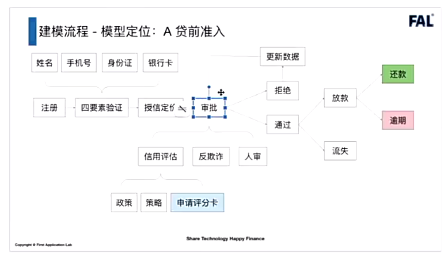
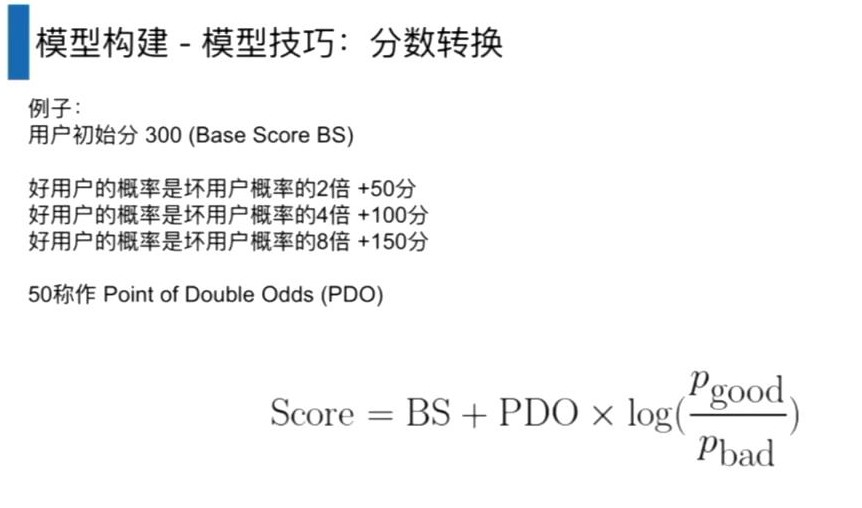

[toc]

# FAL视频课笔记

## 1、建模流程

1. 模型定位ABC

   贷前：A卡，一般是超过这个分通过，不超过这个分拒绝

   贷中：B卡，评分高提额，评分低降额

   贷后：C卡，根据催收分数决定是否需要更早去催收

### 1.1、A卡-贷前准入

贷前流程大致如下：

1. 授信定价：初次授信额度

2. 审批：信用评估、反欺诈评估，都是策略相关；部分情况需要人工审核
   * 信用评估策略中，有一部分是A卡分数
3. 拒绝的用户，在更新数据后可以重新申请。通过的客户如果不提款，那么这部分客户称为流失

### 1.2、B卡-贷中管理

多次借贷或循环额度

上面的图，暂时以一次借贷（单笔单批）的流程举例。

客户还款后，不再次借款，称为流失。

客户再次借款，需要复贷审批（策略部分），和贷前基本一致。评分卡替换成B卡评分。

### 1.3、C卡-贷后催收

逾期一段时间后，列入黑名单，一般是30天或者90田以上。

C卡用来做三件事：

* 早期预警：可能是忘了，或者不会还款操作。这个跟逾期前提醒是不一样的。逾期前预警一般是短信提醒之类的，比较简单。
* 早期催收：忘记还，或者是信用问题，用其他方式解决还款问题。
* 委外处置：信用实在是有问题，需要找外部机构。

### 1.4、模型定位

用户响应模型：在互联网行业中，对用户进行拉新操作，和流量平台合作，吸引用户注册申请信贷产品。

用户流失模型：在各个环节用户都可能不选择贷款，对客户进行挽留。

用户分群：不同客群，不同风控模型是不同的。

用户画像：不同用户的特性是不同的，需要针对不同用户采用不同的风控方法。

失联修复：用户联系方式可能失效，通过现有数据，找到用户更多的联系方式。

洗钱识别：除银行外的机构可能不是特别关注。

使用的数据：

内部数据：

* 自有数据：银行内部数据（信用数据，还款数据）、电商内部数据。（内部数据的质量是最好的）。
* 手机设备数据。GPS、IP；APP列表（安卓）；设备信息：设备指纹（判断设备唯一性）、电池使用、手机参数
* KYC（Know Your Customer）。身份信息（四要素）、申请表单、APP行为数据（如表单填写速度，速度过快说明不是真人操作；贷款额度，贷款利率界面停留时间过短，说明客户对这部分不够严肃；截图行为，在申请过程中有大量截图，可能不太正常，有人指导或者指导他人）

外部数据：

* 授权类数据。手机通讯录、社保、公积金、学历、职业、运营商等等
* 第三方数据服务。人行征信、黑名单、信用分。

### 1.5、建模步骤

模型交付：需要做好模型说明和模型管理

模型部署：和开发沟通

模型监控：拿到线上真实的表现，进行模型的迭代

#### 1.5.1、明确需求

1. 风控产品做什么。比如小微企业贷、消费贷、现金贷等。通过产品定位，去收集具体的数据。
2. 建模人群：申请新客（针对首次申请不同的产品是否算新客，建模之前的考虑。客户分类需要模型、策略、运营一起去沟通这），优质老客，入催人群。

#### 1.5.2、标签设计

如何定义好坏用户，对于银行来说一般逾期周期会比较长，对于银行来说用户本身是不太缺乏的；对于消金公司来说，逾期天数一般没有那么长（类似现金贷这种）。

上面的例子，假设既提供消费贷也提供现金贷（比如花呗、借呗）。

现金贷的风险高于消费贷，可以把现金贷的坏用户，纳入消费贷中。即使现金贷的逾期了，消费贷没逾期，也认为有逾期风险（现金贷逾期了，大概率消费贷也会逾期）。

消费贷逾期时间不长可以容忍，消费贷逾期时间太长，在现金贷中也可以认为是个坏客户。

抵押类的贷款，一般不会用到模型，才策略中会涉及到。

一般是信用贷会用到模型。

表现期越长，标签会越稳定，但是建模样本就少了。（需要在样本量和表现期之间做一个权衡）。

如果不是现金贷，坏客户标签定义尽量不要选逾期30天以内。催收一般会在30天以内有大动作，就导致催收对标签影响和会比较大。

通过滚动率判断坏标签的逾期天数范围，通过Vintage选择表现期的长度。

当产品比较稳定的时候，就会考虑将坏标签的时间拉长。

**业内，一般认为样本最少需要3000总样本，200坏样本。**

分数段一般分成10份，高分段的人数一般会多一些，低分段的人数少。每份用户量少30人，每份占总体比利不小于2%。

训练集和验证集是同分布的（比如训练集和测试集的坏样本都是2%）。

OOT和训练集与验证集的时间是完全不重合的。

比如训练集和验证集从1-6月份选择，测试集7-8月份选择。

当数据规模比较小的时候，可以不划分验证集，直接并入训练集，比如采用交叉验证的方法。

#### 1.5.3、特征构建

##### 数据调研

误区一：拿到的数据都是准确的

实际工作中常见的数据问题（需要先理顺数据逻辑，查看是否存在异常数据）：

（1）数据获取错误

（2）数据存储错误

（3）数据更新错误

误区二：原始数据没问题=生成特征没问题

常见特征问题：

（1）特征生成逻辑错误

（2）生成的特征效果很差（不同背景的产品，特征加工逻辑可能需要改变，不适合直接套用以前的特征加工逻辑）

误区三：模型性能差是不一定是模型的问题，大部分形况可能是数据本身有问题。

常用数据质量考虑点：

1、空值率，0值率

2、数据是否单一，比如国家代码都是中国

3、数据是否存在特殊格式，比如数据中夹杂了特殊值，数据格式（比如时间）不一致等等

##### 特征选择方法

在**特征构建过程中，先列出特征框架，考虑好要使用哪些特征**，再去写代码比较合适。

根据RFM维度设计特征框架。R：近期情况、F：频率、M：价值

以GPS数据为例：

从经纬度可以衍生出，经纬度、时间、地址几个特征。再根据这几个特征，从RFM入手，从三个方面去想特征，想不到就写None。

特征开发的几个方法：

一般先把特征分成几个类型，每个类型有不同的方法。

同一个特征，在不同场景和产品下可能会是不同类型的特征

（1）用户静态信息特征（一定时间段内，信息不怎么发生改变）。

* 如用户姓名、性别、年龄（一般是取当前时间和出生年月日的差，所以也认为是静态的）。

（2）用户时间截面特征（在当前时间点下的统计量，一般是加总求和等等）

* 截面时点电商购物GMV（比如说1月份，到当前时间点的总额）
* 界面时点银行存数额

（3）用户时间序列特征（更多的是数据变化的趋势，起伏、涨跌幅、环比同比等等）

* 用户过去一个月的GPS数据

* 用户过去六个月的银行流水

  

通常来说，静态特征和时间序列特征的构造是比较模板化的，特别是统计类特征，如下：

记录型特征（一般是客户有行为后，数据库里会增加一条记录。比如客户的登录记录，下单后有订单记录，转账后有转账记录日志等）

记录型特征模板（VECT）如上：t-时间，e-事件，c-类别，v-数值。

##### 特征评估

好特征的几个特点：

1. 特征区分度高

   容易将好坏客户区分出来

2. 特征稳定性好

   随着部署时间边长，模型性能变化小。信贷模型不像反欺诈或者其它模型，按天或者按周迭代。信贷模型一般用2-3个月，或者半年至一年时间。

   如果特征稳定性不好，可能会导致模型效果不稳定，会打乱风控整体的节奏。

3. 特征覆盖度高

   对大多数用户都能使用这个特征。比如说黑名单，进入黑名单的客户一般是坏客户，但是大多数客户都不在黑名单内，所以模型的效果一般不好。一般认为，有80%（缺失率）的客户没有数据，可以认为这个特征覆盖度不高。

###### 分箱

特征评估时，一般会做分箱操作。

对于离散型特征的分箱：就是每个特征值的数量

对于连续性特征的分箱：对特征进行**等距切分**，然后统计每个区间范围内的数量。主要能够看出特征的趋势。一般来说，**连续性特征如果是单调的，那么这个特征的稳定性一般比较好**；有些特征是个U型的，说明中间某些拐点对特征影响较大，稳定性就没有那么好。

为什么要特征分箱：

1. 降低异常值影响。特征值如果差异性较大，直接拿特征本身的值，出现异常值后会对模型有不好的影响。例如，某个人的年龄理论上为20-60岁，突然出现了年龄为200岁的人，如果仍然选取该值作为样本，就不太合适，这种情况，需要将异常值剔除；或者负数为异常值，作为单独的分箱。
2. 单独处理空值。不同场景下的空值，表示的含义不同，可以处理成不同的分箱。
3. 提升可解释性。通过特征分箱的趋势，能够提高模型的可解释性。
4. 对机器学习而言，分箱可以提升模型的稳定性和鲁棒性；防止模型过拟合；加快模型训练速度；处理空值与缺失值；增强逻辑回归的拟合力。

分箱过程中注意的问题：

1. 分箱个数不应该过多或过少。常规经验来说，分数分箱是十个箱体，其它分箱是五个箱体。
2. 分箱后风险趋势尽量单调。有些特征是不单调的，比如年龄、收入情况；有些特征是比较单调的，比如登录次数，app安装次数等。整体上来说，单调的特征对模型的泛化性能要好很多。

常用的分箱方法：

TOAD包，包含了常用的分箱方法：

https://github.com/amphibian-dev/toad

无监督：

1. 等频：将数据由大到小排列后，以数据量为依据，将数据分为N等份，保证每个分箱中的数据量是一致的
2. 等距：以特征值的最大和最小值为依据，将数据分为N等份，保证每个箱的长度一致
3. kmeans

有监督：

1. Chi Merge（卡方分箱）
2. Best KS（KS分箱）
3. Decision Tree（决策树分箱）
4. Mono Bining

分箱示例：等频（特征评估）和等距（分数，评分之类）

卡方分箱：

将数据按等频或等距分箱后，计算卡方值，**将卡方值较小的两个相邻箱体合并**，使得不同箱体的好坏样本比例区别放大，容易获得高IV

首先算出平均坏人数比例

再算出卡方值，对每个箱体都要计算

每个箱体的卡方值 =  （每个箱体的坏人数 - 平均坏人比例 * 每个箱体的总人数）^2^ / （平均坏人比例 * 每个箱体总人数）

卡方分箱合并到，某一个箱体的最小值大于人为设置的阈值，或者是箱体个数小于等于设置的数量时（一般是五个），停止合并，固定分箱个数

###### WOE

WOE——weight of evidence

表示每个分箱中好坏客户的比例差异。WOE越大表示好坏客户比例差异越明显；WOE越小表示好坏客户比例差异越小。

WOE越大风险越小，WOE越小风险越大。WOE越大可以认为该分箱样本的用户在整体样本中的偏好

当WOE=0，说明该分箱好客户=坏客户，说明该分箱无预测能力

p^k^ ~good~ = 该分箱的好人 / 所有分箱的好人总数

p^k^ ~bad~ = 该分箱的坏人 / 所有分箱的坏人总数

###### IV

IV（information value）与WOE关联比较紧密，常用来评估变量的预测能力，**区分度**。可以用来快速筛选变量。

> 1. *WOE describes the **relationship** between a predictive variable and a binary target variable.*
> 2. *IV measures the **strength** of that relationship.*

p^k^ ~good~ = 该分箱的好人 / 所有分箱的好人总数

p^k^ ~bad~ = 该分箱的坏人 / 所有分箱的坏人总数

IV = （好用户概率 - 坏用户概率）* WOE

一般认为IV > 0.02是个可用特征（一般在0.02~0.1之间）

IV过大可能是标签泄露，需要仔细排查

###### PSI

PSI衡量不同时间段内，同一特征的分布差异，通常用于评价特征的稳定性（PSI越大，不同时间段分布差异越大，稳定性越差）。

p^k^ ~actual~ = 第一段时间的好样本 / 第一段时间所有分箱的好人总数

p^k^ ~expect~ = 第二段时间的好样本 / 第二段时间所有分箱的好人总数

不同时间段内特征的差异越明显，那么表示这个分箱的稳定性越差

一般认为PSI < 0.1 是比较稳定的特征，PSI数值过大时需要重点检查是否有数据问题。

分箱数量一般在2-5左右，比较少的情况会取10个分箱，一般是根据经验选择分箱的个数。一般是选择5个分箱，然后去跑数据。

###### 单特征评估（总结）

##### 模型构建

###### 设计实验

先理清新模型的侧重点，针对需求做好方案设计，并考虑好验证方案，证明新模型在侧重点上的效果更好，解决痛点问题。

1. 首先切分数据集

   

###### 模型训练

   最常用的是逻辑回归模型。逻辑回归实际上是在线性回归（linear regression）的结果上，转换成非线性的结果（0,1）。线性回归的结果可能是 >1 或者 <0 的，加上逻辑回归函数（logistic function）后，映射到(0,1)。

   x为特征向量。w向量为权重向量，表示每个特征对预测结果的影响程度。

   常用的逻辑回归函数为sigmoid函数：

   一般坏客户的标签为1，好客户的标签为0。

   那么：

   sigmoid函数输出的结果，越接近1表示为坏客户的概率越高。

   最后再将逻辑回归输出的概率转换为评分卡的分数。

   

   常用逻辑回归的Python包如下：

   常用的是statsmodel包，这个包除了逻辑回归算法，还可以获得许多统计信息。

   

   一般情况下，模型训练使用逻辑回归就足够了。

* 逻辑回归比较稳定
* 逻辑回归解释性比较强

再深入，可以使用树模型（bossting tree）：

* 信贷场景下，树模型未必效果比逻辑回归好
* 树模型在信贷场景下，稳定性不一定比逻辑回归好

深度学习目前在信贷场景的应用比较有限。在反欺诈中有应用，比如说图模型。

###### 模型评估

**模型性能：**

* 模型区分能力
  * 混淆矩阵
  * AUC
  * KS
* 模型稳定度
  * PSI

**（1）精确率和召回率**

混淆矩阵（一般是将有问题的客户作为正例Positive，类似医学中的阳性是不好的）：

Positive和Negtive表示预测的结果，True和False表示预测的结果是否正确。

* TP：True Positive
* FP：False Positive（预测为坏客户，但实际上是好客户，误杀，损失的是流量成本）
* TN：True Negtive
* FN：False Negtive（预测为好客户，但实际上是坏客户，漏杀，损失的是本金）

一般认为FN的损失比FP的损失要大。

Precision（精确率）= TP / (TP + FP)  （预测为坏客户的尽可能都**抓对**，查准，不准错）

Recall（召回率）= TP/ (TP + FN)（实际是坏人的尽可能都**抓全**，查全，不准漏）

理想情况下，精确率和召回率，这两个指标都高是最好的。但实际上，这两个指标往往是相互制约的，两个指标的相对大小有差异。精确率高，召回率低；精确率低，召回率就高。

原因：

以上两个指标的分母， **FP + FN = 错判的总数量**。FP为将负例错判为正例的数量，FN为将正例错判为负例的数量。（正负样本错判的概率不同导致精确率和召回率的不同）

* 当模型错判的数量比较少时，分母中的 FP 与 FN 都比较小，那么指标整体的数值都会比较大。
* 模型确定后，同一个测试集中，错判的样本总数是固定的。FP多，FN就少；FN少，FP就多
  * 当FP较小时，即负例错判的数量较少时，精确率就较高（判得准，查得准）；同时错判的样本中，FN正例错判的数量就相对较多，那么召回率就相对精确率较低
  * 当FP较大时，即负例错判的数量较多时，精确率就较低（判不准，查不准）；同时错判的样本中，FN正例错判的数量就相对较少（**正例基本都识别出来了**），那么召回率就相对精确率较高（查得全）
  * 当FP=FN时，精确率和召回率相同

针对搜广推之类的模型，更期望精确率高的模型，**减少假阳性率，单次预测准确率更高**，减少对客户的打扰；

针对癌症检测、地震监测、金融欺诈等方向的模型，则更期望召回率高的模型，**减少假阴性率，减少漏检的情况**。

通过 F~1~ 和 F~beta~ 参数调和精确率、召回率。

当参数beta > 1时，表示更重视召回率；beta < 1时，表示更重视精确率。

**（2）TPR与FPR**

1. 精确率（Precision，纵轴）与召回率（Recall，横轴）是一套组合的评价体系。

2. TPR（纵轴）与FPR（横轴）是一套组合的评价体系。

**(3）ROC曲线：**反映模型区分度

红色点表示坏客户，绿色点表示好客户。

纵轴0和1表示实际好坏客户。1表示坏客户，0表示好客户。

横轴是预测的概率，图中的蓝色竖线（decision boundary，好坏客户判断的临界点），左边全部判断（预测）为好客户，右边全部判断（预测）为坏客户。

图中是一种比较极端的情况，竖线在最左边，所有人都会被判定成坏客户。

然后得到混淆矩阵，计算得到TPR与FPR。

调整完判断临界点的概率后，得到新的混淆矩阵和TPR、FPR指标。

不停地调整概率判断的临界值，能够得到不同的混淆矩阵。可以得到不同TP和FP的对应关系，展示为下图中的 X ，就得到了ROC曲线（一定会过（0,0）和（1,1）点）。

ROC曲线在y=x的上方时，认为模型有区分能力（预测坏客户的准度高）。**当ROC曲线下的面积越大，认为模型的区分效果越好。**

**（4）AUC定义：**ROC曲线下面的面积，反应模型区分度的平均状况。**随机给定一个正样本和负样本，用一个分类器进行分类和预测，该正样本的得分比该负样本的得分要大的概率。**

D^+^ 是所有坏用户的集合，D^-^ 是所有好用户的集合。好坏人错排指：坏客户预测的概率 < 好客户预测的概率（由于坏客户标签定为1，好客户标签定为0）。

AUC < 0.5，并不是表示模型效果不好，不会比随机预测效果差，是与标签反相关（例子：避开所有正确答案，故意选错，考了0分）。

理论上所有坏用户的预测概率，全部高于所有好用户预测概率的时候（所有坏客户预测的概率，全部在好客户的右边），选择合适的临界点概率，可以实现好用户和坏用户的完全区分；当好坏用户预测的概率有重叠时，就会发生预测出错的情况，如下图。

4号坏客户的预测概率小于2号和3号坏客户的概率，所以AUC = 1- 2/(3*3)

**（5）ACU与基尼系数的关系：**

上图为ROC曲线。

**基尼系数**（GINI）= A / (A + B) = A / (0.5) = 2A = 2(AUC - 0.5) = 2AUC - 1

AUC越大，基尼系数越大，模型区分度越好。AUC=0.5时，效果最差，此时基尼系数=0

**（6）KS：**反映模型区分度的最佳状况

KS = max（TPR - FPR）

正例预测正确与预测错误的概率差的最大值

上图中，左侧为ROC曲线；右侧为KS曲线。

KS曲线中，横轴是信用评分，纵轴是概率（上面的曲线是TP，下面的曲线是FP，绿色的曲线是TPR - FPR）。KS即为曲线中最高的那个点。

**在追求高AUC和高KS外，还需要KS出现最高点的位置尽可能偏向于高分段。**

个人理解：线上客户的分数一般比较高，尽可能将模型区分效果好的位置往高分段移动，确保模型在线上也能有较好的效果。

举例：

确定不同的好坏客户判定概率的阈值（decision boudary），每确定一个阈值，能够计算出对应的TPR和FPR，能够计算得到TPR - FPR的大小。

在各种阈值下，进行比较，最后取max(TPR - FPR)得到KS。

##### 模型技巧

 ###### WOE和概率的关系

如果y是坏客户的概率，那么权重w一定是负数，这样才能保证坏客户概率和woe是负相关的。

###### 可解释性

python有一个可解释性的类库，SHAP。shap value表示每个特征对最终预测值的贡献程度。

###### 分数转换

模型的结果是概率，需要把概率转换成分数。

sklearn包的二分类模型的输出，model.predict(x)，将0.5作为概率的区分点，这个时候需要自己去选取区分点；换成model.predict_proba()先拿到概率，再自己去转换。

需要把 0~1 的数值转换到 300~950 的区间，方便策略同事理解。

**分数转换策略：**

假设将初始分定为300分（Base Score BS）

PDO（Point of Double Odds）（步长，假设定为50）：

* 好用户的概率是坏用户的 2^k^ 倍时，分数 +50 * k 分

上图中的坏人比例，为理论的坏人比例

第一个表格中的数字为每个月，这一段分数区间的人数比例。

第二个表格中的数字为每个与，这一段分数区间的逾期率（理论上高分的逾期率更稳定，且不同分段之间的逾期率不应该有交叉，如果有交叉说明模型的效果不好——不同分段的客户逾期率应该是分层的）。

###### 样本不均衡

通常情况下，坏样本的比例比较小，那么判断好坏的概率（模型切分点）不应该是0.5，需要重新选择。

坏样本用户过少时，一般采用对坏客户的过采样（对坏客户重复采样），不太可能会丢弃好用户（丢弃好用户，也可以平衡好坏样本的比例）。

调整损失函数，如focal loss。

给坏样本更高的权重。

###### 生存者偏差

在信贷领域中比较常见，模型能使用的客户数据是准入后的客户，准入客户是比申请客户要少的。依靠准入用户训练的模型可能会误杀其它的申请用户。

**训练样本不够全，只有准入用户才有好坏标签**。

 一般可以使用拒绝推断模型，来解决样本覆盖不全面的问题。

* 首先用准入样本，训练一个模型
* 用训练好的模型，去跑拒绝样本，给拒绝样本中的客户打上好坏标签（通过准入样本的模型，大致判断拒绝样本中客户的好坏）
* 再把拒绝样本加到准入样本中，重新训练一边模型

通常情况下，这种方式训练出来的模型，效果可能比准入样本的模型效果稍微差一点，如何说服大家接受拒绝推断模型，是工作中经常遇到的问题。

虽然拒绝推断模型讨论比较多，但实际应用中使用的并不多。

优先挖掘新数据，挖掘特征，优化模型。这些部分都做的差不多之后，再考虑拒绝推断模型。

###### 特征筛选

每套公司有自己筛选特征的方法论。

1. 举个例子，比如和星座特征对比，拿星座特征做尺子。

​	类似上面的方法，有一个推荐的包：Boruta。

​	生成随机的影子特征后，拿影子特征和原始特征训练模型，之后对比原始特征和影子特征的重要程度，剔除不如影子特征效果的原始特征。

2. 方差膨胀系数（在银行中常用）

   

   一般是把所有的VIF算出来，做一个柱状图之类的，然后把明显有异常的特征挑选出来剔除掉

3. 后向特征筛选

   控制变量：

   （1）每次训练只去除一个特征，观察效果，选出模型性能下降最小的那个。

   （2）每次训练只增加一个特征，观察效果，选出模型性能增加最大的那个。

   

### 1.6、模型运营

###### 模型交付

**模型交付的一些注意点：**

在实际工作场景中，花精力在技术侧上对模型进行优化，收获的效果往往不会那么好。

更多的是在业务层面，在数据层面，收到运营的反馈，及时做出调整，才能取得更好的效果。

风控模型一般会有很多版本，一些是确定上线的模型，一些是离线陪跑对比的模型等等。

其次，上模型需要和领导老板报备，本次上线了什么模型，修改的内容是什么，金融信贷模型需要严谨，和资金相关。推广搜的模型相对影响要稍小一点。

需要定时监控模型，每周或者每月去看模型表现，查看模型是否有较大的波动（**每个波动都需要解释，且波动在预期范围内**），调研是什么原因造成了模型的波动（数据问题还是模型本身问题，还是其它问题）

模型交付时需要提供特征报告和模型报告：

（1）特征报告

ER图：数据之间的关系图（数据调研过程中需要知道的，提高数据查询的准确性）

样本设计：样本的时间区间，样本的内容，特征源等等。不同模型的样本大概都有差别，需要在报告中写好和模型对应好。

特征框架：要把特征写出来，下次迭代的时候，可以直接根据上一版的特征报告进行优化。能够让工作不停地改进。

（2）模型报告

模型设计：重要的模型是什么，用了什么类型的模型（比如逻辑回归），有没有分主模型子模型之类的。

模型训练流程和实验设计：如何证明模型的效果，如何设计实验验证，如何训练模型等等。用于向其他人解释模型效果，以及方便自己追溯模型训练过程（模型训练过程比较多，有时候做到一半忘记了）

（3）每周开发进度和结果，以及每周改进意见都是通用的。需要定时去观察模型、特征的效果，做好监控。

**模型部署：**

有时候由于系统的问题，或者python版本等其他问题，会导致线上打分和离线打分不一致。这个时候需要先在线上陪跑几个客户，然后和离线打分对比一下，保证两者一致后，再上线批量打分。

还需要看一下模型的耗时（压测），保证模型性能没问题，能够满足实时业务的要求。

**模型监控：**

模型监控是模型上线后最重要的工作。

这里的前后端和开发概念中的前后端不同。

* 前端监控：贷款发放出去后，还未生成还款记录（未产生逾期表现）。这种客户样本监控称为前端监控。还是以预测为主，还未产生真实的标签。
* 后端监控：样本用户产生还款后，从这个时间之后开始可以看到客户的逾期表现。这种客户样本的监控，称为后端监控。后端监控时间周期很长，客户最少要有一期的还款才看得到。假设坏客户认为是逾期30天，那么首次满足逾期条件的客户出现时，最少要等2个月。

可以通过分数区间，来统计各区间内的好坏人数以及KS

通过比较不同测试集和不同时间段内的模型效果，查看模型的稳定性。

**分数区分度：**

当区分度有比较大的波动时，一般总人数的变化也比较大。比如业务扩张期时，总用户数呈指数型增加，此时坏账率有上升，也认为是比较正常的情况。

一般来说平均分的变化不能太大，平均分超过5分，一般就认为波动比较大了。

**分数稳定性：**

决策点上比例：超过指定分数的客户比例，该比率近似于通过率。某些客户被拒绝可能是由于一些策略和反欺诈规则导致的，并不是因为客户低于模型分数而被拒绝。

PSI也是模型稳定性一个很重要的指标。PSI是两两比较的，测试集1没有比较对象，导致没有PSI。

可以选择不同的方式来计算PSI：

* 比如后面所有的时间段都和第一段比较，这种情况PSI一般是越来越大，差异会逐步增大。
* 或者通过两两相邻时间段内的数据进行对比，这种情况下PSI变化一般不会太明显。

