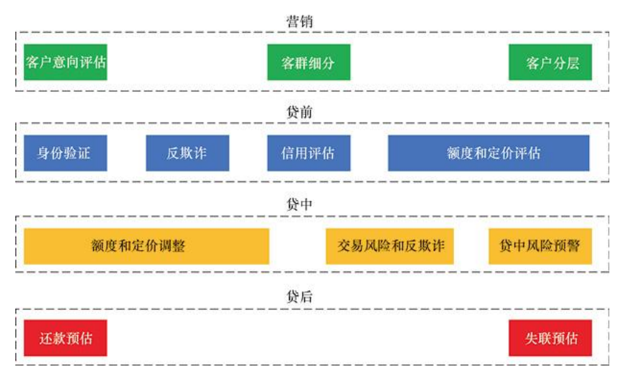
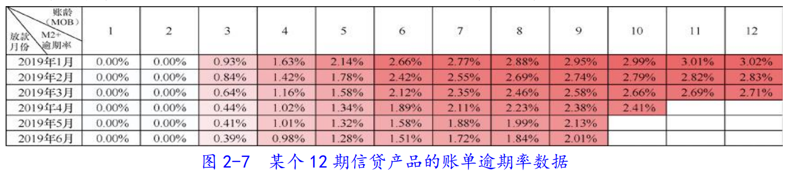
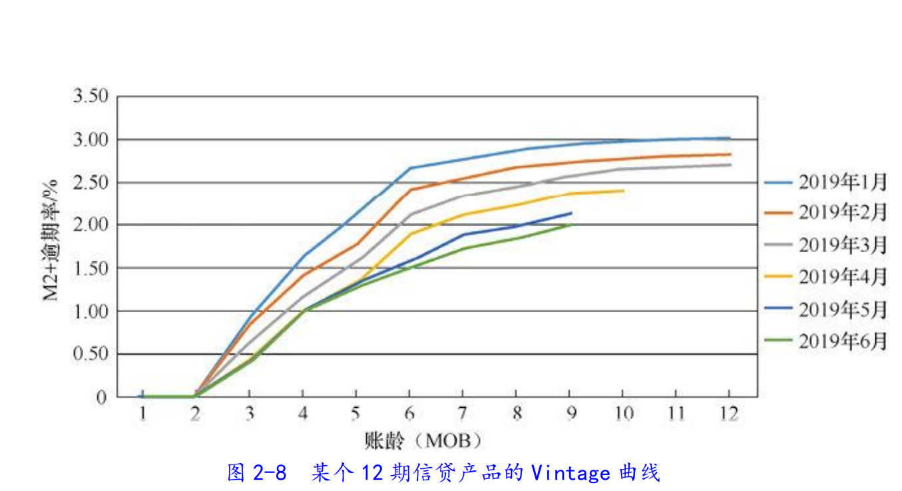

[toc]

# 1、智能风控包含的业务环节

## 1.1、营销

智能风控通 过收集大量数据，运用机器学习模型，预测客户的风险概率，自动评估信贷申请人的身份真 实性、信用等级和风险等级，并给予相应的信用额度和定价。

* 营销和风控的侧重点不同，**营销端负责获取大量客户，风控端负责筛选出好客户**
* 营 销的目标是获取符合期望的目标客户，而不仅仅是获得一定数量的客户。
* 营销环节的智能风 控应用主要包**括客户意向评估**、**客群细分**和**客群分层**。

### 1.1.1、营销意向评估

​	营销的第一个关键点是找到有需求且有意向购买信贷产品的客群，**提升营销环节转化率**， 从而降低分摊到每个申请客户上的成本。

​	在智能风控中，我们利用从营销环节到申请环节可以获得的**多维、异构化、高度分散**的数据，进行整合分析，形成**客户画像**，同时利用机器学习技术建立营销响应模型。根据客户响应概率，客户可分为**高响应客户、中响应客户和低响应**客户。针对不同的响应级别，金融机构可以设置不同的营销策略，如对高响应客户采取主动营销策略（如电话营销），对低响应客户可暂时放弃，以降低营销成本。

### 1.1.2、客群细分

​	不同类型的客户对信贷产品的需求不同，根据客户的不同需求，有针对性地营销产品， 有利于提升申请转化率。当然，不同人的需求有很多共性，金融机构提供的产品是有限的， 有效的做法是区别对待每一群人，为“相似”的人提供同一类产品。

​	在智能营销中，通过建立客户分群模型，可以将具有多个相似特征的客户划分到一个细分群体，进而分析细分客群的需求，提供相应的信贷产品。例如，在细分客户中，发现有车 人群，可以设计针对车主的营销方案和定制产品。

### 1.1.3、客群分层

​	客群分层是指将**潜在的信贷申请客户**，**预先**进行风险等级评定，从而在营销之前将一些高风险客户排除在外，为低风险客户提供更有吸引力的金融产品。

​	在智能风控中，通过建立一系列客户筛选规则和预授信模型，对客户进行分层评估，从 而有区别地进行营销。营销阶段的客群分层有利于降低整体客群的风险水平，提高转化率， 降低营销成本。我们可以认为，客群分层是一种**风控前置**的方法。

## 1.2、贷前

​	智能风控通过收集大量数据，运用机器学习模型，预测客户的风险概率，自动**评估信贷申请人的身份真实性、信用等级和风险等级**，并给予相应的信用**额度**和**定价**。

​	贷前风控主要包括**身份验证**、**反欺诈**、**信用评估**，以及**额度和定价评估**。

1. 身份验证。人脸识别、活体检测、通过官方信息库校验身份证等信息准确性（二要素、三要素验证）。

2. 反欺诈。主要是**贷前申请欺诈**。在智能风控中，我们已经通过**身份认证技术**解决了一部分身份欺诈问题，但是，还有更隐蔽的欺诈方式，需要借助多元化的工具解决。例如，我们从**关系网络数据**、**设备信息**等 多种高维度数据中挖掘特征，构建一系列反欺诈规则和模型，提高欺诈案件识别率。

3. 信用评估。目的是确认借款人的**还款意愿**和**还款能力**。还款意愿可以通过借款人的历史行为体现，如之前的借款是 否按时偿还，还款能力可以从借款人的收入水平方面判断。

   ​	通常借助多维度大数据建立信用风险模型，对借款人的信用等级进 行评估。这些数据维度包括**中国人民银行征信数据、客户社交、司法、行为、搜索、电商、 线上线下消费等**。由于还款意愿和还款能力很难绝对区分，因此，通常将体现还款意愿或者 还款能力的各维度特征综合以作为模型的输入，通过模型学习，从历史有表现的数据中找到 各个维度与信用等级的量化关系，从而进行综合信用等级评估。

4. 额度和定价评估。信贷产品的关键要素包括**授信额度、利率、期限**。

## 1.3、贷中

​	**贷中环节是指贷款申请成功到贷款结清阶段**，一旦客户逾期，就转入贷后环节。信贷 产品一般分多期进行还款，有可能在贷款期间存在提额和提款需求，因此，贷中管理关系到**还款质量、新需求是否满足和客户风险的变动**。贷中风险控制主要包括**额度和定价调整**，**交易风险和反欺诈**，以及**贷中风险预警**。

1.  额度和定价调整

   ​	贷中额度和定价调整一般有两种情况：一是客户主动发起调整申请，二是金融机构为了 满足客户潜在需求而主动调整。在智能风控中，我们一般通过**贷中风险模型对客户的信用等级进行重新评估**，当客户 信用等级比以前高（信用更好）时，给予更高的额度和更优惠的定价。金融机构可以主动、 定期地运行贷中风险模型，对客户进行信用等级评估，从而给出更合理的产品方案，这将有 利于留存客户，提升客户价值。

2. 交易风险和反欺诈

   ​	当客户获得授信额度后，真正的**借款交易可能在贷中分多次进行**。而**客户的资质和风险是随着时间变化的**，因此，在贷中，需要对在线交易进行仿冒和欺诈识别，对借款人的行为 进行分析，有效防范和控制欺诈交易等贷中风险。

   在智能风控中，我们通过**关联各类数据，寻找新出现的欺诈模式，运用机器学习、深度学习、图谱学习**等技术，**构建贷中反欺诈规则和模型，对风险进行拦截**。

3. 贷中风险预警。在客户借款之后，就可以**通过客户的贷中行为对客户是否会入催进行预测**，从而提前知道哪些客户有可能逾期。**对于高风险客户，提前介入催收，往往会取得良好的效果**，因为信贷借款人往往存在从多个金融机构借款的情况，而当客户还款资金有限时，更早介入的金融机构往往更有可能收回贷款。

   ​	在智能风控中，我们可以构建**贷中风险预估模型和贷中逾期识别规则**，提前预判入催可能性高的客户，并采取有效措施以降低借款人入催的比例，从而降低贷款逾期率，减少损失。

## 1.4、贷后

​	贷后风险控制主要包括**还款预估和失联预估**等。

# 2、搭建智能风控体系模型

## 2.1、模型概述

我们可以采用多种机器学习算法搭建风控模型，它们的主要步骤是相同的，一般包括**问题定义，样本的选择与划分，模型架构设计，数据准备与描述分析，数据清洗， 特征选择，模型训练与效果评估，部署上线，模型监控，以及模型调优**10 个步骤。

* 1~3步属于模型立项分析阶段。
* 4~7步属于模型预训练开发阶段。
* 8~10步属于模型上线和维护阶段。

## 2.2、构建好样本

### 2.2.1、问题定义

实际业务中，确定项目背景和目标，做好问题定义非常重要（标签、样本），基于错误的问题定义，模型训练越好，结果可能越糟糕。

1. **预测对象粒度**。实际业务中，面对的可能是不同层次（维度）的问题。一个客户的所有借款和一个客户的每笔借款（一个客户可能有多比借款）是不同的层次（维度）。

   * **渠道粒度**：在某些场景下，借款申请人来自同一个来源渠道，我们可以预测渠道的风险， 一个渠道是一条记录。

   * **客户粒度**：一个借款人可能有多笔借款，从借款申请人的层次角度考虑风险，只要其任 何一笔借款出现逾期，即表示出现风险事件，一个人是一条记录。

   * **借款粒度**：对借款人的一次借款申请考虑风险，该笔借款逾期，即表示出现风险事件，一次借款是一条记录。

   * **还款粒度**：每个借款人的每次借款都可能分为不同的还款期，那么一次还款是一条记录。

     ​	在实际业务中，我们需要根据**业务模式**和**模型应用策略**来选择合适的粒度进行建模，如一次性借款产品的申请风险模型通常选择借款粒度；循环额度产品选择客户粒度；催收还款预估时通常选用还款粒度。预测对象的粒度决定了标签定义和特征计算的粒度。

2. **标签定义**。标签是模型所要预测的结果，它可以是二元分类结果，如好/坏、响应/不响应等；也可以是连续变量，如收益、损失等。**标签定义需要明确的是在什么时间点预测未来多久发生的什么事件**。我们考虑在什么时间点进行预测， 这个时间点即观测点。**观测点前后分别是观察窗口和表现窗口**。

   * **观察窗口**：用来观察客户行为的时间区间。设计特征时，一般需要考虑不同的时间窗口，如最近 3、6、9 或 12 个月内在其他机构申请的次数， 最近 3、6、9 或 12 个月内借款的总金额等。观察窗口也称为观察期。
   * **表现窗口**：用来考察客户的表现，从而确定标签定义（逾期客户、响应客户）的时间区间。表现窗口也称作表现期。

   

   

   标签定义中，对于好坏程度和表现窗口的长度，需要结合**滚动率分析**和**账龄分析**。

   

   首先解释两个基础概念：

   （1）**逾期期数**概念：逾期天数按区间划分后的逾期状态。通常以30天为区间划分，用英文字母M表示，具体如下：

   * **M0**：当前未逾期。
   * **M1**：逾期1期，或逾期1~30日。
   * **M2**：逾期2期，或逾期31~60日。
   * **M3**：逾期3期，或逾期61~90日。

   （2）**账龄**（Month of Book，MOB）概念：指多期信贷产品**从首次放款起所经历的月数**。

   * **MOB0**：放款日至当月月底，观察时间点为放款当月月末。
   * **MOB1**：放款后第二个月，观察时间点为第二个月月末。
   * **MOB2**：放款后第三个月，观察时间点为第三个月月末。

   

   * **滚动率分析**（**定义逾期多长时间算坏客户**）。滚动率是指，客户从某个观测点之前的一段时间的逾期状态向观测点之后的一段时间的逾期状态转化的比例。例如，我们以 2020 年 7 月 1 日为观测点，选取 1 万名客户，统计这部分客户在上个月的逾期状态，对比他们在当月的逾期状态的转化比例。下图为某信贷产品的滚动率结果。由于是和这个月对比，所以逾期最多只增加一个月。

     

     上个月逾期状态为 M3 及 M3+的客户，好转率已经比较低了（只有24%），因此，我们**可以认为逾期状态为 M2+ 的客户已经足够“坏”**，用 M2+（逾期天数大于 60）来定义“坏”客户较为合适。

   * **账龄分析**（通过Vintage曲线，**权衡表现期的长度**）。经常使用Vintage曲线分析账户的**成熟期**、**变化规律**等。

     （1）权衡**表现期的长度**，在**数据时效性**和**风险暴露程度**上进行取舍。比如，一个分为12期的产品，理论上只有客户全部经历完12期还款后，才能准确定义“好坏“。否则，我们只能判断目前为止客户是“好”还是“坏”，并不能知道未来几期客户会不会逾期。 因此，对于该产品，完整的表现期是 12 个月。12 个月的表现期是否合适？能否根据客户 6 个月时的表现来定义其“好坏”呢（**比如前6期客户均未逾期，但是很从第6期开始客户突然开始逾期**）？

     * 表现期越长，信用风险暴露越彻底，但是观测点距离当前时间越远，满足条件的样本越少，数据越陈旧，建模样本和未来样本的差异越大。

     * 表现期越短，信用风险还未完全暴露，但是建模样本距离现在越近，数据时效性越强。
     
     （2）Vintage曲线是**根据账龄绘制**的不同时间放款样本的**逾期率**变化曲线。逾期率有金额逾期率和账单逾期率两种口径。
       * 金额逾期率：逾期金额 / 放款总金额
     
       * 账单逾期率：逾期账单数 / 放款总账单数
     
         下图为某个信贷产品的账单逾期率数据。
     
         
     
         下图展示了信贷产品对应的Vintage曲线，横轴表示账龄，纵轴表示M2+逾期率，图中各条线分别表示不同放款时间对应的账龄的逾期率变化趋势。
     
         
     
         分析曲线可以得到几个信息：
     
         （1）在相同 MOB 的情况下，每个放款月份对应的逾期率逐渐降低，说明客群质量提升，可能是因为金融机构**收紧了风险敞口**，或者**使用了效果更好的预测模型或反欺诈规则**。
     
         （2）不同月份放款的逾期率在经过 MOB6 后，上升趋势开始平缓。我们以 2019 年 1 月为例， 设定表现期为 6 个月，即可覆盖 90%的“坏”客户。
     
         ​	因此，通过分析 Vintage 曲线，我们可以寻找**逾期率开始趋于稳定的时间点**，**辅助确定**表现期长度。
     
         ​	综上所述，**滚动率分析用于定义客户的“好坏”程度**，**账龄分析用于确定合适的表现期**，二者结合，可以尽可能多地覆盖“坏”客户。以上示例中，标签可以按以下方式定义：
     
         * 客户经过 6 期及 6 期以下，**历史逾期状态为 M2+（逾期超过 60 天）**，定义为“坏”客户，此时， 标签 Y 的值。
     
         * 客户经过 6 期，历史未逾期，此时，标签 Y 的值设为 0。
     
         * 客户经过 6 期，历史逾期未达到 M2+状态（逾期不超过 60 天），此样本属于**灰度样本**（经过表 现期后，已逾期但逾期程度未达到“坏”标准的样本）。
     
         * 客户**未达到 6 期且未逾期**，则无法定义好坏，属于不定样本，一般不应该将其纳入建模样本中
     
         对于灰度样本，通常有两种处理方法：第一种方法是直接摒弃灰度样本，建模中不予考虑；第二种方法是将其加入“好”客户样本中，这样可以增加样本量。在灰度样本较少时， 我们一般采用第一种方法。如果灰度样本较多，那么作者建议读者尝试上述两种方法，以最 终模型预测效果作为选择依据。
         
         在确定样本标签时，严格按照 6 个月表现期取样本属于“硬表现窗口”取样。在实际业 务中，有些客户已经有超过 6 个月的表现期，而逾期发生在 6 个月表现期之后，我们也可以将这种样本加入建模样本中，这属于“软表现窗口”取样。此时的预测结果的含义有所不同， 我们已经不能再将其严格理解为“预测客户未来 6 个月内的风险”，但**实践中，我们更关心模型的预测排序能力，如果这样能够补充更多坏样本并使模型效果提升**，那么也无妨。
         
         需要注意的是，**标签定义需要结合实际的业务场景，必须和业务目标保持一致**。例如， 有些业务历史较短，“坏”客户样本量较少，可能需要**缩短表现期**，这**有利于提高样本的充分性**。一种有用的尝试是通过**在建模样本中选择不同的逾期状态，尽可能多地覆盖“坏”客户**，**这样可以兼容样本总量和“坏”客户样本量**，**特别适用于业务开展早期样本少的情况**。
         
         另外，标签定义并非只能采取一种。作者所在的团队经常会基于同一个业务问题，设定多种标签定义并进行建模，最后将模型进行融合，这也是一种重要的模型优化方法。当然， 在最后评价模型效果时，我们还是需要基于业务选择特定的标签作为主要评价标准。
   
3. **细分客群**。根据不同产品拆分客群，可以根据不同的**进件渠道**、**借款期数**、**区域**和**借款金额**等划分客群。

### 2.2.2、样本的选择与划分

1. **样本选取**需要把握的重要原则是“建模样本必须能够代表总体（**样本的充分性**），与未来模型使用场景下的样本差异尽可能小”，具体体现为下面4点：

（1）**代表性**

​	代表性主要是指客群的代表性。由于不同客群间客户行为具有差异，为了使建模样本能够代表总体，选取的建模样本需要能够反映未来使用场景的客群性质。例如，历史上有多种 期限的产品，而未来主要以某一种期限的产品为主，那么我们最好选取未来期限的产品样本 来建模。对于有多个子类别的客群，为了保持代表性，可采用**分层采样**方式，保证每个重要类别的对象都在样本中拥有足够的比例。

（2）**充分性**

​	充分性主要是指样本的充分性。样本太少，可能无法反映客户群体携带的内在信息，无 法满足统计的显著性要求。风控建模时，**要求坏样本数不能太少，至少上千条**，否则模型效果难以保证。**当坏样本占比较小时，我们可以考虑通过上采样方式扩充坏样本数。**在信贷风控领域，如果建立信用评分模型，那么数万条样本已经可以做出比较可靠的模型。更大的样本量一般能够提升模型的效果和稳定性。但是，样本量并非越大越好，因为当样本量达到一 定程度，已经可以从样本中充分提炼出具有代表性的数理关系时，若再增加样本量，那么对 模型效果的提升微乎其微，反而消耗更多的资源。

（3）**时效性**：

​	在已满足建模样本的充分性要求后，我们应尽量选取近期样本，即样本的产生时间越近越好。时间越久远，数据越陈旧，可能造成未来使用场景下的样本的差异较大。对于银行等客群相对稳定的机构，长久之前的样本对时效性的影响不大。但是，对于客群变化较大的信 贷平台，我们就需要对时效性的影响进行重点关注。

（4）**排除性**：

​	建模样本除需要满足客群的代表性，以及样本的充分性和时效性以外，还应在选取样本 时排除某些因政策调整、不可控因素导致的客群质量异常样本。例如，某工厂在 3 月因某种 原因停产，导致这段时间在某信贷产品上的逾期率显著升高，到了 4 月，该工厂恢复生产， 逾期率也恢复到了正常水平。因此，在选取建模样本时，我们应将排除 3 月的样本作为一种 实验方案，因为这段时间客户逾期行为受某种因素的影响较大。 

​	需要注意的是，我们是在放款样本上选取的建模样本，而未来模型的使用场景会在全量 申请样本上，因此，存在“部分样本估计总体”问题，对全量申请客户的风险估计就不准确。 解决这一问题的方法可以是**拒绝推断（reject inference）**，2.5.3 节中会详细介绍。 

​	作者强调一点，**多进行对比实验**。尽管我们给出了样本选择的一般性原则，但在实践中， 我们建议，在有条件的情况下，**对不同的样本组合进行尝试，原理上最优并不代表实际上最优**。我们经常面临样本量和样本质量的权衡，它们之间的平衡点在哪里，除非将各种组合都 尝试一遍，否则无法知晓。

2. 样本集划分

   数据一般分为训练集和验证集。
   
   

